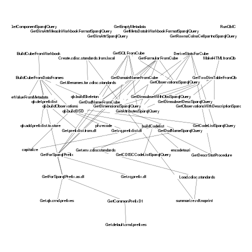
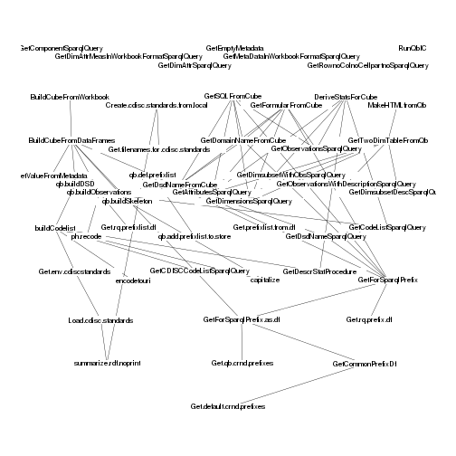

# Introduction

This vignette shows the structure of the `rrdfqbcrnd0` package.

The graphical presentation is made using the R-package `DiagrammeR`
(https://github.com/rich-iannone/DiagrammeR). The R-package uses
`mermaid` a javascript blibrary (https://github.com/knsv/mermaid),
described as in the credits as

> Many thanks to the d3 (http://d3js.org/) and dagre-d3
> (https://github.com/cpettitt/dagre-d3) projects for providing the
> graphical layout and drawing libraries!  Thanks also to the
> js-sequence-diagram (http://bramp.github.io/js-sequence-diagrams)
> project for usage of the grammar for the sequence diagrams.

Note: the html file must be made using `rmarkdown::render`.

This is under development

mja@statgroup.dk 


## Setup


```r
knitr::read_chunk("setup.R")
```

```r
devtools::load_all(pkg="../..")
```

```
## Loading rrdfqbcrnd0
## Loading required package: xlsx
## Loading required package: rJava
## Loading required package: methods
## Loading required package: xlsxjars
## Loading required package: RCurl
## Loading required package: bitops
## 
## Attaching package: 'RCurl'
## 
## The following object is masked from 'package:rJava':
## 
##     clone
```

```
## Warning: character(0)
```

```r
# install.packages("DiagrammeR")
# install.packages("mvbutils")
library(DiagrammeR)
library(mvbutils)
```

```
## Loading required package: tools
## 
## Attaching package: 'mvbutils'
## 
## The following objects are masked from 'devtools_shims':
## 
##     ?, help
## 
## The following object is masked from 'package:graphics':
## 
##     clip
## 
## The following objects are masked from 'package:utils':
## 
##     ?, help
## 
## The following objects are masked from 'package:base':
## 
##     print.default, print.function, rbind, rbind.data.frame
```

```r
library(rrdf) # apparantly needed 
```

```
## Loading required package: rrdflibs
```

```r
## library(rrdfqbcrnd0) # should not go here 

pretty.print.rq<- function(rqstring) {
    ## print sparql query with line numbers - use full for finding errors
    ## when using knitr in Rmd files use highlight instead
rqlines<- unlist(strsplit(rqstring,"\n"))
cat(paste( format(seq(rqlines),format="f",digits=floor(log10(length(rqlines)+1))), rqlines, sep=": ", collapse="\n"),"\n")
}
```

# Get package information


```r
foodweb(where=("package:rrdfqbcrnd0"), cex=0.8, charlim=60,color.lines=FALSE)
```

 

```r
funs<- foodweb(where=("package:rrdfqbcrnd0"), cex=0.8, charlim=60,color.lines=FALSE)
```

 

```r
model <- new.rdf(ontology=FALSE)
funmat<- funs$funmat
funcPREFIX<- "http://example.org/rrdfqbcrnd0/"
for (r in seq(nrow(funmat))) {
        add.data.triple(model,
                   subject=paste0(funcPREFIX, rownames(funmat)[r]),
                   predicate=paste0(funcPREFIX, "functionName"),
                   data=rownames(funmat)[r]
                   )
    
    for (c in seq(ncol(funmat))) {
        if (funmat[r,c]==1) {
        add.triple(model,
                   subject=paste0(funcPREFIX, rownames(funmat)[r]),
                   predicate=paste0(funcPREFIX, "calls"),
                   object=paste0(funcPREFIX, colnames(funmat)[c])
                   )
    }
    }
    }        
```

# Make the package overview

First get the labels for the functions.

```r
prefix.text<- "PREFIX prog: <http://example.org/rrdfqbcrnd0/>"
RP.labels.rq<-  paste0( paste0(prefix.text, collapse="\n"), "
select ?rfunc ?rfunclabel
where {
?rfunc prog:functionName ?rfunclabel
    .
    }
", collapse="\n" )
pretty.print.rq(RP.labels.rq)
```

```
## 1: PREFIX prog: <http://example.org/rrdfqbcrnd0/>
## 2: select ?rfunc ?rfunclabel
## 3: where {
## 4: ?rfunc prog:functionName ?rfunclabel
## 5:     .
## 6:     }
```

```r
RP.labels<- data.frame(sparql.rdf(model, RP.labels.rq),stringsAsFactors=FALSE)
knitr::kable(RP.labels)
```


|rfunc                                          |rfunclabel                                |
|:----------------------------------------------|:-----------------------------------------|
|prog:GetCDISCCodeListSparqlQuery               |GetCDISCCodeListSparqlQuery               |
|prog:Create.cdisc.standards.from.local         |Create.cdisc.standards.from.local         |
|prog:GetDimsubsetDescSparqlQuery               |GetDimsubsetDescSparqlQuery               |
|prog:GetAttributesSparqlQuery                  |GetAttributesSparqlQuery                  |
|prog:qb.def.prefixlist                         |qb.def.prefixlist                         |
|prog:GetSQLFromCube                            |GetSQLFromCube                            |
|prog:GetTwoDimTableFromQb                      |GetTwoDimTableFromQb                      |
|prog:Load.cdisc.standards                      |Load.cdisc.standards                      |
|prog:Get.env.cdiscstandards                    |Get.env.cdiscstandards                    |
|prog:GetForSparqlPrefix                        |GetForSparqlPrefix                        |
|prog:GetDimAttrSparqlQuery                     |GetDimAttrSparqlQuery                     |
|prog:GetDescrStatProcedure                     |GetDescrStatProcedure                     |
|prog:summarize.rdf.noprint                     |summarize.rdf.noprint                     |
|prog:Get.default.crnd.prefixes                 |Get.default.crnd.prefixes                 |
|prog:GetEmptyMetadata                          |GetEmptyMetadata                          |
|prog:DeriveStatsForCube                        |DeriveStatsForCube                        |
|prog:qb.buildObservations                      |qb.buildObservations                      |
|prog:BuildCubeFromDataFrames                   |BuildCubeFromDataFrames                   |
|prog:capitalize                                |capitalize                                |
|prog:GetDsdNameSparqlQuery                     |GetDsdNameSparqlQuery                     |
|prog:qb.buildDSD                               |qb.buildDSD                               |
|prog:GetDimensionsSparqlQuery                  |GetDimensionsSparqlQuery                  |
|prog:BuildCubeFromWorkbook                     |BuildCubeFromWorkbook                     |
|prog:GetDomainNameFromCube                     |GetDomainNameFromCube                     |
|prog:GetDimsubsetWithObsSparqlQuery            |GetDimsubsetWithObsSparqlQuery            |
|prog:qb.buildSkeleton                          |qb.buildSkeleton                          |
|prog:encodetouri                               |encodetouri                               |
|prog:GetRownoColnoCellpartnoSparqlQuery        |GetRownoColnoCellpartnoSparqlQuery        |
|prog:Get.rq.prefixlist.df                      |Get.rq.prefixlist.df                      |
|prog:GetObservationsWithDescriptionSparqlQuery |GetObservationsWithDescriptionSparqlQuery |
|prog:GetObservationsSparqlQuery                |GetObservationsSparqlQuery                |
|prog:GetCommonPrefixDf                         |GetCommonPrefixDf                         |
|prog:GetValueFromMetadata                      |GetValueFromMetadata                      |
|prog:RunQbIC                                   |RunQbIC                                   |
|prog:buildCodelist                             |buildCodelist                             |
|prog:MakeHTMLfromQb                            |MakeHTMLfromQb                            |
|prog:GetDsdNameFromCube                        |GetDsdNameFromCube                        |
|prog:ph.recode                                 |ph.recode                                 |
|prog:GetDimAttrMeasInWorkbookFormatSparqlQuery |GetDimAttrMeasInWorkbookFormatSparqlQuery |
|prog:GetComponentSparqlQuery                   |GetComponentSparqlQuery                   |
|prog:GetMetaDataInWorkbookFormatSparqlQuery    |GetMetaDataInWorkbookFormatSparqlQuery    |
|prog:Get.qb.crnd.prefixes                      |Get.qb.crnd.prefixes                      |
|prog:GetCodeListSparqlQuery                    |GetCodeListSparqlQuery                    |
|prog:Get.rq.prefix.df                          |Get.rq.prefix.df                          |
|prog:Get.filenames.for.cdisc.standards         |Get.filenames.for.cdisc.standards         |
|prog:GetFormularFromCube                       |GetFormularFromCube                       |

Now get the links between the functions.

```r
RP.calls.rq<-  paste0( paste0(prefix.text, collapse="\n"), "
select ?rfunc ?rcaller
where {
?rfunc prog:calls ?rcaller
    .
    }
", collapse="\n" )
pretty.print.rq(RP.calls.rq)
```

```
## 1: PREFIX prog: <http://example.org/rrdfqbcrnd0/>
## 2: select ?rfunc ?rcaller
## 3: where {
## 4: ?rfunc prog:calls ?rcaller
## 5:     .
## 6:     }
```

```r
RP.calls<- data.frame(sparql.rdf(model, RP.calls.rq),stringsAsFactors=FALSE)
knitr::kable(RP.calls)
```


|rfunc                                  |rcaller                                        |
|:--------------------------------------|:----------------------------------------------|
|prog:BuildCubeFromDataFrames           |prog:qb.buildDSD                               |
|prog:GetFormularFromCube               |prog:GetDomainNameFromCube                     |
|prog:GetForSparqlPrefix                |prog:Get.qb.crnd.prefixes                      |
|prog:BuildCubeFromDataFrames           |prog:qb.buildObservations                      |
|prog:BuildCubeFromDataFrames           |prog:Get.default.crnd.prefixes                 |
|prog:GetCommonPrefixDf                 |prog:Get.default.crnd.prefixes                 |
|prog:GetSQLFromCube                    |prog:GetForSparqlPrefix                        |
|prog:GetDsdNameFromCube                |prog:GetForSparqlPrefix                        |
|prog:GetForSparqlPrefix                |prog:Get.rq.prefix.df                          |
|prog:GetSQLFromCube                    |prog:GetDomainNameFromCube                     |
|prog:Get.env.cdiscstandards            |prog:Load.cdisc.standards                      |
|prog:qb.buildObservations              |prog:Get.rq.prefixlist.df                      |
|prog:GetFormularFromCube               |prog:GetForSparqlPrefix                        |
|prog:DeriveStatsForCube                |prog:GetObservationsSparqlQuery                |
|prog:BuildCubeFromWorkbook             |prog:BuildCubeFromDataFrames                   |
|prog:GetDsdNameFromCube                |prog:GetDsdNameSparqlQuery                     |
|prog:GetDomainNameFromCube             |prog:GetDsdNameFromCube                        |
|prog:qb.buildDSD                       |prog:buildCodelist                             |
|prog:buildCodelist                     |prog:encodetouri                               |
|prog:GetTwoDimTableFromQb              |prog:GetDimsubsetDescSparqlQuery               |
|prog:BuildCubeFromDataFrames           |prog:GetValueFromMetadata                      |
|prog:DeriveStatsForCube                |prog:GetAttributesSparqlQuery                  |
|prog:GetSQLFromCube                    |prog:GetDsdNameFromCube                        |
|prog:qb.buildSkeleton                  |prog:capitalize                                |
|prog:GetSQLFromCube                    |prog:GetAttributesSparqlQuery                  |
|prog:BuildCubeFromDataFrames           |prog:Get.qb.crnd.prefixes                      |
|prog:buildCodelist                     |prog:Get.env.cdiscstandards                    |
|prog:DeriveStatsForCube                |prog:GetDescrStatProcedure                     |
|prog:GetFormularFromCube               |prog:GetObservationsSparqlQuery                |
|prog:qb.buildObservations              |prog:ph.recode                                 |
|prog:GetFormularFromCube               |prog:GetDimensionsSparqlQuery                  |
|prog:GetTwoDimTableFromQb              |prog:GetAttributesSparqlQuery                  |
|prog:GetSQLFromCube                    |prog:GetObservationsSparqlQuery                |
|prog:Create.cdisc.standards.from.local |prog:Get.filenames.for.cdisc.standards         |
|prog:GetTwoDimTableFromQb              |prog:GetDimensionsSparqlQuery                  |
|prog:buildCodelist                     |prog:capitalize                                |
|prog:GetSQLFromCube                    |prog:GetDimensionsSparqlQuery                  |
|prog:Create.cdisc.standards.from.local |prog:summarize.rdf.noprint                     |
|prog:GetForSparqlPrefix                |prog:GetCommonPrefixDf                         |
|prog:buildCodelist                     |prog:GetDescrStatProcedure                     |
|prog:GetFormularFromCube               |prog:GetDsdNameFromCube                        |
|prog:GetDomainNameFromCube             |prog:GetForSparqlPrefix                        |
|prog:GetTwoDimTableFromQb              |prog:GetDimsubsetWithObsSparqlQuery            |
|prog:GetTwoDimTableFromQb              |prog:GetObservationsWithDescriptionSparqlQuery |
|prog:GetDsdNameSparqlQuery             |prog:GetForSparqlPrefix                        |
|prog:DeriveStatsForCube                |prog:GetDimensionsSparqlQuery                  |
|prog:BuildCubeFromDataFrames           |prog:qb.def.prefixlist                         |
|prog:MakeHTMLfromQb                    |prog:GetTwoDimTableFromQb                      |
|prog:buildCodelist                     |prog:GetCDISCCodeListSparqlQuery               |
|prog:qb.buildObservations              |prog:GetCodeListSparqlQuery                    |
|prog:DeriveStatsForCube                |prog:GetCodeListSparqlQuery                    |
|prog:GetFormularFromCube               |prog:GetAttributesSparqlQuery                  |
|prog:BuildCubeFromDataFrames           |prog:qb.buildSkeleton                          |
|prog:Load.cdisc.standards              |prog:summarize.rdf.noprint                     |

Finally, generate the `mermaid` commands for showing the process.

```r
mermaid.commands<- paste(
           "graph TB; ", 
           paste( gsub("^prog:","", gsub("\\.","", RP.labels$rfunc)),"(", RP.labels$rfunclabel, "); ", sep="", collapse=" \n" ),
    paste( gsub("^prog:","", gsub("\\.","", RP.calls$rfunc)), "-->",
          gsub("^prog:","", gsub("\\.","", RP.calls$rcaller)), "; ", sep="", collapse=" \n" ),
          "\n",
          sep=" \n", collapse=" \n")
cat(mermaid.commands,"\n")
```

```
## graph TB;  
## GetCDISCCodeListSparqlQuery(GetCDISCCodeListSparqlQuery);  
## Createcdiscstandardsfromlocal(Create.cdisc.standards.from.local);  
## GetDimsubsetDescSparqlQuery(GetDimsubsetDescSparqlQuery);  
## GetAttributesSparqlQuery(GetAttributesSparqlQuery);  
## qbdefprefixlist(qb.def.prefixlist);  
## GetSQLFromCube(GetSQLFromCube);  
## GetTwoDimTableFromQb(GetTwoDimTableFromQb);  
## Loadcdiscstandards(Load.cdisc.standards);  
## Getenvcdiscstandards(Get.env.cdiscstandards);  
## GetForSparqlPrefix(GetForSparqlPrefix);  
## GetDimAttrSparqlQuery(GetDimAttrSparqlQuery);  
## GetDescrStatProcedure(GetDescrStatProcedure);  
## summarizerdfnoprint(summarize.rdf.noprint);  
## Getdefaultcrndprefixes(Get.default.crnd.prefixes);  
## GetEmptyMetadata(GetEmptyMetadata);  
## DeriveStatsForCube(DeriveStatsForCube);  
## qbbuildObservations(qb.buildObservations);  
## BuildCubeFromDataFrames(BuildCubeFromDataFrames);  
## capitalize(capitalize);  
## GetDsdNameSparqlQuery(GetDsdNameSparqlQuery);  
## qbbuildDSD(qb.buildDSD);  
## GetDimensionsSparqlQuery(GetDimensionsSparqlQuery);  
## BuildCubeFromWorkbook(BuildCubeFromWorkbook);  
## GetDomainNameFromCube(GetDomainNameFromCube);  
## GetDimsubsetWithObsSparqlQuery(GetDimsubsetWithObsSparqlQuery);  
## qbbuildSkeleton(qb.buildSkeleton);  
## encodetouri(encodetouri);  
## GetRownoColnoCellpartnoSparqlQuery(GetRownoColnoCellpartnoSparqlQuery);  
## Getrqprefixlistdf(Get.rq.prefixlist.df);  
## GetObservationsWithDescriptionSparqlQuery(GetObservationsWithDescriptionSparqlQuery);  
## GetObservationsSparqlQuery(GetObservationsSparqlQuery);  
## GetCommonPrefixDf(GetCommonPrefixDf);  
## GetValueFromMetadata(GetValueFromMetadata);  
## RunQbIC(RunQbIC);  
## buildCodelist(buildCodelist);  
## MakeHTMLfromQb(MakeHTMLfromQb);  
## GetDsdNameFromCube(GetDsdNameFromCube);  
## phrecode(ph.recode);  
## GetDimAttrMeasInWorkbookFormatSparqlQuery(GetDimAttrMeasInWorkbookFormatSparqlQuery);  
## GetComponentSparqlQuery(GetComponentSparqlQuery);  
## GetMetaDataInWorkbookFormatSparqlQuery(GetMetaDataInWorkbookFormatSparqlQuery);  
## Getqbcrndprefixes(Get.qb.crnd.prefixes);  
## GetCodeListSparqlQuery(GetCodeListSparqlQuery);  
## Getrqprefixdf(Get.rq.prefix.df);  
## Getfilenamesforcdiscstandards(Get.filenames.for.cdisc.standards);  
## GetFormularFromCube(GetFormularFromCube);  
## BuildCubeFromDataFrames-->qbbuildDSD;  
## GetFormularFromCube-->GetDomainNameFromCube;  
## GetForSparqlPrefix-->Getqbcrndprefixes;  
## BuildCubeFromDataFrames-->qbbuildObservations;  
## BuildCubeFromDataFrames-->Getdefaultcrndprefixes;  
## GetCommonPrefixDf-->Getdefaultcrndprefixes;  
## GetSQLFromCube-->GetForSparqlPrefix;  
## GetDsdNameFromCube-->GetForSparqlPrefix;  
## GetForSparqlPrefix-->Getrqprefixdf;  
## GetSQLFromCube-->GetDomainNameFromCube;  
## Getenvcdiscstandards-->Loadcdiscstandards;  
## qbbuildObservations-->Getrqprefixlistdf;  
## GetFormularFromCube-->GetForSparqlPrefix;  
## DeriveStatsForCube-->GetObservationsSparqlQuery;  
## BuildCubeFromWorkbook-->BuildCubeFromDataFrames;  
## GetDsdNameFromCube-->GetDsdNameSparqlQuery;  
## GetDomainNameFromCube-->GetDsdNameFromCube;  
## qbbuildDSD-->buildCodelist;  
## buildCodelist-->encodetouri;  
## GetTwoDimTableFromQb-->GetDimsubsetDescSparqlQuery;  
## BuildCubeFromDataFrames-->GetValueFromMetadata;  
## DeriveStatsForCube-->GetAttributesSparqlQuery;  
## GetSQLFromCube-->GetDsdNameFromCube;  
## qbbuildSkeleton-->capitalize;  
## GetSQLFromCube-->GetAttributesSparqlQuery;  
## BuildCubeFromDataFrames-->Getqbcrndprefixes;  
## buildCodelist-->Getenvcdiscstandards;  
## DeriveStatsForCube-->GetDescrStatProcedure;  
## GetFormularFromCube-->GetObservationsSparqlQuery;  
## qbbuildObservations-->phrecode;  
## GetFormularFromCube-->GetDimensionsSparqlQuery;  
## GetTwoDimTableFromQb-->GetAttributesSparqlQuery;  
## GetSQLFromCube-->GetObservationsSparqlQuery;  
## Createcdiscstandardsfromlocal-->Getfilenamesforcdiscstandards;  
## GetTwoDimTableFromQb-->GetDimensionsSparqlQuery;  
## buildCodelist-->capitalize;  
## GetSQLFromCube-->GetDimensionsSparqlQuery;  
## Createcdiscstandardsfromlocal-->summarizerdfnoprint;  
## GetForSparqlPrefix-->GetCommonPrefixDf;  
## buildCodelist-->GetDescrStatProcedure;  
## GetFormularFromCube-->GetDsdNameFromCube;  
## GetDomainNameFromCube-->GetForSparqlPrefix;  
## GetTwoDimTableFromQb-->GetDimsubsetWithObsSparqlQuery;  
## GetTwoDimTableFromQb-->GetObservationsWithDescriptionSparqlQuery;  
## GetDsdNameSparqlQuery-->GetForSparqlPrefix;  
## DeriveStatsForCube-->GetDimensionsSparqlQuery;  
## BuildCubeFromDataFrames-->qbdefprefixlist;  
## MakeHTMLfromQb-->GetTwoDimTableFromQb;  
## buildCodelist-->GetCDISCCodeListSparqlQuery;  
## qbbuildObservations-->GetCodeListSparqlQuery;  
## DeriveStatsForCube-->GetCodeListSparqlQuery;  
## GetFormularFromCube-->GetAttributesSparqlQuery;  
## BuildCubeFromDataFrames-->qbbuildSkeleton;  
## Loadcdiscstandards-->summarizerdfnoprint;  
## 
## 
```

```r
# cat(mermaid.commands,"\n", file="mm.mmd")
```

Then display the graph.

```r
# mermaid("mm.mmd")
DiagrammeR( mermaid.commands )
```

<!--html_preserve--><div id="htmlwidget-1367" style="width:504px;height:504px;" class="DiagrammeR"></div>
<script type="application/json" data-for="htmlwidget-1367">{"x":{"diagram":"graph TB;  \nGetCDISCCodeListSparqlQuery(GetCDISCCodeListSparqlQuery);  \nCreatecdiscstandardsfromlocal(Create.cdisc.standards.from.local);  \nGetDimsubsetDescSparqlQuery(GetDimsubsetDescSparqlQuery);  \nGetAttributesSparqlQuery(GetAttributesSparqlQuery);  \nqbdefprefixlist(qb.def.prefixlist);  \nGetSQLFromCube(GetSQLFromCube);  \nGetTwoDimTableFromQb(GetTwoDimTableFromQb);  \nLoadcdiscstandards(Load.cdisc.standards);  \nGetenvcdiscstandards(Get.env.cdiscstandards);  \nGetForSparqlPrefix(GetForSparqlPrefix);  \nGetDimAttrSparqlQuery(GetDimAttrSparqlQuery);  \nGetDescrStatProcedure(GetDescrStatProcedure);  \nsummarizerdfnoprint(summarize.rdf.noprint);  \nGetdefaultcrndprefixes(Get.default.crnd.prefixes);  \nGetEmptyMetadata(GetEmptyMetadata);  \nDeriveStatsForCube(DeriveStatsForCube);  \nqbbuildObservations(qb.buildObservations);  \nBuildCubeFromDataFrames(BuildCubeFromDataFrames);  \ncapitalize(capitalize);  \nGetDsdNameSparqlQuery(GetDsdNameSparqlQuery);  \nqbbuildDSD(qb.buildDSD);  \nGetDimensionsSparqlQuery(GetDimensionsSparqlQuery);  \nBuildCubeFromWorkbook(BuildCubeFromWorkbook);  \nGetDomainNameFromCube(GetDomainNameFromCube);  \nGetDimsubsetWithObsSparqlQuery(GetDimsubsetWithObsSparqlQuery);  \nqbbuildSkeleton(qb.buildSkeleton);  \nencodetouri(encodetouri);  \nGetRownoColnoCellpartnoSparqlQuery(GetRownoColnoCellpartnoSparqlQuery);  \nGetrqprefixlistdf(Get.rq.prefixlist.df);  \nGetObservationsWithDescriptionSparqlQuery(GetObservationsWithDescriptionSparqlQuery);  \nGetObservationsSparqlQuery(GetObservationsSparqlQuery);  \nGetCommonPrefixDf(GetCommonPrefixDf);  \nGetValueFromMetadata(GetValueFromMetadata);  \nRunQbIC(RunQbIC);  \nbuildCodelist(buildCodelist);  \nMakeHTMLfromQb(MakeHTMLfromQb);  \nGetDsdNameFromCube(GetDsdNameFromCube);  \nphrecode(ph.recode);  \nGetDimAttrMeasInWorkbookFormatSparqlQuery(GetDimAttrMeasInWorkbookFormatSparqlQuery);  \nGetComponentSparqlQuery(GetComponentSparqlQuery);  \nGetMetaDataInWorkbookFormatSparqlQuery(GetMetaDataInWorkbookFormatSparqlQuery);  \nGetqbcrndprefixes(Get.qb.crnd.prefixes);  \nGetCodeListSparqlQuery(GetCodeListSparqlQuery);  \nGetrqprefixdf(Get.rq.prefix.df);  \nGetfilenamesforcdiscstandards(Get.filenames.for.cdisc.standards);  \nGetFormularFromCube(GetFormularFromCube);  \nBuildCubeFromDataFrames-->qbbuildDSD;  \nGetFormularFromCube-->GetDomainNameFromCube;  \nGetForSparqlPrefix-->Getqbcrndprefixes;  \nBuildCubeFromDataFrames-->qbbuildObservations;  \nBuildCubeFromDataFrames-->Getdefaultcrndprefixes;  \nGetCommonPrefixDf-->Getdefaultcrndprefixes;  \nGetSQLFromCube-->GetForSparqlPrefix;  \nGetDsdNameFromCube-->GetForSparqlPrefix;  \nGetForSparqlPrefix-->Getrqprefixdf;  \nGetSQLFromCube-->GetDomainNameFromCube;  \nGetenvcdiscstandards-->Loadcdiscstandards;  \nqbbuildObservations-->Getrqprefixlistdf;  \nGetFormularFromCube-->GetForSparqlPrefix;  \nDeriveStatsForCube-->GetObservationsSparqlQuery;  \nBuildCubeFromWorkbook-->BuildCubeFromDataFrames;  \nGetDsdNameFromCube-->GetDsdNameSparqlQuery;  \nGetDomainNameFromCube-->GetDsdNameFromCube;  \nqbbuildDSD-->buildCodelist;  \nbuildCodelist-->encodetouri;  \nGetTwoDimTableFromQb-->GetDimsubsetDescSparqlQuery;  \nBuildCubeFromDataFrames-->GetValueFromMetadata;  \nDeriveStatsForCube-->GetAttributesSparqlQuery;  \nGetSQLFromCube-->GetDsdNameFromCube;  \nqbbuildSkeleton-->capitalize;  \nGetSQLFromCube-->GetAttributesSparqlQuery;  \nBuildCubeFromDataFrames-->Getqbcrndprefixes;  \nbuildCodelist-->Getenvcdiscstandards;  \nDeriveStatsForCube-->GetDescrStatProcedure;  \nGetFormularFromCube-->GetObservationsSparqlQuery;  \nqbbuildObservations-->phrecode;  \nGetFormularFromCube-->GetDimensionsSparqlQuery;  \nGetTwoDimTableFromQb-->GetAttributesSparqlQuery;  \nGetSQLFromCube-->GetObservationsSparqlQuery;  \nCreatecdiscstandardsfromlocal-->Getfilenamesforcdiscstandards;  \nGetTwoDimTableFromQb-->GetDimensionsSparqlQuery;  \nbuildCodelist-->capitalize;  \nGetSQLFromCube-->GetDimensionsSparqlQuery;  \nCreatecdiscstandardsfromlocal-->summarizerdfnoprint;  \nGetForSparqlPrefix-->GetCommonPrefixDf;  \nbuildCodelist-->GetDescrStatProcedure;  \nGetFormularFromCube-->GetDsdNameFromCube;  \nGetDomainNameFromCube-->GetForSparqlPrefix;  \nGetTwoDimTableFromQb-->GetDimsubsetWithObsSparqlQuery;  \nGetTwoDimTableFromQb-->GetObservationsWithDescriptionSparqlQuery;  \nGetDsdNameSparqlQuery-->GetForSparqlPrefix;  \nDeriveStatsForCube-->GetDimensionsSparqlQuery;  \nBuildCubeFromDataFrames-->qbdefprefixlist;  \nMakeHTMLfromQb-->GetTwoDimTableFromQb;  \nbuildCodelist-->GetCDISCCodeListSparqlQuery;  \nqbbuildObservations-->GetCodeListSparqlQuery;  \nDeriveStatsForCube-->GetCodeListSparqlQuery;  \nGetFormularFromCube-->GetAttributesSparqlQuery;  \nBuildCubeFromDataFrames-->qbbuildSkeleton;  \nLoadcdiscstandards-->summarizerdfnoprint;  \n\n"},"evals":[]}</script><!--/html_preserve-->


# How to make the HTML file


```r
rmarkdown::render("package-overview.Rmd")
```
