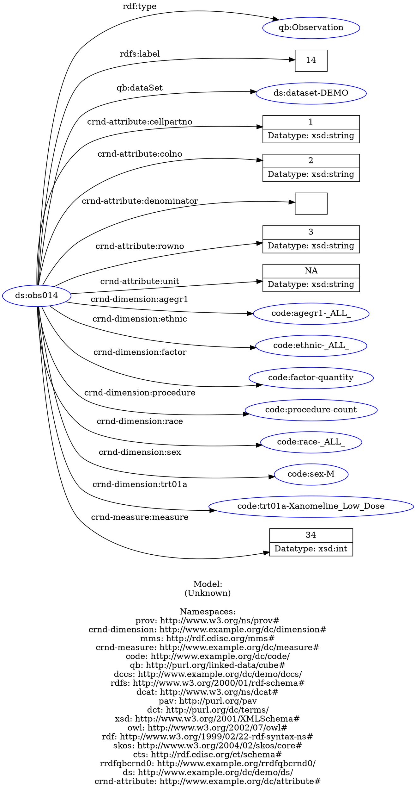

Graphical display of results from SPARQL scripts for the demographics cube (DC-DEMO-sample.ttl)
===============================================================================================

The examples below uses `arq` from Apache Jena (<http://jena.apache.org>). To install arq - download and unpack the latest version of apache-jena from (<http://jena.apache.org/download/index.cgi>). Put the executable `arq` in the path, or invoke `arq` with the full path to the directory with arq.

The use of arq is described many places, see for example (<http://www.learningsparql.com/>).

All `arq` commands below are to be run in the directory with the sample files, which is `inst/extdata/sample-rdf` directory or `extdata/sample-rdf` depending on the whether the development version or the installed version of the package is used.

The cd below in each code block is included because I could not find a quick way to get the code chunk executed in that directory. knitr is flexible enough to do it, I have not yet found the right way to do it. So, ignore the repeated cd ..

Get one observation and display graphically
-------------------------------------------

The SPARQL query returns all triples for one observation, and stores it in the file `fordot.ttl`. The file is used as input to `rapper` and converted to the dot format, and displayed using the `dot` program part of Graphviz (<http://www.graphviz.org/>).

``` bash
cd ../extdata/sample-rdf
arq --data DC-DEMO-sample.ttl --query OneQBobservation.rq > fordot.ttl
cat fordot.ttl
rapper -i turtle -o dot fordot.ttl > fordot.dot
dot -x -Tpdf -ograph.pdf fordot.dot
```

    ## 12:01:30 WARN  riot                 :: [line: 47, col: 37] Bad IRI: <http://www.example.org/dc/code/CODING ERROR- no decode value> Code: 17/WHITESPACE in PATH: A single whitespace character. These match no grammar rules of URIs/IRIs. These characters are permitted in RDF URI References, XML system identifiers, and XML Schema anyURIs.
    ## 12:01:30 WARN  riot                 :: [line: 48, col: 37] Bad IRI: <http://www.example.org/dc/code/CODING ERROR- no decode value> Code: 17/WHITESPACE in PATH: A single whitespace character. These match no grammar rules of URIs/IRIs. These characters are permitted in RDF URI References, XML system identifiers, and XML Schema anyURIs.
    ## 12:01:30 WARN  riot                 :: [line: 49, col: 37] Bad IRI: <http://www.example.org/dc/code/CODING ERROR- no decode value> Code: 17/WHITESPACE in PATH: A single whitespace character. These match no grammar rules of URIs/IRIs. These characters are permitted in RDF URI References, XML system identifiers, and XML Schema anyURIs.
    ## 12:01:30 WARN  riot                 :: [line: 50, col: 37] Bad IRI: <http://www.example.org/dc/code/CODING ERROR- no decode value> Code: 17/WHITESPACE in PATH: A single whitespace character. These match no grammar rules of URIs/IRIs. These characters are permitted in RDF URI References, XML system identifiers, and XML Schema anyURIs.
    ## 12:01:30 WARN  riot                 :: [line: 51, col: 37] Bad IRI: <http://www.example.org/dc/code/CODING ERROR- no decode value> Code: 17/WHITESPACE in PATH: A single whitespace character. These match no grammar rules of URIs/IRIs. These characters are permitted in RDF URI References, XML system identifiers, and XML Schema anyURIs.
    ## 12:01:30 WARN  riot                 :: [line: 52, col: 37] Bad IRI: <http://www.example.org/dc/code/CODING ERROR- no decode value> Code: 17/WHITESPACE in PATH: A single whitespace character. These match no grammar rules of URIs/IRIs. These characters are permitted in RDF URI References, XML system identifiers, and XML Schema anyURIs.
    ## 12:01:30 WARN  riot                 :: [line: 53, col: 37] Bad IRI: <http://www.example.org/dc/code/CODING ERROR- no decode value> Code: 17/WHITESPACE in PATH: A single whitespace character. These match no grammar rules of URIs/IRIs. These characters are permitted in RDF URI References, XML system identifiers, and XML Schema anyURIs.
    ## 12:01:30 WARN  riot                 :: [line: 66, col: 37] Bad IRI: <http://www.example.org/dc/code/CODING ERROR- no decode value> Code: 17/WHITESPACE in PATH: A single whitespace character. These match no grammar rules of URIs/IRIs. These characters are permitted in RDF URI References, XML system identifiers, and XML Schema anyURIs.
    ## 12:01:30 WARN  riot                 :: [line: 67, col: 37] Bad IRI: <http://www.example.org/dc/code/CODING ERROR- no decode value> Code: 17/WHITESPACE in PATH: A single whitespace character. These match no grammar rules of URIs/IRIs. These characters are permitted in RDF URI References, XML system identifiers, and XML Schema anyURIs.
    ## 12:01:30 WARN  riot                 :: [line: 68, col: 37] Bad IRI: <http://www.example.org/dc/code/CODING ERROR- no decode value> Code: 17/WHITESPACE in PATH: A single whitespace character. These match no grammar rules of URIs/IRIs. These characters are permitted in RDF URI References, XML system identifiers, and XML Schema anyURIs.
    ## 12:01:30 WARN  riot                 :: [line: 69, col: 37] Bad IRI: <http://www.example.org/dc/code/CODING ERROR- no decode value> Code: 17/WHITESPACE in PATH: A single whitespace character. These match no grammar rules of URIs/IRIs. These characters are permitted in RDF URI References, XML system identifiers, and XML Schema anyURIs.
    ## 12:01:30 WARN  riot                 :: [line: 70, col: 37] Bad IRI: <http://www.example.org/dc/code/CODING ERROR- no decode value> Code: 17/WHITESPACE in PATH: A single whitespace character. These match no grammar rules of URIs/IRIs. These characters are permitted in RDF URI References, XML system identifiers, and XML Schema anyURIs.
    ## 12:01:30 WARN  riot                 :: [line: 71, col: 37] Bad IRI: <http://www.example.org/dc/code/CODING ERROR- no decode value> Code: 17/WHITESPACE in PATH: A single whitespace character. These match no grammar rules of URIs/IRIs. These characters are permitted in RDF URI References, XML system identifiers, and XML Schema anyURIs.
    ## 12:01:30 WARN  riot                 :: [line: 72, col: 37] Bad IRI: <http://www.example.org/dc/code/CODING ERROR- no decode value> Code: 17/WHITESPACE in PATH: A single whitespace character. These match no grammar rules of URIs/IRIs. These characters are permitted in RDF URI References, XML system identifiers, and XML Schema anyURIs.
    ## 12:01:30 WARN  riot                 :: [line: 94, col: 37] Bad IRI: <http://www.example.org/dc/code/CODING ERROR- no decode value> Code: 17/WHITESPACE in PATH: A single whitespace character. These match no grammar rules of URIs/IRIs. These characters are permitted in RDF URI References, XML system identifiers, and XML Schema anyURIs.
    ## 12:01:30 WARN  riot                 :: [line: 95, col: 37] Bad IRI: <http://www.example.org/dc/code/CODING ERROR- no decode value> Code: 17/WHITESPACE in PATH: A single whitespace character. These match no grammar rules of URIs/IRIs. These characters are permitted in RDF URI References, XML system identifiers, and XML Schema anyURIs.
    ## 12:01:30 WARN  riot                 :: [line: 96, col: 37] Bad IRI: <http://www.example.org/dc/code/CODING ERROR- no decode value> Code: 17/WHITESPACE in PATH: A single whitespace character. These match no grammar rules of URIs/IRIs. These characters are permitted in RDF URI References, XML system identifiers, and XML Schema anyURIs.
    ## 12:01:30 WARN  riot                 :: [line: 97, col: 37] Bad IRI: <http://www.example.org/dc/code/CODING ERROR- no decode value> Code: 17/WHITESPACE in PATH: A single whitespace character. These match no grammar rules of URIs/IRIs. These characters are permitted in RDF URI References, XML system identifiers, and XML Schema anyURIs.
    ## 12:01:30 WARN  riot                 :: [line: 98, col: 37] Bad IRI: <http://www.example.org/dc/code/CODING ERROR- no decode value> Code: 17/WHITESPACE in PATH: A single whitespace character. These match no grammar rules of URIs/IRIs. These characters are permitted in RDF URI References, XML system identifiers, and XML Schema anyURIs.
    ## 12:01:30 WARN  riot                 :: [line: 99, col: 37] Bad IRI: <http://www.example.org/dc/code/CODING ERROR- no decode value> Code: 17/WHITESPACE in PATH: A single whitespace character. These match no grammar rules of URIs/IRIs. These characters are permitted in RDF URI References, XML system identifiers, and XML Schema anyURIs.
    ## 12:01:30 WARN  riot                 :: [line: 100, col: 37] Bad IRI: <http://www.example.org/dc/code/CODING ERROR- no decode value> Code: 17/WHITESPACE in PATH: A single whitespace character. These match no grammar rules of URIs/IRIs. These characters are permitted in RDF URI References, XML system identifiers, and XML Schema anyURIs.
    ## 12:01:30 WARN  riot                 :: [line: 113, col: 37] Bad IRI: <http://www.example.org/dc/code/CODING ERROR- no decode value> Code: 17/WHITESPACE in PATH: A single whitespace character. These match no grammar rules of URIs/IRIs. These characters are permitted in RDF URI References, XML system identifiers, and XML Schema anyURIs.
    ## 12:01:30 WARN  riot                 :: [line: 114, col: 37] Bad IRI: <http://www.example.org/dc/code/CODING ERROR- no decode value> Code: 17/WHITESPACE in PATH: A single whitespace character. These match no grammar rules of URIs/IRIs. These characters are permitted in RDF URI References, XML system identifiers, and XML Schema anyURIs.
    ## 12:01:30 WARN  riot                 :: [line: 115, col: 37] Bad IRI: <http://www.example.org/dc/code/CODING ERROR- no decode value> Code: 17/WHITESPACE in PATH: A single whitespace character. These match no grammar rules of URIs/IRIs. These characters are permitted in RDF URI References, XML system identifiers, and XML Schema anyURIs.
    ## 12:01:30 WARN  riot                 :: [line: 116, col: 37] Bad IRI: <http://www.example.org/dc/code/CODING ERROR- no decode value> Code: 17/WHITESPACE in PATH: A single whitespace character. These match no grammar rules of URIs/IRIs. These characters are permitted in RDF URI References, XML system identifiers, and XML Schema anyURIs.
    ## 12:01:30 WARN  riot                 :: [line: 117, col: 37] Bad IRI: <http://www.example.org/dc/code/CODING ERROR- no decode value> Code: 17/WHITESPACE in PATH: A single whitespace character. These match no grammar rules of URIs/IRIs. These characters are permitted in RDF URI References, XML system identifiers, and XML Schema anyURIs.
    ## 12:01:30 WARN  riot                 :: [line: 118, col: 37] Bad IRI: <http://www.example.org/dc/code/CODING ERROR- no decode value> Code: 17/WHITESPACE in PATH: A single whitespace character. These match no grammar rules of URIs/IRIs. These characters are permitted in RDF URI References, XML system identifiers, and XML Schema anyURIs.
    ## 12:01:30 WARN  riot                 :: [line: 119, col: 37] Bad IRI: <http://www.example.org/dc/code/CODING ERROR- no decode value> Code: 17/WHITESPACE in PATH: A single whitespace character. These match no grammar rules of URIs/IRIs. These characters are permitted in RDF URI References, XML system identifiers, and XML Schema anyURIs.
    ## 12:01:30 WARN  riot                 :: [line: 132, col: 37] Bad IRI: <http://www.example.org/dc/code/CODING ERROR- no decode value> Code: 17/WHITESPACE in PATH: A single whitespace character. These match no grammar rules of URIs/IRIs. These characters are permitted in RDF URI References, XML system identifiers, and XML Schema anyURIs.
    ## 12:01:30 WARN  riot                 :: [line: 133, col: 37] Bad IRI: <http://www.example.org/dc/code/CODING ERROR- no decode value> Code: 17/WHITESPACE in PATH: A single whitespace character. These match no grammar rules of URIs/IRIs. These characters are permitted in RDF URI References, XML system identifiers, and XML Schema anyURIs.
    ## 12:01:30 WARN  riot                 :: [line: 134, col: 37] Bad IRI: <http://www.example.org/dc/code/CODING ERROR- no decode value> Code: 17/WHITESPACE in PATH: A single whitespace character. These match no grammar rules of URIs/IRIs. These characters are permitted in RDF URI References, XML system identifiers, and XML Schema anyURIs.
    ## 12:01:30 WARN  riot                 :: [line: 135, col: 37] Bad IRI: <http://www.example.org/dc/code/CODING ERROR- no decode value> Code: 17/WHITESPACE in PATH: A single whitespace character. These match no grammar rules of URIs/IRIs. These characters are permitted in RDF URI References, XML system identifiers, and XML Schema anyURIs.
    ## 12:01:30 WARN  riot                 :: [line: 136, col: 37] Bad IRI: <http://www.example.org/dc/code/CODING ERROR- no decode value> Code: 17/WHITESPACE in PATH: A single whitespace character. These match no grammar rules of URIs/IRIs. These characters are permitted in RDF URI References, XML system identifiers, and XML Schema anyURIs.
    ## 12:01:30 WARN  riot                 :: [line: 137, col: 37] Bad IRI: <http://www.example.org/dc/code/CODING ERROR- no decode value> Code: 17/WHITESPACE in PATH: A single whitespace character. These match no grammar rules of URIs/IRIs. These characters are permitted in RDF URI References, XML system identifiers, and XML Schema anyURIs.
    ## 12:01:30 WARN  riot                 :: [line: 138, col: 37] Bad IRI: <http://www.example.org/dc/code/CODING ERROR- no decode value> Code: 17/WHITESPACE in PATH: A single whitespace character. These match no grammar rules of URIs/IRIs. These characters are permitted in RDF URI References, XML system identifiers, and XML Schema anyURIs.
    ## 12:01:30 WARN  riot                 :: [line: 176, col: 37] Bad IRI: <http://www.example.org/dc/code/CODING ERROR- no decode value> Code: 17/WHITESPACE in PATH: A single whitespace character. These match no grammar rules of URIs/IRIs. These characters are permitted in RDF URI References, XML system identifiers, and XML Schema anyURIs.
    ## 12:01:30 WARN  riot                 :: [line: 177, col: 37] Bad IRI: <http://www.example.org/dc/code/CODING ERROR- no decode value> Code: 17/WHITESPACE in PATH: A single whitespace character. These match no grammar rules of URIs/IRIs. These characters are permitted in RDF URI References, XML system identifiers, and XML Schema anyURIs.
    ## 12:01:30 WARN  riot                 :: [line: 178, col: 37] Bad IRI: <http://www.example.org/dc/code/CODING ERROR- no decode value> Code: 17/WHITESPACE in PATH: A single whitespace character. These match no grammar rules of URIs/IRIs. These characters are permitted in RDF URI References, XML system identifiers, and XML Schema anyURIs.
    ## 12:01:30 WARN  riot                 :: [line: 179, col: 37] Bad IRI: <http://www.example.org/dc/code/CODING ERROR- no decode value> Code: 17/WHITESPACE in PATH: A single whitespace character. These match no grammar rules of URIs/IRIs. These characters are permitted in RDF URI References, XML system identifiers, and XML Schema anyURIs.
    ## 12:01:30 WARN  riot                 :: [line: 180, col: 37] Bad IRI: <http://www.example.org/dc/code/CODING ERROR- no decode value> Code: 17/WHITESPACE in PATH: A single whitespace character. These match no grammar rules of URIs/IRIs. These characters are permitted in RDF URI References, XML system identifiers, and XML Schema anyURIs.
    ## 12:01:30 WARN  riot                 :: [line: 181, col: 37] Bad IRI: <http://www.example.org/dc/code/CODING ERROR- no decode value> Code: 17/WHITESPACE in PATH: A single whitespace character. These match no grammar rules of URIs/IRIs. These characters are permitted in RDF URI References, XML system identifiers, and XML Schema anyURIs.
    ## 12:01:30 WARN  riot                 :: [line: 182, col: 37] Bad IRI: <http://www.example.org/dc/code/CODING ERROR- no decode value> Code: 17/WHITESPACE in PATH: A single whitespace character. These match no grammar rules of URIs/IRIs. These characters are permitted in RDF URI References, XML system identifiers, and XML Schema anyURIs.
    ## 12:01:30 WARN  riot                 :: [line: 195, col: 37] Bad IRI: <http://www.example.org/dc/code/CODING ERROR- no decode value> Code: 17/WHITESPACE in PATH: A single whitespace character. These match no grammar rules of URIs/IRIs. These characters are permitted in RDF URI References, XML system identifiers, and XML Schema anyURIs.
    ## 12:01:30 WARN  riot                 :: [line: 196, col: 37] Bad IRI: <http://www.example.org/dc/code/CODING ERROR- no decode value> Code: 17/WHITESPACE in PATH: A single whitespace character. These match no grammar rules of URIs/IRIs. These characters are permitted in RDF URI References, XML system identifiers, and XML Schema anyURIs.
    ## 12:01:30 WARN  riot                 :: [line: 197, col: 37] Bad IRI: <http://www.example.org/dc/code/CODING ERROR- no decode value> Code: 17/WHITESPACE in PATH: A single whitespace character. These match no grammar rules of URIs/IRIs. These characters are permitted in RDF URI References, XML system identifiers, and XML Schema anyURIs.
    ## 12:01:30 WARN  riot                 :: [line: 198, col: 37] Bad IRI: <http://www.example.org/dc/code/CODING ERROR- no decode value> Code: 17/WHITESPACE in PATH: A single whitespace character. These match no grammar rules of URIs/IRIs. These characters are permitted in RDF URI References, XML system identifiers, and XML Schema anyURIs.
    ## 12:01:30 WARN  riot                 :: [line: 199, col: 37] Bad IRI: <http://www.example.org/dc/code/CODING ERROR- no decode value> Code: 17/WHITESPACE in PATH: A single whitespace character. These match no grammar rules of URIs/IRIs. These characters are permitted in RDF URI References, XML system identifiers, and XML Schema anyURIs.
    ## 12:01:30 WARN  riot                 :: [line: 200, col: 37] Bad IRI: <http://www.example.org/dc/code/CODING ERROR- no decode value> Code: 17/WHITESPACE in PATH: A single whitespace character. These match no grammar rules of URIs/IRIs. These characters are permitted in RDF URI References, XML system identifiers, and XML Schema anyURIs.
    ## 12:01:30 WARN  riot                 :: [line: 201, col: 37] Bad IRI: <http://www.example.org/dc/code/CODING ERROR- no decode value> Code: 17/WHITESPACE in PATH: A single whitespace character. These match no grammar rules of URIs/IRIs. These characters are permitted in RDF URI References, XML system identifiers, and XML Schema anyURIs.
    ## 12:01:30 WARN  riot                 :: [line: 223, col: 37] Bad IRI: <http://www.example.org/dc/code/CODING ERROR- no decode value> Code: 17/WHITESPACE in PATH: A single whitespace character. These match no grammar rules of URIs/IRIs. These characters are permitted in RDF URI References, XML system identifiers, and XML Schema anyURIs.
    ## 12:01:30 WARN  riot                 :: [line: 224, col: 37] Bad IRI: <http://www.example.org/dc/code/CODING ERROR- no decode value> Code: 17/WHITESPACE in PATH: A single whitespace character. These match no grammar rules of URIs/IRIs. These characters are permitted in RDF URI References, XML system identifiers, and XML Schema anyURIs.
    ## 12:01:30 WARN  riot                 :: [line: 225, col: 37] Bad IRI: <http://www.example.org/dc/code/CODING ERROR- no decode value> Code: 17/WHITESPACE in PATH: A single whitespace character. These match no grammar rules of URIs/IRIs. These characters are permitted in RDF URI References, XML system identifiers, and XML Schema anyURIs.
    ## 12:01:30 WARN  riot                 :: [line: 226, col: 37] Bad IRI: <http://www.example.org/dc/code/CODING ERROR- no decode value> Code: 17/WHITESPACE in PATH: A single whitespace character. These match no grammar rules of URIs/IRIs. These characters are permitted in RDF URI References, XML system identifiers, and XML Schema anyURIs.
    ## 12:01:30 WARN  riot                 :: [line: 227, col: 37] Bad IRI: <http://www.example.org/dc/code/CODING ERROR- no decode value> Code: 17/WHITESPACE in PATH: A single whitespace character. These match no grammar rules of URIs/IRIs. These characters are permitted in RDF URI References, XML system identifiers, and XML Schema anyURIs.
    ## 12:01:30 WARN  riot                 :: [line: 228, col: 37] Bad IRI: <http://www.example.org/dc/code/CODING ERROR- no decode value> Code: 17/WHITESPACE in PATH: A single whitespace character. These match no grammar rules of URIs/IRIs. These characters are permitted in RDF URI References, XML system identifiers, and XML Schema anyURIs.
    ## 12:01:30 WARN  riot                 :: [line: 229, col: 37] Bad IRI: <http://www.example.org/dc/code/CODING ERROR- no decode value> Code: 17/WHITESPACE in PATH: A single whitespace character. These match no grammar rules of URIs/IRIs. These characters are permitted in RDF URI References, XML system identifiers, and XML Schema anyURIs.
    ## 12:01:30 WARN  riot                 :: [line: 242, col: 37] Bad IRI: <http://www.example.org/dc/code/CODING ERROR- no decode value> Code: 17/WHITESPACE in PATH: A single whitespace character. These match no grammar rules of URIs/IRIs. These characters are permitted in RDF URI References, XML system identifiers, and XML Schema anyURIs.
    ## 12:01:30 WARN  riot                 :: [line: 243, col: 37] Bad IRI: <http://www.example.org/dc/code/CODING ERROR- no decode value> Code: 17/WHITESPACE in PATH: A single whitespace character. These match no grammar rules of URIs/IRIs. These characters are permitted in RDF URI References, XML system identifiers, and XML Schema anyURIs.
    ## 12:01:30 WARN  riot                 :: [line: 244, col: 37] Bad IRI: <http://www.example.org/dc/code/CODING ERROR- no decode value> Code: 17/WHITESPACE in PATH: A single whitespace character. These match no grammar rules of URIs/IRIs. These characters are permitted in RDF URI References, XML system identifiers, and XML Schema anyURIs.
    ## 12:01:30 WARN  riot                 :: [line: 245, col: 37] Bad IRI: <http://www.example.org/dc/code/CODING ERROR- no decode value> Code: 17/WHITESPACE in PATH: A single whitespace character. These match no grammar rules of URIs/IRIs. These characters are permitted in RDF URI References, XML system identifiers, and XML Schema anyURIs.
    ## 12:01:30 WARN  riot                 :: [line: 246, col: 37] Bad IRI: <http://www.example.org/dc/code/CODING ERROR- no decode value> Code: 17/WHITESPACE in PATH: A single whitespace character. These match no grammar rules of URIs/IRIs. These characters are permitted in RDF URI References, XML system identifiers, and XML Schema anyURIs.
    ## 12:01:30 WARN  riot                 :: [line: 247, col: 37] Bad IRI: <http://www.example.org/dc/code/CODING ERROR- no decode value> Code: 17/WHITESPACE in PATH: A single whitespace character. These match no grammar rules of URIs/IRIs. These characters are permitted in RDF URI References, XML system identifiers, and XML Schema anyURIs.
    ## 12:01:30 WARN  riot                 :: [line: 248, col: 37] Bad IRI: <http://www.example.org/dc/code/CODING ERROR- no decode value> Code: 17/WHITESPACE in PATH: A single whitespace character. These match no grammar rules of URIs/IRIs. These characters are permitted in RDF URI References, XML system identifiers, and XML Schema anyURIs.
    ## 12:01:30 WARN  riot                 :: [line: 271, col: 37] Bad IRI: <http://www.example.org/dc/code/CODING ERROR- no decode value> Code: 17/WHITESPACE in PATH: A single whitespace character. These match no grammar rules of URIs/IRIs. These characters are permitted in RDF URI References, XML system identifiers, and XML Schema anyURIs.
    ## 12:01:30 WARN  riot                 :: [line: 272, col: 37] Bad IRI: <http://www.example.org/dc/code/CODING ERROR- no decode value> Code: 17/WHITESPACE in PATH: A single whitespace character. These match no grammar rules of URIs/IRIs. These characters are permitted in RDF URI References, XML system identifiers, and XML Schema anyURIs.
    ## 12:01:30 WARN  riot                 :: [line: 273, col: 37] Bad IRI: <http://www.example.org/dc/code/CODING ERROR- no decode value> Code: 17/WHITESPACE in PATH: A single whitespace character. These match no grammar rules of URIs/IRIs. These characters are permitted in RDF URI References, XML system identifiers, and XML Schema anyURIs.
    ## 12:01:30 WARN  riot                 :: [line: 274, col: 37] Bad IRI: <http://www.example.org/dc/code/CODING ERROR- no decode value> Code: 17/WHITESPACE in PATH: A single whitespace character. These match no grammar rules of URIs/IRIs. These characters are permitted in RDF URI References, XML system identifiers, and XML Schema anyURIs.
    ## 12:01:30 WARN  riot                 :: [line: 275, col: 37] Bad IRI: <http://www.example.org/dc/code/CODING ERROR- no decode value> Code: 17/WHITESPACE in PATH: A single whitespace character. These match no grammar rules of URIs/IRIs. These characters are permitted in RDF URI References, XML system identifiers, and XML Schema anyURIs.
    ## 12:01:30 WARN  riot                 :: [line: 276, col: 37] Bad IRI: <http://www.example.org/dc/code/CODING ERROR- no decode value> Code: 17/WHITESPACE in PATH: A single whitespace character. These match no grammar rules of URIs/IRIs. These characters are permitted in RDF URI References, XML system identifiers, and XML Schema anyURIs.
    ## 12:01:30 WARN  riot                 :: [line: 277, col: 37] Bad IRI: <http://www.example.org/dc/code/CODING ERROR- no decode value> Code: 17/WHITESPACE in PATH: A single whitespace character. These match no grammar rules of URIs/IRIs. These characters are permitted in RDF URI References, XML system identifiers, and XML Schema anyURIs.
    ## 12:01:30 WARN  riot                 :: [line: 304, col: 37] Bad IRI: <http://www.example.org/dc/code/CODING ERROR- no decode value> Code: 17/WHITESPACE in PATH: A single whitespace character. These match no grammar rules of URIs/IRIs. These characters are permitted in RDF URI References, XML system identifiers, and XML Schema anyURIs.
    ## 12:01:30 WARN  riot                 :: [line: 305, col: 37] Bad IRI: <http://www.example.org/dc/code/CODING ERROR- no decode value> Code: 17/WHITESPACE in PATH: A single whitespace character. These match no grammar rules of URIs/IRIs. These characters are permitted in RDF URI References, XML system identifiers, and XML Schema anyURIs.
    ## 12:01:30 WARN  riot                 :: [line: 306, col: 37] Bad IRI: <http://www.example.org/dc/code/CODING ERROR- no decode value> Code: 17/WHITESPACE in PATH: A single whitespace character. These match no grammar rules of URIs/IRIs. These characters are permitted in RDF URI References, XML system identifiers, and XML Schema anyURIs.
    ## 12:01:30 WARN  riot                 :: [line: 307, col: 37] Bad IRI: <http://www.example.org/dc/code/CODING ERROR- no decode value> Code: 17/WHITESPACE in PATH: A single whitespace character. These match no grammar rules of URIs/IRIs. These characters are permitted in RDF URI References, XML system identifiers, and XML Schema anyURIs.
    ## 12:01:30 WARN  riot                 :: [line: 308, col: 37] Bad IRI: <http://www.example.org/dc/code/CODING ERROR- no decode value> Code: 17/WHITESPACE in PATH: A single whitespace character. These match no grammar rules of URIs/IRIs. These characters are permitted in RDF URI References, XML system identifiers, and XML Schema anyURIs.
    ## 12:01:30 WARN  riot                 :: [line: 309, col: 37] Bad IRI: <http://www.example.org/dc/code/CODING ERROR- no decode value> Code: 17/WHITESPACE in PATH: A single whitespace character. These match no grammar rules of URIs/IRIs. These characters are permitted in RDF URI References, XML system identifiers, and XML Schema anyURIs.
    ## 12:01:30 WARN  riot                 :: [line: 310, col: 37] Bad IRI: <http://www.example.org/dc/code/CODING ERROR- no decode value> Code: 17/WHITESPACE in PATH: A single whitespace character. These match no grammar rules of URIs/IRIs. These characters are permitted in RDF URI References, XML system identifiers, and XML Schema anyURIs.
    ## 12:01:30 WARN  riot                 :: [line: 323, col: 37] Bad IRI: <http://www.example.org/dc/code/CODING ERROR- no decode value> Code: 17/WHITESPACE in PATH: A single whitespace character. These match no grammar rules of URIs/IRIs. These characters are permitted in RDF URI References, XML system identifiers, and XML Schema anyURIs.
    ## 12:01:30 WARN  riot                 :: [line: 324, col: 37] Bad IRI: <http://www.example.org/dc/code/CODING ERROR- no decode value> Code: 17/WHITESPACE in PATH: A single whitespace character. These match no grammar rules of URIs/IRIs. These characters are permitted in RDF URI References, XML system identifiers, and XML Schema anyURIs.
    ## 12:01:30 WARN  riot                 :: [line: 325, col: 37] Bad IRI: <http://www.example.org/dc/code/CODING ERROR- no decode value> Code: 17/WHITESPACE in PATH: A single whitespace character. These match no grammar rules of URIs/IRIs. These characters are permitted in RDF URI References, XML system identifiers, and XML Schema anyURIs.
    ## 12:01:30 WARN  riot                 :: [line: 326, col: 37] Bad IRI: <http://www.example.org/dc/code/CODING ERROR- no decode value> Code: 17/WHITESPACE in PATH: A single whitespace character. These match no grammar rules of URIs/IRIs. These characters are permitted in RDF URI References, XML system identifiers, and XML Schema anyURIs.
    ## 12:01:30 WARN  riot                 :: [line: 327, col: 37] Bad IRI: <http://www.example.org/dc/code/CODING ERROR- no decode value> Code: 17/WHITESPACE in PATH: A single whitespace character. These match no grammar rules of URIs/IRIs. These characters are permitted in RDF URI References, XML system identifiers, and XML Schema anyURIs.
    ## 12:01:30 WARN  riot                 :: [line: 328, col: 37] Bad IRI: <http://www.example.org/dc/code/CODING ERROR- no decode value> Code: 17/WHITESPACE in PATH: A single whitespace character. These match no grammar rules of URIs/IRIs. These characters are permitted in RDF URI References, XML system identifiers, and XML Schema anyURIs.
    ## 12:01:30 WARN  riot                 :: [line: 329, col: 37] Bad IRI: <http://www.example.org/dc/code/CODING ERROR- no decode value> Code: 17/WHITESPACE in PATH: A single whitespace character. These match no grammar rules of URIs/IRIs. These characters are permitted in RDF URI References, XML system identifiers, and XML Schema anyURIs.
    ## 12:01:30 WARN  riot                 :: [line: 351, col: 37] Bad IRI: <http://www.example.org/dc/code/CODING ERROR- no decode value> Code: 17/WHITESPACE in PATH: A single whitespace character. These match no grammar rules of URIs/IRIs. These characters are permitted in RDF URI References, XML system identifiers, and XML Schema anyURIs.
    ## 12:01:30 WARN  riot                 :: [line: 352, col: 37] Bad IRI: <http://www.example.org/dc/code/CODING ERROR- no decode value> Code: 17/WHITESPACE in PATH: A single whitespace character. These match no grammar rules of URIs/IRIs. These characters are permitted in RDF URI References, XML system identifiers, and XML Schema anyURIs.
    ## 12:01:30 WARN  riot                 :: [line: 353, col: 37] Bad IRI: <http://www.example.org/dc/code/CODING ERROR- no decode value> Code: 17/WHITESPACE in PATH: A single whitespace character. These match no grammar rules of URIs/IRIs. These characters are permitted in RDF URI References, XML system identifiers, and XML Schema anyURIs.
    ## 12:01:30 WARN  riot                 :: [line: 354, col: 37] Bad IRI: <http://www.example.org/dc/code/CODING ERROR- no decode value> Code: 17/WHITESPACE in PATH: A single whitespace character. These match no grammar rules of URIs/IRIs. These characters are permitted in RDF URI References, XML system identifiers, and XML Schema anyURIs.
    ## 12:01:30 WARN  riot                 :: [line: 355, col: 37] Bad IRI: <http://www.example.org/dc/code/CODING ERROR- no decode value> Code: 17/WHITESPACE in PATH: A single whitespace character. These match no grammar rules of URIs/IRIs. These characters are permitted in RDF URI References, XML system identifiers, and XML Schema anyURIs.
    ## 12:01:30 WARN  riot                 :: [line: 356, col: 37] Bad IRI: <http://www.example.org/dc/code/CODING ERROR- no decode value> Code: 17/WHITESPACE in PATH: A single whitespace character. These match no grammar rules of URIs/IRIs. These characters are permitted in RDF URI References, XML system identifiers, and XML Schema anyURIs.
    ## 12:01:30 WARN  riot                 :: [line: 357, col: 37] Bad IRI: <http://www.example.org/dc/code/CODING ERROR- no decode value> Code: 17/WHITESPACE in PATH: A single whitespace character. These match no grammar rules of URIs/IRIs. These characters are permitted in RDF URI References, XML system identifiers, and XML Schema anyURIs.
    ## 12:01:30 WARN  riot                 :: [line: 373, col: 37] Bad IRI: <http://www.example.org/dc/code/CODING ERROR- no decode value> Code: 17/WHITESPACE in PATH: A single whitespace character. These match no grammar rules of URIs/IRIs. These characters are permitted in RDF URI References, XML system identifiers, and XML Schema anyURIs.
    ## 12:01:30 WARN  riot                 :: [line: 374, col: 37] Bad IRI: <http://www.example.org/dc/code/CODING ERROR- no decode value> Code: 17/WHITESPACE in PATH: A single whitespace character. These match no grammar rules of URIs/IRIs. These characters are permitted in RDF URI References, XML system identifiers, and XML Schema anyURIs.
    ## 12:01:30 WARN  riot                 :: [line: 375, col: 37] Bad IRI: <http://www.example.org/dc/code/CODING ERROR- no decode value> Code: 17/WHITESPACE in PATH: A single whitespace character. These match no grammar rules of URIs/IRIs. These characters are permitted in RDF URI References, XML system identifiers, and XML Schema anyURIs.
    ## 12:01:30 WARN  riot                 :: [line: 376, col: 37] Bad IRI: <http://www.example.org/dc/code/CODING ERROR- no decode value> Code: 17/WHITESPACE in PATH: A single whitespace character. These match no grammar rules of URIs/IRIs. These characters are permitted in RDF URI References, XML system identifiers, and XML Schema anyURIs.
    ## 12:01:30 WARN  riot                 :: [line: 377, col: 37] Bad IRI: <http://www.example.org/dc/code/CODING ERROR- no decode value> Code: 17/WHITESPACE in PATH: A single whitespace character. These match no grammar rules of URIs/IRIs. These characters are permitted in RDF URI References, XML system identifiers, and XML Schema anyURIs.
    ## 12:01:30 WARN  riot                 :: [line: 378, col: 37] Bad IRI: <http://www.example.org/dc/code/CODING ERROR- no decode value> Code: 17/WHITESPACE in PATH: A single whitespace character. These match no grammar rules of URIs/IRIs. These characters are permitted in RDF URI References, XML system identifiers, and XML Schema anyURIs.
    ## 12:01:30 WARN  riot                 :: [line: 379, col: 37] Bad IRI: <http://www.example.org/dc/code/CODING ERROR- no decode value> Code: 17/WHITESPACE in PATH: A single whitespace character. These match no grammar rules of URIs/IRIs. These characters are permitted in RDF URI References, XML system identifiers, and XML Schema anyURIs.
    ## 12:01:30 WARN  riot                 :: [line: 392, col: 37] Bad IRI: <http://www.example.org/dc/code/CODING ERROR- no decode value> Code: 17/WHITESPACE in PATH: A single whitespace character. These match no grammar rules of URIs/IRIs. These characters are permitted in RDF URI References, XML system identifiers, and XML Schema anyURIs.
    ## 12:01:30 WARN  riot                 :: [line: 393, col: 37] Bad IRI: <http://www.example.org/dc/code/CODING ERROR- no decode value> Code: 17/WHITESPACE in PATH: A single whitespace character. These match no grammar rules of URIs/IRIs. These characters are permitted in RDF URI References, XML system identifiers, and XML Schema anyURIs.
    ## 12:01:30 WARN  riot                 :: [line: 394, col: 37] Bad IRI: <http://www.example.org/dc/code/CODING ERROR- no decode value> Code: 17/WHITESPACE in PATH: A single whitespace character. These match no grammar rules of URIs/IRIs. These characters are permitted in RDF URI References, XML system identifiers, and XML Schema anyURIs.
    ## 12:01:30 WARN  riot                 :: [line: 395, col: 37] Bad IRI: <http://www.example.org/dc/code/CODING ERROR- no decode value> Code: 17/WHITESPACE in PATH: A single whitespace character. These match no grammar rules of URIs/IRIs. These characters are permitted in RDF URI References, XML system identifiers, and XML Schema anyURIs.
    ## 12:01:30 WARN  riot                 :: [line: 396, col: 37] Bad IRI: <http://www.example.org/dc/code/CODING ERROR- no decode value> Code: 17/WHITESPACE in PATH: A single whitespace character. These match no grammar rules of URIs/IRIs. These characters are permitted in RDF URI References, XML system identifiers, and XML Schema anyURIs.
    ## 12:01:30 WARN  riot                 :: [line: 397, col: 37] Bad IRI: <http://www.example.org/dc/code/CODING ERROR- no decode value> Code: 17/WHITESPACE in PATH: A single whitespace character. These match no grammar rules of URIs/IRIs. These characters are permitted in RDF URI References, XML system identifiers, and XML Schema anyURIs.
    ## 12:01:30 WARN  riot                 :: [line: 398, col: 37] Bad IRI: <http://www.example.org/dc/code/CODING ERROR- no decode value> Code: 17/WHITESPACE in PATH: A single whitespace character. These match no grammar rules of URIs/IRIs. These characters are permitted in RDF URI References, XML system identifiers, and XML Schema anyURIs.
    ## 12:01:30 WARN  riot                 :: [line: 411, col: 37] Bad IRI: <http://www.example.org/dc/code/CODING ERROR- no decode value> Code: 17/WHITESPACE in PATH: A single whitespace character. These match no grammar rules of URIs/IRIs. These characters are permitted in RDF URI References, XML system identifiers, and XML Schema anyURIs.
    ## 12:01:30 WARN  riot                 :: [line: 412, col: 37] Bad IRI: <http://www.example.org/dc/code/CODING ERROR- no decode value> Code: 17/WHITESPACE in PATH: A single whitespace character. These match no grammar rules of URIs/IRIs. These characters are permitted in RDF URI References, XML system identifiers, and XML Schema anyURIs.
    ## 12:01:30 WARN  riot                 :: [line: 413, col: 37] Bad IRI: <http://www.example.org/dc/code/CODING ERROR- no decode value> Code: 17/WHITESPACE in PATH: A single whitespace character. These match no grammar rules of URIs/IRIs. These characters are permitted in RDF URI References, XML system identifiers, and XML Schema anyURIs.
    ## 12:01:30 WARN  riot                 :: [line: 414, col: 37] Bad IRI: <http://www.example.org/dc/code/CODING ERROR- no decode value> Code: 17/WHITESPACE in PATH: A single whitespace character. These match no grammar rules of URIs/IRIs. These characters are permitted in RDF URI References, XML system identifiers, and XML Schema anyURIs.
    ## 12:01:30 WARN  riot                 :: [line: 415, col: 37] Bad IRI: <http://www.example.org/dc/code/CODING ERROR- no decode value> Code: 17/WHITESPACE in PATH: A single whitespace character. These match no grammar rules of URIs/IRIs. These characters are permitted in RDF URI References, XML system identifiers, and XML Schema anyURIs.
    ## 12:01:30 WARN  riot                 :: [line: 416, col: 37] Bad IRI: <http://www.example.org/dc/code/CODING ERROR- no decode value> Code: 17/WHITESPACE in PATH: A single whitespace character. These match no grammar rules of URIs/IRIs. These characters are permitted in RDF URI References, XML system identifiers, and XML Schema anyURIs.
    ## 12:01:30 WARN  riot                 :: [line: 417, col: 37] Bad IRI: <http://www.example.org/dc/code/CODING ERROR- no decode value> Code: 17/WHITESPACE in PATH: A single whitespace character. These match no grammar rules of URIs/IRIs. These characters are permitted in RDF URI References, XML system identifiers, and XML Schema anyURIs.
    ## 12:01:30 WARN  riot                 :: [line: 430, col: 37] Bad IRI: <http://www.example.org/dc/code/CODING ERROR- no decode value> Code: 17/WHITESPACE in PATH: A single whitespace character. These match no grammar rules of URIs/IRIs. These characters are permitted in RDF URI References, XML system identifiers, and XML Schema anyURIs.
    ## 12:01:30 WARN  riot                 :: [line: 431, col: 37] Bad IRI: <http://www.example.org/dc/code/CODING ERROR- no decode value> Code: 17/WHITESPACE in PATH: A single whitespace character. These match no grammar rules of URIs/IRIs. These characters are permitted in RDF URI References, XML system identifiers, and XML Schema anyURIs.
    ## 12:01:30 WARN  riot                 :: [line: 432, col: 37] Bad IRI: <http://www.example.org/dc/code/CODING ERROR- no decode value> Code: 17/WHITESPACE in PATH: A single whitespace character. These match no grammar rules of URIs/IRIs. These characters are permitted in RDF URI References, XML system identifiers, and XML Schema anyURIs.
    ## 12:01:30 WARN  riot                 :: [line: 433, col: 37] Bad IRI: <http://www.example.org/dc/code/CODING ERROR- no decode value> Code: 17/WHITESPACE in PATH: A single whitespace character. These match no grammar rules of URIs/IRIs. These characters are permitted in RDF URI References, XML system identifiers, and XML Schema anyURIs.
    ## 12:01:30 WARN  riot                 :: [line: 434, col: 37] Bad IRI: <http://www.example.org/dc/code/CODING ERROR- no decode value> Code: 17/WHITESPACE in PATH: A single whitespace character. These match no grammar rules of URIs/IRIs. These characters are permitted in RDF URI References, XML system identifiers, and XML Schema anyURIs.
    ## 12:01:30 WARN  riot                 :: [line: 435, col: 37] Bad IRI: <http://www.example.org/dc/code/CODING ERROR- no decode value> Code: 17/WHITESPACE in PATH: A single whitespace character. These match no grammar rules of URIs/IRIs. These characters are permitted in RDF URI References, XML system identifiers, and XML Schema anyURIs.
    ## 12:01:30 WARN  riot                 :: [line: 436, col: 37] Bad IRI: <http://www.example.org/dc/code/CODING ERROR- no decode value> Code: 17/WHITESPACE in PATH: A single whitespace character. These match no grammar rules of URIs/IRIs. These characters are permitted in RDF URI References, XML system identifiers, and XML Schema anyURIs.
    ## 12:01:30 WARN  riot                 :: [line: 449, col: 37] Bad IRI: <http://www.example.org/dc/code/CODING ERROR- no decode value> Code: 17/WHITESPACE in PATH: A single whitespace character. These match no grammar rules of URIs/IRIs. These characters are permitted in RDF URI References, XML system identifiers, and XML Schema anyURIs.
    ## 12:01:30 WARN  riot                 :: [line: 450, col: 37] Bad IRI: <http://www.example.org/dc/code/CODING ERROR- no decode value> Code: 17/WHITESPACE in PATH: A single whitespace character. These match no grammar rules of URIs/IRIs. These characters are permitted in RDF URI References, XML system identifiers, and XML Schema anyURIs.
    ## 12:01:30 WARN  riot                 :: [line: 451, col: 37] Bad IRI: <http://www.example.org/dc/code/CODING ERROR- no decode value> Code: 17/WHITESPACE in PATH: A single whitespace character. These match no grammar rules of URIs/IRIs. These characters are permitted in RDF URI References, XML system identifiers, and XML Schema anyURIs.
    ## 12:01:30 WARN  riot                 :: [line: 452, col: 37] Bad IRI: <http://www.example.org/dc/code/CODING ERROR- no decode value> Code: 17/WHITESPACE in PATH: A single whitespace character. These match no grammar rules of URIs/IRIs. These characters are permitted in RDF URI References, XML system identifiers, and XML Schema anyURIs.
    ## 12:01:30 WARN  riot                 :: [line: 453, col: 37] Bad IRI: <http://www.example.org/dc/code/CODING ERROR- no decode value> Code: 17/WHITESPACE in PATH: A single whitespace character. These match no grammar rules of URIs/IRIs. These characters are permitted in RDF URI References, XML system identifiers, and XML Schema anyURIs.
    ## 12:01:30 WARN  riot                 :: [line: 454, col: 37] Bad IRI: <http://www.example.org/dc/code/CODING ERROR- no decode value> Code: 17/WHITESPACE in PATH: A single whitespace character. These match no grammar rules of URIs/IRIs. These characters are permitted in RDF URI References, XML system identifiers, and XML Schema anyURIs.
    ## 12:01:30 WARN  riot                 :: [line: 455, col: 37] Bad IRI: <http://www.example.org/dc/code/CODING ERROR- no decode value> Code: 17/WHITESPACE in PATH: A single whitespace character. These match no grammar rules of URIs/IRIs. These characters are permitted in RDF URI References, XML system identifiers, and XML Schema anyURIs.
    ## 12:01:30 WARN  riot                 :: [line: 481, col: 37] Bad IRI: <http://www.example.org/dc/code/CODING ERROR- no decode value> Code: 17/WHITESPACE in PATH: A single whitespace character. These match no grammar rules of URIs/IRIs. These characters are permitted in RDF URI References, XML system identifiers, and XML Schema anyURIs.
    ## 12:01:30 WARN  riot                 :: [line: 482, col: 37] Bad IRI: <http://www.example.org/dc/code/CODING ERROR- no decode value> Code: 17/WHITESPACE in PATH: A single whitespace character. These match no grammar rules of URIs/IRIs. These characters are permitted in RDF URI References, XML system identifiers, and XML Schema anyURIs.
    ## 12:01:30 WARN  riot                 :: [line: 483, col: 37] Bad IRI: <http://www.example.org/dc/code/CODING ERROR- no decode value> Code: 17/WHITESPACE in PATH: A single whitespace character. These match no grammar rules of URIs/IRIs. These characters are permitted in RDF URI References, XML system identifiers, and XML Schema anyURIs.
    ## 12:01:30 WARN  riot                 :: [line: 484, col: 37] Bad IRI: <http://www.example.org/dc/code/CODING ERROR- no decode value> Code: 17/WHITESPACE in PATH: A single whitespace character. These match no grammar rules of URIs/IRIs. These characters are permitted in RDF URI References, XML system identifiers, and XML Schema anyURIs.
    ## 12:01:30 WARN  riot                 :: [line: 485, col: 37] Bad IRI: <http://www.example.org/dc/code/CODING ERROR- no decode value> Code: 17/WHITESPACE in PATH: A single whitespace character. These match no grammar rules of URIs/IRIs. These characters are permitted in RDF URI References, XML system identifiers, and XML Schema anyURIs.
    ## 12:01:30 WARN  riot                 :: [line: 486, col: 37] Bad IRI: <http://www.example.org/dc/code/CODING ERROR- no decode value> Code: 17/WHITESPACE in PATH: A single whitespace character. These match no grammar rules of URIs/IRIs. These characters are permitted in RDF URI References, XML system identifiers, and XML Schema anyURIs.
    ## 12:01:30 WARN  riot                 :: [line: 487, col: 37] Bad IRI: <http://www.example.org/dc/code/CODING ERROR- no decode value> Code: 17/WHITESPACE in PATH: A single whitespace character. These match no grammar rules of URIs/IRIs. These characters are permitted in RDF URI References, XML system identifiers, and XML Schema anyURIs.
    ## 12:01:30 WARN  riot                 :: [line: 500, col: 37] Bad IRI: <http://www.example.org/dc/code/CODING ERROR- no decode value> Code: 17/WHITESPACE in PATH: A single whitespace character. These match no grammar rules of URIs/IRIs. These characters are permitted in RDF URI References, XML system identifiers, and XML Schema anyURIs.
    ## 12:01:30 WARN  riot                 :: [line: 501, col: 37] Bad IRI: <http://www.example.org/dc/code/CODING ERROR- no decode value> Code: 17/WHITESPACE in PATH: A single whitespace character. These match no grammar rules of URIs/IRIs. These characters are permitted in RDF URI References, XML system identifiers, and XML Schema anyURIs.
    ## 12:01:30 WARN  riot                 :: [line: 502, col: 37] Bad IRI: <http://www.example.org/dc/code/CODING ERROR- no decode value> Code: 17/WHITESPACE in PATH: A single whitespace character. These match no grammar rules of URIs/IRIs. These characters are permitted in RDF URI References, XML system identifiers, and XML Schema anyURIs.
    ## 12:01:30 WARN  riot                 :: [line: 503, col: 37] Bad IRI: <http://www.example.org/dc/code/CODING ERROR- no decode value> Code: 17/WHITESPACE in PATH: A single whitespace character. These match no grammar rules of URIs/IRIs. These characters are permitted in RDF URI References, XML system identifiers, and XML Schema anyURIs.
    ## 12:01:30 WARN  riot                 :: [line: 504, col: 37] Bad IRI: <http://www.example.org/dc/code/CODING ERROR- no decode value> Code: 17/WHITESPACE in PATH: A single whitespace character. These match no grammar rules of URIs/IRIs. These characters are permitted in RDF URI References, XML system identifiers, and XML Schema anyURIs.
    ## 12:01:30 WARN  riot                 :: [line: 505, col: 37] Bad IRI: <http://www.example.org/dc/code/CODING ERROR- no decode value> Code: 17/WHITESPACE in PATH: A single whitespace character. These match no grammar rules of URIs/IRIs. These characters are permitted in RDF URI References, XML system identifiers, and XML Schema anyURIs.
    ## 12:01:30 WARN  riot                 :: [line: 506, col: 37] Bad IRI: <http://www.example.org/dc/code/CODING ERROR- no decode value> Code: 17/WHITESPACE in PATH: A single whitespace character. These match no grammar rules of URIs/IRIs. These characters are permitted in RDF URI References, XML system identifiers, and XML Schema anyURIs.
    ## 12:01:30 WARN  riot                 :: [line: 519, col: 37] Bad IRI: <http://www.example.org/dc/code/CODING ERROR- no decode value> Code: 17/WHITESPACE in PATH: A single whitespace character. These match no grammar rules of URIs/IRIs. These characters are permitted in RDF URI References, XML system identifiers, and XML Schema anyURIs.
    ## 12:01:30 WARN  riot                 :: [line: 520, col: 37] Bad IRI: <http://www.example.org/dc/code/CODING ERROR- no decode value> Code: 17/WHITESPACE in PATH: A single whitespace character. These match no grammar rules of URIs/IRIs. These characters are permitted in RDF URI References, XML system identifiers, and XML Schema anyURIs.
    ## 12:01:30 WARN  riot                 :: [line: 521, col: 37] Bad IRI: <http://www.example.org/dc/code/CODING ERROR- no decode value> Code: 17/WHITESPACE in PATH: A single whitespace character. These match no grammar rules of URIs/IRIs. These characters are permitted in RDF URI References, XML system identifiers, and XML Schema anyURIs.
    ## 12:01:30 WARN  riot                 :: [line: 522, col: 37] Bad IRI: <http://www.example.org/dc/code/CODING ERROR- no decode value> Code: 17/WHITESPACE in PATH: A single whitespace character. These match no grammar rules of URIs/IRIs. These characters are permitted in RDF URI References, XML system identifiers, and XML Schema anyURIs.
    ## 12:01:30 WARN  riot                 :: [line: 523, col: 37] Bad IRI: <http://www.example.org/dc/code/CODING ERROR- no decode value> Code: 17/WHITESPACE in PATH: A single whitespace character. These match no grammar rules of URIs/IRIs. These characters are permitted in RDF URI References, XML system identifiers, and XML Schema anyURIs.
    ## 12:01:30 WARN  riot                 :: [line: 524, col: 37] Bad IRI: <http://www.example.org/dc/code/CODING ERROR- no decode value> Code: 17/WHITESPACE in PATH: A single whitespace character. These match no grammar rules of URIs/IRIs. These characters are permitted in RDF URI References, XML system identifiers, and XML Schema anyURIs.
    ## 12:01:30 WARN  riot                 :: [line: 525, col: 37] Bad IRI: <http://www.example.org/dc/code/CODING ERROR- no decode value> Code: 17/WHITESPACE in PATH: A single whitespace character. These match no grammar rules of URIs/IRIs. These characters are permitted in RDF URI References, XML system identifiers, and XML Schema anyURIs.
    ## 12:01:30 WARN  riot                 :: [line: 538, col: 37] Bad IRI: <http://www.example.org/dc/code/CODING ERROR- no decode value> Code: 17/WHITESPACE in PATH: A single whitespace character. These match no grammar rules of URIs/IRIs. These characters are permitted in RDF URI References, XML system identifiers, and XML Schema anyURIs.
    ## 12:01:30 WARN  riot                 :: [line: 539, col: 37] Bad IRI: <http://www.example.org/dc/code/CODING ERROR- no decode value> Code: 17/WHITESPACE in PATH: A single whitespace character. These match no grammar rules of URIs/IRIs. These characters are permitted in RDF URI References, XML system identifiers, and XML Schema anyURIs.
    ## 12:01:30 WARN  riot                 :: [line: 540, col: 37] Bad IRI: <http://www.example.org/dc/code/CODING ERROR- no decode value> Code: 17/WHITESPACE in PATH: A single whitespace character. These match no grammar rules of URIs/IRIs. These characters are permitted in RDF URI References, XML system identifiers, and XML Schema anyURIs.
    ## 12:01:30 WARN  riot                 :: [line: 541, col: 37] Bad IRI: <http://www.example.org/dc/code/CODING ERROR- no decode value> Code: 17/WHITESPACE in PATH: A single whitespace character. These match no grammar rules of URIs/IRIs. These characters are permitted in RDF URI References, XML system identifiers, and XML Schema anyURIs.
    ## 12:01:30 WARN  riot                 :: [line: 542, col: 37] Bad IRI: <http://www.example.org/dc/code/CODING ERROR- no decode value> Code: 17/WHITESPACE in PATH: A single whitespace character. These match no grammar rules of URIs/IRIs. These characters are permitted in RDF URI References, XML system identifiers, and XML Schema anyURIs.
    ## 12:01:30 WARN  riot                 :: [line: 543, col: 37] Bad IRI: <http://www.example.org/dc/code/CODING ERROR- no decode value> Code: 17/WHITESPACE in PATH: A single whitespace character. These match no grammar rules of URIs/IRIs. These characters are permitted in RDF URI References, XML system identifiers, and XML Schema anyURIs.
    ## 12:01:30 WARN  riot                 :: [line: 544, col: 37] Bad IRI: <http://www.example.org/dc/code/CODING ERROR- no decode value> Code: 17/WHITESPACE in PATH: A single whitespace character. These match no grammar rules of URIs/IRIs. These characters are permitted in RDF URI References, XML system identifiers, and XML Schema anyURIs.
    ## 12:01:30 WARN  riot                 :: [line: 562, col: 37] Bad IRI: <http://www.example.org/dc/code/CODING ERROR- no decode value> Code: 17/WHITESPACE in PATH: A single whitespace character. These match no grammar rules of URIs/IRIs. These characters are permitted in RDF URI References, XML system identifiers, and XML Schema anyURIs.
    ## 12:01:30 WARN  riot                 :: [line: 563, col: 37] Bad IRI: <http://www.example.org/dc/code/CODING ERROR- no decode value> Code: 17/WHITESPACE in PATH: A single whitespace character. These match no grammar rules of URIs/IRIs. These characters are permitted in RDF URI References, XML system identifiers, and XML Schema anyURIs.
    ## 12:01:30 WARN  riot                 :: [line: 564, col: 37] Bad IRI: <http://www.example.org/dc/code/CODING ERROR- no decode value> Code: 17/WHITESPACE in PATH: A single whitespace character. These match no grammar rules of URIs/IRIs. These characters are permitted in RDF URI References, XML system identifiers, and XML Schema anyURIs.
    ## 12:01:30 WARN  riot                 :: [line: 565, col: 37] Bad IRI: <http://www.example.org/dc/code/CODING ERROR- no decode value> Code: 17/WHITESPACE in PATH: A single whitespace character. These match no grammar rules of URIs/IRIs. These characters are permitted in RDF URI References, XML system identifiers, and XML Schema anyURIs.
    ## 12:01:30 WARN  riot                 :: [line: 566, col: 37] Bad IRI: <http://www.example.org/dc/code/CODING ERROR- no decode value> Code: 17/WHITESPACE in PATH: A single whitespace character. These match no grammar rules of URIs/IRIs. These characters are permitted in RDF URI References, XML system identifiers, and XML Schema anyURIs.
    ## 12:01:30 WARN  riot                 :: [line: 567, col: 37] Bad IRI: <http://www.example.org/dc/code/CODING ERROR- no decode value> Code: 17/WHITESPACE in PATH: A single whitespace character. These match no grammar rules of URIs/IRIs. These characters are permitted in RDF URI References, XML system identifiers, and XML Schema anyURIs.
    ## 12:01:30 WARN  riot                 :: [line: 568, col: 37] Bad IRI: <http://www.example.org/dc/code/CODING ERROR- no decode value> Code: 17/WHITESPACE in PATH: A single whitespace character. These match no grammar rules of URIs/IRIs. These characters are permitted in RDF URI References, XML system identifiers, and XML Schema anyURIs.
    ## 12:01:30 WARN  riot                 :: [line: 581, col: 37] Bad IRI: <http://www.example.org/dc/code/CODING ERROR- no decode value> Code: 17/WHITESPACE in PATH: A single whitespace character. These match no grammar rules of URIs/IRIs. These characters are permitted in RDF URI References, XML system identifiers, and XML Schema anyURIs.
    ## 12:01:30 WARN  riot                 :: [line: 582, col: 37] Bad IRI: <http://www.example.org/dc/code/CODING ERROR- no decode value> Code: 17/WHITESPACE in PATH: A single whitespace character. These match no grammar rules of URIs/IRIs. These characters are permitted in RDF URI References, XML system identifiers, and XML Schema anyURIs.
    ## 12:01:30 WARN  riot                 :: [line: 583, col: 37] Bad IRI: <http://www.example.org/dc/code/CODING ERROR- no decode value> Code: 17/WHITESPACE in PATH: A single whitespace character. These match no grammar rules of URIs/IRIs. These characters are permitted in RDF URI References, XML system identifiers, and XML Schema anyURIs.
    ## 12:01:30 WARN  riot                 :: [line: 584, col: 37] Bad IRI: <http://www.example.org/dc/code/CODING ERROR- no decode value> Code: 17/WHITESPACE in PATH: A single whitespace character. These match no grammar rules of URIs/IRIs. These characters are permitted in RDF URI References, XML system identifiers, and XML Schema anyURIs.
    ## 12:01:30 WARN  riot                 :: [line: 585, col: 37] Bad IRI: <http://www.example.org/dc/code/CODING ERROR- no decode value> Code: 17/WHITESPACE in PATH: A single whitespace character. These match no grammar rules of URIs/IRIs. These characters are permitted in RDF URI References, XML system identifiers, and XML Schema anyURIs.
    ## 12:01:30 WARN  riot                 :: [line: 586, col: 37] Bad IRI: <http://www.example.org/dc/code/CODING ERROR- no decode value> Code: 17/WHITESPACE in PATH: A single whitespace character. These match no grammar rules of URIs/IRIs. These characters are permitted in RDF URI References, XML system identifiers, and XML Schema anyURIs.
    ## 12:01:30 WARN  riot                 :: [line: 587, col: 37] Bad IRI: <http://www.example.org/dc/code/CODING ERROR- no decode value> Code: 17/WHITESPACE in PATH: A single whitespace character. These match no grammar rules of URIs/IRIs. These characters are permitted in RDF URI References, XML system identifiers, and XML Schema anyURIs.
    ## 12:01:30 WARN  riot                 :: [line: 624, col: 37] Bad IRI: <http://www.example.org/dc/code/CODING ERROR- no decode value> Code: 17/WHITESPACE in PATH: A single whitespace character. These match no grammar rules of URIs/IRIs. These characters are permitted in RDF URI References, XML system identifiers, and XML Schema anyURIs.
    ## 12:01:30 WARN  riot                 :: [line: 625, col: 37] Bad IRI: <http://www.example.org/dc/code/CODING ERROR- no decode value> Code: 17/WHITESPACE in PATH: A single whitespace character. These match no grammar rules of URIs/IRIs. These characters are permitted in RDF URI References, XML system identifiers, and XML Schema anyURIs.
    ## 12:01:30 WARN  riot                 :: [line: 626, col: 37] Bad IRI: <http://www.example.org/dc/code/CODING ERROR- no decode value> Code: 17/WHITESPACE in PATH: A single whitespace character. These match no grammar rules of URIs/IRIs. These characters are permitted in RDF URI References, XML system identifiers, and XML Schema anyURIs.
    ## 12:01:30 WARN  riot                 :: [line: 627, col: 37] Bad IRI: <http://www.example.org/dc/code/CODING ERROR- no decode value> Code: 17/WHITESPACE in PATH: A single whitespace character. These match no grammar rules of URIs/IRIs. These characters are permitted in RDF URI References, XML system identifiers, and XML Schema anyURIs.
    ## 12:01:30 WARN  riot                 :: [line: 628, col: 37] Bad IRI: <http://www.example.org/dc/code/CODING ERROR- no decode value> Code: 17/WHITESPACE in PATH: A single whitespace character. These match no grammar rules of URIs/IRIs. These characters are permitted in RDF URI References, XML system identifiers, and XML Schema anyURIs.
    ## 12:01:30 WARN  riot                 :: [line: 629, col: 37] Bad IRI: <http://www.example.org/dc/code/CODING ERROR- no decode value> Code: 17/WHITESPACE in PATH: A single whitespace character. These match no grammar rules of URIs/IRIs. These characters are permitted in RDF URI References, XML system identifiers, and XML Schema anyURIs.
    ## 12:01:30 WARN  riot                 :: [line: 630, col: 37] Bad IRI: <http://www.example.org/dc/code/CODING ERROR- no decode value> Code: 17/WHITESPACE in PATH: A single whitespace character. These match no grammar rules of URIs/IRIs. These characters are permitted in RDF URI References, XML system identifiers, and XML Schema anyURIs.
    ## 12:01:30 WARN  riot                 :: [line: 643, col: 37] Bad IRI: <http://www.example.org/dc/code/CODING ERROR- no decode value> Code: 17/WHITESPACE in PATH: A single whitespace character. These match no grammar rules of URIs/IRIs. These characters are permitted in RDF URI References, XML system identifiers, and XML Schema anyURIs.
    ## 12:01:30 WARN  riot                 :: [line: 644, col: 37] Bad IRI: <http://www.example.org/dc/code/CODING ERROR- no decode value> Code: 17/WHITESPACE in PATH: A single whitespace character. These match no grammar rules of URIs/IRIs. These characters are permitted in RDF URI References, XML system identifiers, and XML Schema anyURIs.
    ## 12:01:30 WARN  riot                 :: [line: 645, col: 37] Bad IRI: <http://www.example.org/dc/code/CODING ERROR- no decode value> Code: 17/WHITESPACE in PATH: A single whitespace character. These match no grammar rules of URIs/IRIs. These characters are permitted in RDF URI References, XML system identifiers, and XML Schema anyURIs.
    ## 12:01:30 WARN  riot                 :: [line: 646, col: 37] Bad IRI: <http://www.example.org/dc/code/CODING ERROR- no decode value> Code: 17/WHITESPACE in PATH: A single whitespace character. These match no grammar rules of URIs/IRIs. These characters are permitted in RDF URI References, XML system identifiers, and XML Schema anyURIs.
    ## 12:01:30 WARN  riot                 :: [line: 647, col: 37] Bad IRI: <http://www.example.org/dc/code/CODING ERROR- no decode value> Code: 17/WHITESPACE in PATH: A single whitespace character. These match no grammar rules of URIs/IRIs. These characters are permitted in RDF URI References, XML system identifiers, and XML Schema anyURIs.
    ## 12:01:30 WARN  riot                 :: [line: 648, col: 37] Bad IRI: <http://www.example.org/dc/code/CODING ERROR- no decode value> Code: 17/WHITESPACE in PATH: A single whitespace character. These match no grammar rules of URIs/IRIs. These characters are permitted in RDF URI References, XML system identifiers, and XML Schema anyURIs.
    ## 12:01:30 WARN  riot                 :: [line: 649, col: 37] Bad IRI: <http://www.example.org/dc/code/CODING ERROR- no decode value> Code: 17/WHITESPACE in PATH: A single whitespace character. These match no grammar rules of URIs/IRIs. These characters are permitted in RDF URI References, XML system identifiers, and XML Schema anyURIs.
    ## 12:01:30 WARN  riot                 :: [line: 683, col: 37] Bad IRI: <http://www.example.org/dc/code/CODING ERROR- no decode value> Code: 17/WHITESPACE in PATH: A single whitespace character. These match no grammar rules of URIs/IRIs. These characters are permitted in RDF URI References, XML system identifiers, and XML Schema anyURIs.
    ## 12:01:30 WARN  riot                 :: [line: 684, col: 37] Bad IRI: <http://www.example.org/dc/code/CODING ERROR- no decode value> Code: 17/WHITESPACE in PATH: A single whitespace character. These match no grammar rules of URIs/IRIs. These characters are permitted in RDF URI References, XML system identifiers, and XML Schema anyURIs.
    ## 12:01:30 WARN  riot                 :: [line: 685, col: 37] Bad IRI: <http://www.example.org/dc/code/CODING ERROR- no decode value> Code: 17/WHITESPACE in PATH: A single whitespace character. These match no grammar rules of URIs/IRIs. These characters are permitted in RDF URI References, XML system identifiers, and XML Schema anyURIs.
    ## 12:01:30 WARN  riot                 :: [line: 686, col: 37] Bad IRI: <http://www.example.org/dc/code/CODING ERROR- no decode value> Code: 17/WHITESPACE in PATH: A single whitespace character. These match no grammar rules of URIs/IRIs. These characters are permitted in RDF URI References, XML system identifiers, and XML Schema anyURIs.
    ## 12:01:30 WARN  riot                 :: [line: 687, col: 37] Bad IRI: <http://www.example.org/dc/code/CODING ERROR- no decode value> Code: 17/WHITESPACE in PATH: A single whitespace character. These match no grammar rules of URIs/IRIs. These characters are permitted in RDF URI References, XML system identifiers, and XML Schema anyURIs.
    ## 12:01:30 WARN  riot                 :: [line: 688, col: 37] Bad IRI: <http://www.example.org/dc/code/CODING ERROR- no decode value> Code: 17/WHITESPACE in PATH: A single whitespace character. These match no grammar rules of URIs/IRIs. These characters are permitted in RDF URI References, XML system identifiers, and XML Schema anyURIs.
    ## 12:01:30 WARN  riot                 :: [line: 689, col: 37] Bad IRI: <http://www.example.org/dc/code/CODING ERROR- no decode value> Code: 17/WHITESPACE in PATH: A single whitespace character. These match no grammar rules of URIs/IRIs. These characters are permitted in RDF URI References, XML system identifiers, and XML Schema anyURIs.
    ## 12:01:30 WARN  riot                 :: [line: 708, col: 37] Bad IRI: <http://www.example.org/dc/code/CODING ERROR- no decode value> Code: 17/WHITESPACE in PATH: A single whitespace character. These match no grammar rules of URIs/IRIs. These characters are permitted in RDF URI References, XML system identifiers, and XML Schema anyURIs.
    ## 12:01:30 WARN  riot                 :: [line: 709, col: 37] Bad IRI: <http://www.example.org/dc/code/CODING ERROR- no decode value> Code: 17/WHITESPACE in PATH: A single whitespace character. These match no grammar rules of URIs/IRIs. These characters are permitted in RDF URI References, XML system identifiers, and XML Schema anyURIs.
    ## 12:01:30 WARN  riot                 :: [line: 710, col: 37] Bad IRI: <http://www.example.org/dc/code/CODING ERROR- no decode value> Code: 17/WHITESPACE in PATH: A single whitespace character. These match no grammar rules of URIs/IRIs. These characters are permitted in RDF URI References, XML system identifiers, and XML Schema anyURIs.
    ## 12:01:30 WARN  riot                 :: [line: 711, col: 37] Bad IRI: <http://www.example.org/dc/code/CODING ERROR- no decode value> Code: 17/WHITESPACE in PATH: A single whitespace character. These match no grammar rules of URIs/IRIs. These characters are permitted in RDF URI References, XML system identifiers, and XML Schema anyURIs.
    ## 12:01:30 WARN  riot                 :: [line: 712, col: 37] Bad IRI: <http://www.example.org/dc/code/CODING ERROR- no decode value> Code: 17/WHITESPACE in PATH: A single whitespace character. These match no grammar rules of URIs/IRIs. These characters are permitted in RDF URI References, XML system identifiers, and XML Schema anyURIs.
    ## 12:01:30 WARN  riot                 :: [line: 713, col: 37] Bad IRI: <http://www.example.org/dc/code/CODING ERROR- no decode value> Code: 17/WHITESPACE in PATH: A single whitespace character. These match no grammar rules of URIs/IRIs. These characters are permitted in RDF URI References, XML system identifiers, and XML Schema anyURIs.
    ## 12:01:30 WARN  riot                 :: [line: 714, col: 37] Bad IRI: <http://www.example.org/dc/code/CODING ERROR- no decode value> Code: 17/WHITESPACE in PATH: A single whitespace character. These match no grammar rules of URIs/IRIs. These characters are permitted in RDF URI References, XML system identifiers, and XML Schema anyURIs.
    ## 12:01:30 WARN  riot                 :: [line: 727, col: 37] Bad IRI: <http://www.example.org/dc/code/CODING ERROR- no decode value> Code: 17/WHITESPACE in PATH: A single whitespace character. These match no grammar rules of URIs/IRIs. These characters are permitted in RDF URI References, XML system identifiers, and XML Schema anyURIs.
    ## 12:01:30 WARN  riot                 :: [line: 728, col: 37] Bad IRI: <http://www.example.org/dc/code/CODING ERROR- no decode value> Code: 17/WHITESPACE in PATH: A single whitespace character. These match no grammar rules of URIs/IRIs. These characters are permitted in RDF URI References, XML system identifiers, and XML Schema anyURIs.
    ## 12:01:30 WARN  riot                 :: [line: 729, col: 37] Bad IRI: <http://www.example.org/dc/code/CODING ERROR- no decode value> Code: 17/WHITESPACE in PATH: A single whitespace character. These match no grammar rules of URIs/IRIs. These characters are permitted in RDF URI References, XML system identifiers, and XML Schema anyURIs.
    ## 12:01:30 WARN  riot                 :: [line: 730, col: 37] Bad IRI: <http://www.example.org/dc/code/CODING ERROR- no decode value> Code: 17/WHITESPACE in PATH: A single whitespace character. These match no grammar rules of URIs/IRIs. These characters are permitted in RDF URI References, XML system identifiers, and XML Schema anyURIs.
    ## 12:01:30 WARN  riot                 :: [line: 731, col: 37] Bad IRI: <http://www.example.org/dc/code/CODING ERROR- no decode value> Code: 17/WHITESPACE in PATH: A single whitespace character. These match no grammar rules of URIs/IRIs. These characters are permitted in RDF URI References, XML system identifiers, and XML Schema anyURIs.
    ## 12:01:30 WARN  riot                 :: [line: 732, col: 37] Bad IRI: <http://www.example.org/dc/code/CODING ERROR- no decode value> Code: 17/WHITESPACE in PATH: A single whitespace character. These match no grammar rules of URIs/IRIs. These characters are permitted in RDF URI References, XML system identifiers, and XML Schema anyURIs.
    ## 12:01:30 WARN  riot                 :: [line: 733, col: 37] Bad IRI: <http://www.example.org/dc/code/CODING ERROR- no decode value> Code: 17/WHITESPACE in PATH: A single whitespace character. These match no grammar rules of URIs/IRIs. These characters are permitted in RDF URI References, XML system identifiers, and XML Schema anyURIs.
    ## 12:01:30 WARN  riot                 :: [line: 746, col: 37] Bad IRI: <http://www.example.org/dc/code/CODING ERROR- no decode value> Code: 17/WHITESPACE in PATH: A single whitespace character. These match no grammar rules of URIs/IRIs. These characters are permitted in RDF URI References, XML system identifiers, and XML Schema anyURIs.
    ## 12:01:30 WARN  riot                 :: [line: 747, col: 37] Bad IRI: <http://www.example.org/dc/code/CODING ERROR- no decode value> Code: 17/WHITESPACE in PATH: A single whitespace character. These match no grammar rules of URIs/IRIs. These characters are permitted in RDF URI References, XML system identifiers, and XML Schema anyURIs.
    ## 12:01:30 WARN  riot                 :: [line: 748, col: 37] Bad IRI: <http://www.example.org/dc/code/CODING ERROR- no decode value> Code: 17/WHITESPACE in PATH: A single whitespace character. These match no grammar rules of URIs/IRIs. These characters are permitted in RDF URI References, XML system identifiers, and XML Schema anyURIs.
    ## 12:01:30 WARN  riot                 :: [line: 749, col: 37] Bad IRI: <http://www.example.org/dc/code/CODING ERROR- no decode value> Code: 17/WHITESPACE in PATH: A single whitespace character. These match no grammar rules of URIs/IRIs. These characters are permitted in RDF URI References, XML system identifiers, and XML Schema anyURIs.
    ## 12:01:30 WARN  riot                 :: [line: 750, col: 37] Bad IRI: <http://www.example.org/dc/code/CODING ERROR- no decode value> Code: 17/WHITESPACE in PATH: A single whitespace character. These match no grammar rules of URIs/IRIs. These characters are permitted in RDF URI References, XML system identifiers, and XML Schema anyURIs.
    ## 12:01:30 WARN  riot                 :: [line: 751, col: 37] Bad IRI: <http://www.example.org/dc/code/CODING ERROR- no decode value> Code: 17/WHITESPACE in PATH: A single whitespace character. These match no grammar rules of URIs/IRIs. These characters are permitted in RDF URI References, XML system identifiers, and XML Schema anyURIs.
    ## 12:01:30 WARN  riot                 :: [line: 752, col: 37] Bad IRI: <http://www.example.org/dc/code/CODING ERROR- no decode value> Code: 17/WHITESPACE in PATH: A single whitespace character. These match no grammar rules of URIs/IRIs. These characters are permitted in RDF URI References, XML system identifiers, and XML Schema anyURIs.
    ## 12:01:30 WARN  riot                 :: [line: 765, col: 37] Bad IRI: <http://www.example.org/dc/code/CODING ERROR- no decode value> Code: 17/WHITESPACE in PATH: A single whitespace character. These match no grammar rules of URIs/IRIs. These characters are permitted in RDF URI References, XML system identifiers, and XML Schema anyURIs.
    ## 12:01:30 WARN  riot                 :: [line: 766, col: 37] Bad IRI: <http://www.example.org/dc/code/CODING ERROR- no decode value> Code: 17/WHITESPACE in PATH: A single whitespace character. These match no grammar rules of URIs/IRIs. These characters are permitted in RDF URI References, XML system identifiers, and XML Schema anyURIs.
    ## 12:01:30 WARN  riot                 :: [line: 767, col: 37] Bad IRI: <http://www.example.org/dc/code/CODING ERROR- no decode value> Code: 17/WHITESPACE in PATH: A single whitespace character. These match no grammar rules of URIs/IRIs. These characters are permitted in RDF URI References, XML system identifiers, and XML Schema anyURIs.
    ## 12:01:30 WARN  riot                 :: [line: 768, col: 37] Bad IRI: <http://www.example.org/dc/code/CODING ERROR- no decode value> Code: 17/WHITESPACE in PATH: A single whitespace character. These match no grammar rules of URIs/IRIs. These characters are permitted in RDF URI References, XML system identifiers, and XML Schema anyURIs.
    ## 12:01:30 WARN  riot                 :: [line: 769, col: 37] Bad IRI: <http://www.example.org/dc/code/CODING ERROR- no decode value> Code: 17/WHITESPACE in PATH: A single whitespace character. These match no grammar rules of URIs/IRIs. These characters are permitted in RDF URI References, XML system identifiers, and XML Schema anyURIs.
    ## 12:01:30 WARN  riot                 :: [line: 770, col: 37] Bad IRI: <http://www.example.org/dc/code/CODING ERROR- no decode value> Code: 17/WHITESPACE in PATH: A single whitespace character. These match no grammar rules of URIs/IRIs. These characters are permitted in RDF URI References, XML system identifiers, and XML Schema anyURIs.
    ## 12:01:30 WARN  riot                 :: [line: 771, col: 37] Bad IRI: <http://www.example.org/dc/code/CODING ERROR- no decode value> Code: 17/WHITESPACE in PATH: A single whitespace character. These match no grammar rules of URIs/IRIs. These characters are permitted in RDF URI References, XML system identifiers, and XML Schema anyURIs.
    ## 12:01:30 WARN  riot                 :: [line: 800, col: 37] Bad IRI: <http://www.example.org/dc/code/CODING ERROR- no decode value> Code: 17/WHITESPACE in PATH: A single whitespace character. These match no grammar rules of URIs/IRIs. These characters are permitted in RDF URI References, XML system identifiers, and XML Schema anyURIs.
    ## 12:01:30 WARN  riot                 :: [line: 801, col: 37] Bad IRI: <http://www.example.org/dc/code/CODING ERROR- no decode value> Code: 17/WHITESPACE in PATH: A single whitespace character. These match no grammar rules of URIs/IRIs. These characters are permitted in RDF URI References, XML system identifiers, and XML Schema anyURIs.
    ## 12:01:30 WARN  riot                 :: [line: 802, col: 37] Bad IRI: <http://www.example.org/dc/code/CODING ERROR- no decode value> Code: 17/WHITESPACE in PATH: A single whitespace character. These match no grammar rules of URIs/IRIs. These characters are permitted in RDF URI References, XML system identifiers, and XML Schema anyURIs.
    ## 12:01:30 WARN  riot                 :: [line: 803, col: 37] Bad IRI: <http://www.example.org/dc/code/CODING ERROR- no decode value> Code: 17/WHITESPACE in PATH: A single whitespace character. These match no grammar rules of URIs/IRIs. These characters are permitted in RDF URI References, XML system identifiers, and XML Schema anyURIs.
    ## 12:01:30 WARN  riot                 :: [line: 804, col: 37] Bad IRI: <http://www.example.org/dc/code/CODING ERROR- no decode value> Code: 17/WHITESPACE in PATH: A single whitespace character. These match no grammar rules of URIs/IRIs. These characters are permitted in RDF URI References, XML system identifiers, and XML Schema anyURIs.
    ## 12:01:30 WARN  riot                 :: [line: 805, col: 37] Bad IRI: <http://www.example.org/dc/code/CODING ERROR- no decode value> Code: 17/WHITESPACE in PATH: A single whitespace character. These match no grammar rules of URIs/IRIs. These characters are permitted in RDF URI References, XML system identifiers, and XML Schema anyURIs.
    ## 12:01:30 WARN  riot                 :: [line: 806, col: 37] Bad IRI: <http://www.example.org/dc/code/CODING ERROR- no decode value> Code: 17/WHITESPACE in PATH: A single whitespace character. These match no grammar rules of URIs/IRIs. These characters are permitted in RDF URI References, XML system identifiers, and XML Schema anyURIs.
    ## 12:01:30 WARN  riot                 :: [line: 819, col: 37] Bad IRI: <http://www.example.org/dc/code/CODING ERROR- no decode value> Code: 17/WHITESPACE in PATH: A single whitespace character. These match no grammar rules of URIs/IRIs. These characters are permitted in RDF URI References, XML system identifiers, and XML Schema anyURIs.
    ## 12:01:30 WARN  riot                 :: [line: 820, col: 37] Bad IRI: <http://www.example.org/dc/code/CODING ERROR- no decode value> Code: 17/WHITESPACE in PATH: A single whitespace character. These match no grammar rules of URIs/IRIs. These characters are permitted in RDF URI References, XML system identifiers, and XML Schema anyURIs.
    ## 12:01:30 WARN  riot                 :: [line: 821, col: 37] Bad IRI: <http://www.example.org/dc/code/CODING ERROR- no decode value> Code: 17/WHITESPACE in PATH: A single whitespace character. These match no grammar rules of URIs/IRIs. These characters are permitted in RDF URI References, XML system identifiers, and XML Schema anyURIs.
    ## 12:01:30 WARN  riot                 :: [line: 822, col: 37] Bad IRI: <http://www.example.org/dc/code/CODING ERROR- no decode value> Code: 17/WHITESPACE in PATH: A single whitespace character. These match no grammar rules of URIs/IRIs. These characters are permitted in RDF URI References, XML system identifiers, and XML Schema anyURIs.
    ## 12:01:30 WARN  riot                 :: [line: 823, col: 37] Bad IRI: <http://www.example.org/dc/code/CODING ERROR- no decode value> Code: 17/WHITESPACE in PATH: A single whitespace character. These match no grammar rules of URIs/IRIs. These characters are permitted in RDF URI References, XML system identifiers, and XML Schema anyURIs.
    ## 12:01:30 WARN  riot                 :: [line: 824, col: 37] Bad IRI: <http://www.example.org/dc/code/CODING ERROR- no decode value> Code: 17/WHITESPACE in PATH: A single whitespace character. These match no grammar rules of URIs/IRIs. These characters are permitted in RDF URI References, XML system identifiers, and XML Schema anyURIs.
    ## 12:01:30 WARN  riot                 :: [line: 825, col: 37] Bad IRI: <http://www.example.org/dc/code/CODING ERROR- no decode value> Code: 17/WHITESPACE in PATH: A single whitespace character. These match no grammar rules of URIs/IRIs. These characters are permitted in RDF URI References, XML system identifiers, and XML Schema anyURIs.
    ## 12:01:30 WARN  riot                 :: [line: 863, col: 37] Bad IRI: <http://www.example.org/dc/code/CODING ERROR- no decode value> Code: 17/WHITESPACE in PATH: A single whitespace character. These match no grammar rules of URIs/IRIs. These characters are permitted in RDF URI References, XML system identifiers, and XML Schema anyURIs.
    ## 12:01:30 WARN  riot                 :: [line: 864, col: 37] Bad IRI: <http://www.example.org/dc/code/CODING ERROR- no decode value> Code: 17/WHITESPACE in PATH: A single whitespace character. These match no grammar rules of URIs/IRIs. These characters are permitted in RDF URI References, XML system identifiers, and XML Schema anyURIs.
    ## 12:01:30 WARN  riot                 :: [line: 865, col: 37] Bad IRI: <http://www.example.org/dc/code/CODING ERROR- no decode value> Code: 17/WHITESPACE in PATH: A single whitespace character. These match no grammar rules of URIs/IRIs. These characters are permitted in RDF URI References, XML system identifiers, and XML Schema anyURIs.
    ## 12:01:30 WARN  riot                 :: [line: 866, col: 37] Bad IRI: <http://www.example.org/dc/code/CODING ERROR- no decode value> Code: 17/WHITESPACE in PATH: A single whitespace character. These match no grammar rules of URIs/IRIs. These characters are permitted in RDF URI References, XML system identifiers, and XML Schema anyURIs.
    ## 12:01:30 WARN  riot                 :: [line: 867, col: 37] Bad IRI: <http://www.example.org/dc/code/CODING ERROR- no decode value> Code: 17/WHITESPACE in PATH: A single whitespace character. These match no grammar rules of URIs/IRIs. These characters are permitted in RDF URI References, XML system identifiers, and XML Schema anyURIs.
    ## 12:01:30 WARN  riot                 :: [line: 868, col: 37] Bad IRI: <http://www.example.org/dc/code/CODING ERROR- no decode value> Code: 17/WHITESPACE in PATH: A single whitespace character. These match no grammar rules of URIs/IRIs. These characters are permitted in RDF URI References, XML system identifiers, and XML Schema anyURIs.
    ## 12:01:30 WARN  riot                 :: [line: 869, col: 37] Bad IRI: <http://www.example.org/dc/code/CODING ERROR- no decode value> Code: 17/WHITESPACE in PATH: A single whitespace character. These match no grammar rules of URIs/IRIs. These characters are permitted in RDF URI References, XML system identifiers, and XML Schema anyURIs.
    ## 12:01:30 WARN  riot                 :: [line: 882, col: 37] Bad IRI: <http://www.example.org/dc/code/CODING ERROR- no decode value> Code: 17/WHITESPACE in PATH: A single whitespace character. These match no grammar rules of URIs/IRIs. These characters are permitted in RDF URI References, XML system identifiers, and XML Schema anyURIs.
    ## 12:01:30 WARN  riot                 :: [line: 883, col: 37] Bad IRI: <http://www.example.org/dc/code/CODING ERROR- no decode value> Code: 17/WHITESPACE in PATH: A single whitespace character. These match no grammar rules of URIs/IRIs. These characters are permitted in RDF URI References, XML system identifiers, and XML Schema anyURIs.
    ## 12:01:30 WARN  riot                 :: [line: 884, col: 37] Bad IRI: <http://www.example.org/dc/code/CODING ERROR- no decode value> Code: 17/WHITESPACE in PATH: A single whitespace character. These match no grammar rules of URIs/IRIs. These characters are permitted in RDF URI References, XML system identifiers, and XML Schema anyURIs.
    ## 12:01:30 WARN  riot                 :: [line: 885, col: 37] Bad IRI: <http://www.example.org/dc/code/CODING ERROR- no decode value> Code: 17/WHITESPACE in PATH: A single whitespace character. These match no grammar rules of URIs/IRIs. These characters are permitted in RDF URI References, XML system identifiers, and XML Schema anyURIs.
    ## 12:01:30 WARN  riot                 :: [line: 886, col: 37] Bad IRI: <http://www.example.org/dc/code/CODING ERROR- no decode value> Code: 17/WHITESPACE in PATH: A single whitespace character. These match no grammar rules of URIs/IRIs. These characters are permitted in RDF URI References, XML system identifiers, and XML Schema anyURIs.
    ## 12:01:30 WARN  riot                 :: [line: 887, col: 37] Bad IRI: <http://www.example.org/dc/code/CODING ERROR- no decode value> Code: 17/WHITESPACE in PATH: A single whitespace character. These match no grammar rules of URIs/IRIs. These characters are permitted in RDF URI References, XML system identifiers, and XML Schema anyURIs.
    ## 12:01:30 WARN  riot                 :: [line: 888, col: 37] Bad IRI: <http://www.example.org/dc/code/CODING ERROR- no decode value> Code: 17/WHITESPACE in PATH: A single whitespace character. These match no grammar rules of URIs/IRIs. These characters are permitted in RDF URI References, XML system identifiers, and XML Schema anyURIs.
    ## 12:01:30 WARN  riot                 :: [line: 925, col: 37] Bad IRI: <http://www.example.org/dc/code/CODING ERROR- no decode value> Code: 17/WHITESPACE in PATH: A single whitespace character. These match no grammar rules of URIs/IRIs. These characters are permitted in RDF URI References, XML system identifiers, and XML Schema anyURIs.
    ## 12:01:30 WARN  riot                 :: [line: 926, col: 37] Bad IRI: <http://www.example.org/dc/code/CODING ERROR- no decode value> Code: 17/WHITESPACE in PATH: A single whitespace character. These match no grammar rules of URIs/IRIs. These characters are permitted in RDF URI References, XML system identifiers, and XML Schema anyURIs.
    ## 12:01:30 WARN  riot                 :: [line: 927, col: 37] Bad IRI: <http://www.example.org/dc/code/CODING ERROR- no decode value> Code: 17/WHITESPACE in PATH: A single whitespace character. These match no grammar rules of URIs/IRIs. These characters are permitted in RDF URI References, XML system identifiers, and XML Schema anyURIs.
    ## 12:01:30 WARN  riot                 :: [line: 928, col: 37] Bad IRI: <http://www.example.org/dc/code/CODING ERROR- no decode value> Code: 17/WHITESPACE in PATH: A single whitespace character. These match no grammar rules of URIs/IRIs. These characters are permitted in RDF URI References, XML system identifiers, and XML Schema anyURIs.
    ## 12:01:30 WARN  riot                 :: [line: 929, col: 37] Bad IRI: <http://www.example.org/dc/code/CODING ERROR- no decode value> Code: 17/WHITESPACE in PATH: A single whitespace character. These match no grammar rules of URIs/IRIs. These characters are permitted in RDF URI References, XML system identifiers, and XML Schema anyURIs.
    ## 12:01:30 WARN  riot                 :: [line: 930, col: 37] Bad IRI: <http://www.example.org/dc/code/CODING ERROR- no decode value> Code: 17/WHITESPACE in PATH: A single whitespace character. These match no grammar rules of URIs/IRIs. These characters are permitted in RDF URI References, XML system identifiers, and XML Schema anyURIs.
    ## 12:01:30 WARN  riot                 :: [line: 931, col: 37] Bad IRI: <http://www.example.org/dc/code/CODING ERROR- no decode value> Code: 17/WHITESPACE in PATH: A single whitespace character. These match no grammar rules of URIs/IRIs. These characters are permitted in RDF URI References, XML system identifiers, and XML Schema anyURIs.
    ## 12:01:30 WARN  riot                 :: [line: 944, col: 37] Bad IRI: <http://www.example.org/dc/code/CODING ERROR- no decode value> Code: 17/WHITESPACE in PATH: A single whitespace character. These match no grammar rules of URIs/IRIs. These characters are permitted in RDF URI References, XML system identifiers, and XML Schema anyURIs.
    ## 12:01:30 WARN  riot                 :: [line: 945, col: 37] Bad IRI: <http://www.example.org/dc/code/CODING ERROR- no decode value> Code: 17/WHITESPACE in PATH: A single whitespace character. These match no grammar rules of URIs/IRIs. These characters are permitted in RDF URI References, XML system identifiers, and XML Schema anyURIs.
    ## 12:01:30 WARN  riot                 :: [line: 946, col: 37] Bad IRI: <http://www.example.org/dc/code/CODING ERROR- no decode value> Code: 17/WHITESPACE in PATH: A single whitespace character. These match no grammar rules of URIs/IRIs. These characters are permitted in RDF URI References, XML system identifiers, and XML Schema anyURIs.
    ## 12:01:30 WARN  riot                 :: [line: 947, col: 37] Bad IRI: <http://www.example.org/dc/code/CODING ERROR- no decode value> Code: 17/WHITESPACE in PATH: A single whitespace character. These match no grammar rules of URIs/IRIs. These characters are permitted in RDF URI References, XML system identifiers, and XML Schema anyURIs.
    ## 12:01:30 WARN  riot                 :: [line: 948, col: 37] Bad IRI: <http://www.example.org/dc/code/CODING ERROR- no decode value> Code: 17/WHITESPACE in PATH: A single whitespace character. These match no grammar rules of URIs/IRIs. These characters are permitted in RDF URI References, XML system identifiers, and XML Schema anyURIs.
    ## 12:01:30 WARN  riot                 :: [line: 949, col: 37] Bad IRI: <http://www.example.org/dc/code/CODING ERROR- no decode value> Code: 17/WHITESPACE in PATH: A single whitespace character. These match no grammar rules of URIs/IRIs. These characters are permitted in RDF URI References, XML system identifiers, and XML Schema anyURIs.
    ## 12:01:30 WARN  riot                 :: [line: 950, col: 37] Bad IRI: <http://www.example.org/dc/code/CODING ERROR- no decode value> Code: 17/WHITESPACE in PATH: A single whitespace character. These match no grammar rules of URIs/IRIs. These characters are permitted in RDF URI References, XML system identifiers, and XML Schema anyURIs.
    ## 12:01:30 WARN  riot                 :: [line: 979, col: 37] Bad IRI: <http://www.example.org/dc/code/CODING ERROR- no decode value> Code: 17/WHITESPACE in PATH: A single whitespace character. These match no grammar rules of URIs/IRIs. These characters are permitted in RDF URI References, XML system identifiers, and XML Schema anyURIs.
    ## 12:01:30 WARN  riot                 :: [line: 980, col: 37] Bad IRI: <http://www.example.org/dc/code/CODING ERROR- no decode value> Code: 17/WHITESPACE in PATH: A single whitespace character. These match no grammar rules of URIs/IRIs. These characters are permitted in RDF URI References, XML system identifiers, and XML Schema anyURIs.
    ## 12:01:30 WARN  riot                 :: [line: 981, col: 37] Bad IRI: <http://www.example.org/dc/code/CODING ERROR- no decode value> Code: 17/WHITESPACE in PATH: A single whitespace character. These match no grammar rules of URIs/IRIs. These characters are permitted in RDF URI References, XML system identifiers, and XML Schema anyURIs.
    ## 12:01:30 WARN  riot                 :: [line: 982, col: 37] Bad IRI: <http://www.example.org/dc/code/CODING ERROR- no decode value> Code: 17/WHITESPACE in PATH: A single whitespace character. These match no grammar rules of URIs/IRIs. These characters are permitted in RDF URI References, XML system identifiers, and XML Schema anyURIs.
    ## 12:01:30 WARN  riot                 :: [line: 983, col: 37] Bad IRI: <http://www.example.org/dc/code/CODING ERROR- no decode value> Code: 17/WHITESPACE in PATH: A single whitespace character. These match no grammar rules of URIs/IRIs. These characters are permitted in RDF URI References, XML system identifiers, and XML Schema anyURIs.
    ## 12:01:30 WARN  riot                 :: [line: 984, col: 37] Bad IRI: <http://www.example.org/dc/code/CODING ERROR- no decode value> Code: 17/WHITESPACE in PATH: A single whitespace character. These match no grammar rules of URIs/IRIs. These characters are permitted in RDF URI References, XML system identifiers, and XML Schema anyURIs.
    ## 12:01:30 WARN  riot                 :: [line: 985, col: 37] Bad IRI: <http://www.example.org/dc/code/CODING ERROR- no decode value> Code: 17/WHITESPACE in PATH: A single whitespace character. These match no grammar rules of URIs/IRIs. These characters are permitted in RDF URI References, XML system identifiers, and XML Schema anyURIs.
    ## 12:01:30 WARN  riot                 :: [line: 998, col: 37] Bad IRI: <http://www.example.org/dc/code/CODING ERROR- no decode value> Code: 17/WHITESPACE in PATH: A single whitespace character. These match no grammar rules of URIs/IRIs. These characters are permitted in RDF URI References, XML system identifiers, and XML Schema anyURIs.
    ## 12:01:30 WARN  riot                 :: [line: 999, col: 37] Bad IRI: <http://www.example.org/dc/code/CODING ERROR- no decode value> Code: 17/WHITESPACE in PATH: A single whitespace character. These match no grammar rules of URIs/IRIs. These characters are permitted in RDF URI References, XML system identifiers, and XML Schema anyURIs.
    ## 12:01:30 WARN  riot                 :: [line: 1000, col: 37] Bad IRI: <http://www.example.org/dc/code/CODING ERROR- no decode value> Code: 17/WHITESPACE in PATH: A single whitespace character. These match no grammar rules of URIs/IRIs. These characters are permitted in RDF URI References, XML system identifiers, and XML Schema anyURIs.
    ## 12:01:30 WARN  riot                 :: [line: 1001, col: 37] Bad IRI: <http://www.example.org/dc/code/CODING ERROR- no decode value> Code: 17/WHITESPACE in PATH: A single whitespace character. These match no grammar rules of URIs/IRIs. These characters are permitted in RDF URI References, XML system identifiers, and XML Schema anyURIs.
    ## 12:01:30 WARN  riot                 :: [line: 1002, col: 37] Bad IRI: <http://www.example.org/dc/code/CODING ERROR- no decode value> Code: 17/WHITESPACE in PATH: A single whitespace character. These match no grammar rules of URIs/IRIs. These characters are permitted in RDF URI References, XML system identifiers, and XML Schema anyURIs.
    ## 12:01:30 WARN  riot                 :: [line: 1003, col: 37] Bad IRI: <http://www.example.org/dc/code/CODING ERROR- no decode value> Code: 17/WHITESPACE in PATH: A single whitespace character. These match no grammar rules of URIs/IRIs. These characters are permitted in RDF URI References, XML system identifiers, and XML Schema anyURIs.
    ## 12:01:30 WARN  riot                 :: [line: 1004, col: 37] Bad IRI: <http://www.example.org/dc/code/CODING ERROR- no decode value> Code: 17/WHITESPACE in PATH: A single whitespace character. These match no grammar rules of URIs/IRIs. These characters are permitted in RDF URI References, XML system identifiers, and XML Schema anyURIs.
    ## 12:01:30 WARN  riot                 :: [line: 1017, col: 37] Bad IRI: <http://www.example.org/dc/code/CODING ERROR- no decode value> Code: 17/WHITESPACE in PATH: A single whitespace character. These match no grammar rules of URIs/IRIs. These characters are permitted in RDF URI References, XML system identifiers, and XML Schema anyURIs.
    ## 12:01:30 WARN  riot                 :: [line: 1018, col: 37] Bad IRI: <http://www.example.org/dc/code/CODING ERROR- no decode value> Code: 17/WHITESPACE in PATH: A single whitespace character. These match no grammar rules of URIs/IRIs. These characters are permitted in RDF URI References, XML system identifiers, and XML Schema anyURIs.
    ## 12:01:30 WARN  riot                 :: [line: 1019, col: 37] Bad IRI: <http://www.example.org/dc/code/CODING ERROR- no decode value> Code: 17/WHITESPACE in PATH: A single whitespace character. These match no grammar rules of URIs/IRIs. These characters are permitted in RDF URI References, XML system identifiers, and XML Schema anyURIs.
    ## 12:01:30 WARN  riot                 :: [line: 1020, col: 37] Bad IRI: <http://www.example.org/dc/code/CODING ERROR- no decode value> Code: 17/WHITESPACE in PATH: A single whitespace character. These match no grammar rules of URIs/IRIs. These characters are permitted in RDF URI References, XML system identifiers, and XML Schema anyURIs.
    ## 12:01:30 WARN  riot                 :: [line: 1021, col: 37] Bad IRI: <http://www.example.org/dc/code/CODING ERROR- no decode value> Code: 17/WHITESPACE in PATH: A single whitespace character. These match no grammar rules of URIs/IRIs. These characters are permitted in RDF URI References, XML system identifiers, and XML Schema anyURIs.
    ## 12:01:30 WARN  riot                 :: [line: 1022, col: 37] Bad IRI: <http://www.example.org/dc/code/CODING ERROR- no decode value> Code: 17/WHITESPACE in PATH: A single whitespace character. These match no grammar rules of URIs/IRIs. These characters are permitted in RDF URI References, XML system identifiers, and XML Schema anyURIs.
    ## 12:01:30 WARN  riot                 :: [line: 1023, col: 37] Bad IRI: <http://www.example.org/dc/code/CODING ERROR- no decode value> Code: 17/WHITESPACE in PATH: A single whitespace character. These match no grammar rules of URIs/IRIs. These characters are permitted in RDF URI References, XML system identifiers, and XML Schema anyURIs.
    ## 12:01:30 WARN  riot                 :: [line: 1036, col: 37] Bad IRI: <http://www.example.org/dc/code/CODING ERROR- no decode value> Code: 17/WHITESPACE in PATH: A single whitespace character. These match no grammar rules of URIs/IRIs. These characters are permitted in RDF URI References, XML system identifiers, and XML Schema anyURIs.
    ## 12:01:30 WARN  riot                 :: [line: 1037, col: 37] Bad IRI: <http://www.example.org/dc/code/CODING ERROR- no decode value> Code: 17/WHITESPACE in PATH: A single whitespace character. These match no grammar rules of URIs/IRIs. These characters are permitted in RDF URI References, XML system identifiers, and XML Schema anyURIs.
    ## 12:01:30 WARN  riot                 :: [line: 1038, col: 37] Bad IRI: <http://www.example.org/dc/code/CODING ERROR- no decode value> Code: 17/WHITESPACE in PATH: A single whitespace character. These match no grammar rules of URIs/IRIs. These characters are permitted in RDF URI References, XML system identifiers, and XML Schema anyURIs.
    ## 12:01:30 WARN  riot                 :: [line: 1039, col: 37] Bad IRI: <http://www.example.org/dc/code/CODING ERROR- no decode value> Code: 17/WHITESPACE in PATH: A single whitespace character. These match no grammar rules of URIs/IRIs. These characters are permitted in RDF URI References, XML system identifiers, and XML Schema anyURIs.
    ## 12:01:30 WARN  riot                 :: [line: 1040, col: 37] Bad IRI: <http://www.example.org/dc/code/CODING ERROR- no decode value> Code: 17/WHITESPACE in PATH: A single whitespace character. These match no grammar rules of URIs/IRIs. These characters are permitted in RDF URI References, XML system identifiers, and XML Schema anyURIs.
    ## 12:01:30 WARN  riot                 :: [line: 1041, col: 37] Bad IRI: <http://www.example.org/dc/code/CODING ERROR- no decode value> Code: 17/WHITESPACE in PATH: A single whitespace character. These match no grammar rules of URIs/IRIs. These characters are permitted in RDF URI References, XML system identifiers, and XML Schema anyURIs.
    ## 12:01:30 WARN  riot                 :: [line: 1042, col: 37] Bad IRI: <http://www.example.org/dc/code/CODING ERROR- no decode value> Code: 17/WHITESPACE in PATH: A single whitespace character. These match no grammar rules of URIs/IRIs. These characters are permitted in RDF URI References, XML system identifiers, and XML Schema anyURIs.
    ## 12:01:30 WARN  riot                 :: [line: 1055, col: 37] Bad IRI: <http://www.example.org/dc/code/CODING ERROR- no decode value> Code: 17/WHITESPACE in PATH: A single whitespace character. These match no grammar rules of URIs/IRIs. These characters are permitted in RDF URI References, XML system identifiers, and XML Schema anyURIs.
    ## 12:01:30 WARN  riot                 :: [line: 1056, col: 37] Bad IRI: <http://www.example.org/dc/code/CODING ERROR- no decode value> Code: 17/WHITESPACE in PATH: A single whitespace character. These match no grammar rules of URIs/IRIs. These characters are permitted in RDF URI References, XML system identifiers, and XML Schema anyURIs.
    ## 12:01:30 WARN  riot                 :: [line: 1057, col: 37] Bad IRI: <http://www.example.org/dc/code/CODING ERROR- no decode value> Code: 17/WHITESPACE in PATH: A single whitespace character. These match no grammar rules of URIs/IRIs. These characters are permitted in RDF URI References, XML system identifiers, and XML Schema anyURIs.
    ## 12:01:30 WARN  riot                 :: [line: 1058, col: 37] Bad IRI: <http://www.example.org/dc/code/CODING ERROR- no decode value> Code: 17/WHITESPACE in PATH: A single whitespace character. These match no grammar rules of URIs/IRIs. These characters are permitted in RDF URI References, XML system identifiers, and XML Schema anyURIs.
    ## 12:01:30 WARN  riot                 :: [line: 1059, col: 37] Bad IRI: <http://www.example.org/dc/code/CODING ERROR- no decode value> Code: 17/WHITESPACE in PATH: A single whitespace character. These match no grammar rules of URIs/IRIs. These characters are permitted in RDF URI References, XML system identifiers, and XML Schema anyURIs.
    ## 12:01:30 WARN  riot                 :: [line: 1060, col: 37] Bad IRI: <http://www.example.org/dc/code/CODING ERROR- no decode value> Code: 17/WHITESPACE in PATH: A single whitespace character. These match no grammar rules of URIs/IRIs. These characters are permitted in RDF URI References, XML system identifiers, and XML Schema anyURIs.
    ## 12:01:30 WARN  riot                 :: [line: 1061, col: 37] Bad IRI: <http://www.example.org/dc/code/CODING ERROR- no decode value> Code: 17/WHITESPACE in PATH: A single whitespace character. These match no grammar rules of URIs/IRIs. These characters are permitted in RDF URI References, XML system identifiers, and XML Schema anyURIs.
    ## 12:01:30 WARN  riot                 :: [line: 1074, col: 37] Bad IRI: <http://www.example.org/dc/code/CODING ERROR- no decode value> Code: 17/WHITESPACE in PATH: A single whitespace character. These match no grammar rules of URIs/IRIs. These characters are permitted in RDF URI References, XML system identifiers, and XML Schema anyURIs.
    ## 12:01:30 WARN  riot                 :: [line: 1075, col: 37] Bad IRI: <http://www.example.org/dc/code/CODING ERROR- no decode value> Code: 17/WHITESPACE in PATH: A single whitespace character. These match no grammar rules of URIs/IRIs. These characters are permitted in RDF URI References, XML system identifiers, and XML Schema anyURIs.
    ## 12:01:30 WARN  riot                 :: [line: 1076, col: 37] Bad IRI: <http://www.example.org/dc/code/CODING ERROR- no decode value> Code: 17/WHITESPACE in PATH: A single whitespace character. These match no grammar rules of URIs/IRIs. These characters are permitted in RDF URI References, XML system identifiers, and XML Schema anyURIs.
    ## 12:01:30 WARN  riot                 :: [line: 1077, col: 37] Bad IRI: <http://www.example.org/dc/code/CODING ERROR- no decode value> Code: 17/WHITESPACE in PATH: A single whitespace character. These match no grammar rules of URIs/IRIs. These characters are permitted in RDF URI References, XML system identifiers, and XML Schema anyURIs.
    ## 12:01:30 WARN  riot                 :: [line: 1078, col: 37] Bad IRI: <http://www.example.org/dc/code/CODING ERROR- no decode value> Code: 17/WHITESPACE in PATH: A single whitespace character. These match no grammar rules of URIs/IRIs. These characters are permitted in RDF URI References, XML system identifiers, and XML Schema anyURIs.
    ## 12:01:30 WARN  riot                 :: [line: 1079, col: 37] Bad IRI: <http://www.example.org/dc/code/CODING ERROR- no decode value> Code: 17/WHITESPACE in PATH: A single whitespace character. These match no grammar rules of URIs/IRIs. These characters are permitted in RDF URI References, XML system identifiers, and XML Schema anyURIs.
    ## 12:01:30 WARN  riot                 :: [line: 1080, col: 37] Bad IRI: <http://www.example.org/dc/code/CODING ERROR- no decode value> Code: 17/WHITESPACE in PATH: A single whitespace character. These match no grammar rules of URIs/IRIs. These characters are permitted in RDF URI References, XML system identifiers, and XML Schema anyURIs.
    ## 12:01:30 WARN  riot                 :: [line: 1093, col: 37] Bad IRI: <http://www.example.org/dc/code/CODING ERROR- no decode value> Code: 17/WHITESPACE in PATH: A single whitespace character. These match no grammar rules of URIs/IRIs. These characters are permitted in RDF URI References, XML system identifiers, and XML Schema anyURIs.
    ## 12:01:30 WARN  riot                 :: [line: 1094, col: 37] Bad IRI: <http://www.example.org/dc/code/CODING ERROR- no decode value> Code: 17/WHITESPACE in PATH: A single whitespace character. These match no grammar rules of URIs/IRIs. These characters are permitted in RDF URI References, XML system identifiers, and XML Schema anyURIs.
    ## 12:01:30 WARN  riot                 :: [line: 1095, col: 37] Bad IRI: <http://www.example.org/dc/code/CODING ERROR- no decode value> Code: 17/WHITESPACE in PATH: A single whitespace character. These match no grammar rules of URIs/IRIs. These characters are permitted in RDF URI References, XML system identifiers, and XML Schema anyURIs.
    ## 12:01:30 WARN  riot                 :: [line: 1096, col: 37] Bad IRI: <http://www.example.org/dc/code/CODING ERROR- no decode value> Code: 17/WHITESPACE in PATH: A single whitespace character. These match no grammar rules of URIs/IRIs. These characters are permitted in RDF URI References, XML system identifiers, and XML Schema anyURIs.
    ## 12:01:30 WARN  riot                 :: [line: 1097, col: 37] Bad IRI: <http://www.example.org/dc/code/CODING ERROR- no decode value> Code: 17/WHITESPACE in PATH: A single whitespace character. These match no grammar rules of URIs/IRIs. These characters are permitted in RDF URI References, XML system identifiers, and XML Schema anyURIs.
    ## 12:01:30 WARN  riot                 :: [line: 1098, col: 37] Bad IRI: <http://www.example.org/dc/code/CODING ERROR- no decode value> Code: 17/WHITESPACE in PATH: A single whitespace character. These match no grammar rules of URIs/IRIs. These characters are permitted in RDF URI References, XML system identifiers, and XML Schema anyURIs.
    ## 12:01:30 WARN  riot                 :: [line: 1099, col: 37] Bad IRI: <http://www.example.org/dc/code/CODING ERROR- no decode value> Code: 17/WHITESPACE in PATH: A single whitespace character. These match no grammar rules of URIs/IRIs. These characters are permitted in RDF URI References, XML system identifiers, and XML Schema anyURIs.
    ## 12:01:30 WARN  riot                 :: [line: 1112, col: 37] Bad IRI: <http://www.example.org/dc/code/CODING ERROR- no decode value> Code: 17/WHITESPACE in PATH: A single whitespace character. These match no grammar rules of URIs/IRIs. These characters are permitted in RDF URI References, XML system identifiers, and XML Schema anyURIs.
    ## 12:01:30 WARN  riot                 :: [line: 1113, col: 37] Bad IRI: <http://www.example.org/dc/code/CODING ERROR- no decode value> Code: 17/WHITESPACE in PATH: A single whitespace character. These match no grammar rules of URIs/IRIs. These characters are permitted in RDF URI References, XML system identifiers, and XML Schema anyURIs.
    ## 12:01:30 WARN  riot                 :: [line: 1114, col: 37] Bad IRI: <http://www.example.org/dc/code/CODING ERROR- no decode value> Code: 17/WHITESPACE in PATH: A single whitespace character. These match no grammar rules of URIs/IRIs. These characters are permitted in RDF URI References, XML system identifiers, and XML Schema anyURIs.
    ## 12:01:30 WARN  riot                 :: [line: 1115, col: 37] Bad IRI: <http://www.example.org/dc/code/CODING ERROR- no decode value> Code: 17/WHITESPACE in PATH: A single whitespace character. These match no grammar rules of URIs/IRIs. These characters are permitted in RDF URI References, XML system identifiers, and XML Schema anyURIs.
    ## 12:01:30 WARN  riot                 :: [line: 1116, col: 37] Bad IRI: <http://www.example.org/dc/code/CODING ERROR- no decode value> Code: 17/WHITESPACE in PATH: A single whitespace character. These match no grammar rules of URIs/IRIs. These characters are permitted in RDF URI References, XML system identifiers, and XML Schema anyURIs.
    ## 12:01:30 WARN  riot                 :: [line: 1117, col: 37] Bad IRI: <http://www.example.org/dc/code/CODING ERROR- no decode value> Code: 17/WHITESPACE in PATH: A single whitespace character. These match no grammar rules of URIs/IRIs. These characters are permitted in RDF URI References, XML system identifiers, and XML Schema anyURIs.
    ## 12:01:30 WARN  riot                 :: [line: 1118, col: 37] Bad IRI: <http://www.example.org/dc/code/CODING ERROR- no decode value> Code: 17/WHITESPACE in PATH: A single whitespace character. These match no grammar rules of URIs/IRIs. These characters are permitted in RDF URI References, XML system identifiers, and XML Schema anyURIs.
    ## 12:01:30 WARN  riot                 :: [line: 1131, col: 37] Bad IRI: <http://www.example.org/dc/code/CODING ERROR- no decode value> Code: 17/WHITESPACE in PATH: A single whitespace character. These match no grammar rules of URIs/IRIs. These characters are permitted in RDF URI References, XML system identifiers, and XML Schema anyURIs.
    ## 12:01:30 WARN  riot                 :: [line: 1132, col: 37] Bad IRI: <http://www.example.org/dc/code/CODING ERROR- no decode value> Code: 17/WHITESPACE in PATH: A single whitespace character. These match no grammar rules of URIs/IRIs. These characters are permitted in RDF URI References, XML system identifiers, and XML Schema anyURIs.
    ## 12:01:30 WARN  riot                 :: [line: 1133, col: 37] Bad IRI: <http://www.example.org/dc/code/CODING ERROR- no decode value> Code: 17/WHITESPACE in PATH: A single whitespace character. These match no grammar rules of URIs/IRIs. These characters are permitted in RDF URI References, XML system identifiers, and XML Schema anyURIs.
    ## 12:01:30 WARN  riot                 :: [line: 1134, col: 37] Bad IRI: <http://www.example.org/dc/code/CODING ERROR- no decode value> Code: 17/WHITESPACE in PATH: A single whitespace character. These match no grammar rules of URIs/IRIs. These characters are permitted in RDF URI References, XML system identifiers, and XML Schema anyURIs.
    ## 12:01:30 WARN  riot                 :: [line: 1135, col: 37] Bad IRI: <http://www.example.org/dc/code/CODING ERROR- no decode value> Code: 17/WHITESPACE in PATH: A single whitespace character. These match no grammar rules of URIs/IRIs. These characters are permitted in RDF URI References, XML system identifiers, and XML Schema anyURIs.
    ## 12:01:30 WARN  riot                 :: [line: 1136, col: 37] Bad IRI: <http://www.example.org/dc/code/CODING ERROR- no decode value> Code: 17/WHITESPACE in PATH: A single whitespace character. These match no grammar rules of URIs/IRIs. These characters are permitted in RDF URI References, XML system identifiers, and XML Schema anyURIs.
    ## 12:01:30 WARN  riot                 :: [line: 1137, col: 37] Bad IRI: <http://www.example.org/dc/code/CODING ERROR- no decode value> Code: 17/WHITESPACE in PATH: A single whitespace character. These match no grammar rules of URIs/IRIs. These characters are permitted in RDF URI References, XML system identifiers, and XML Schema anyURIs.
    ## 12:01:30 WARN  riot                 :: [line: 1161, col: 37] Bad IRI: <http://www.example.org/dc/code/CODING ERROR- no decode value> Code: 17/WHITESPACE in PATH: A single whitespace character. These match no grammar rules of URIs/IRIs. These characters are permitted in RDF URI References, XML system identifiers, and XML Schema anyURIs.
    ## 12:01:30 WARN  riot                 :: [line: 1162, col: 37] Bad IRI: <http://www.example.org/dc/code/CODING ERROR- no decode value> Code: 17/WHITESPACE in PATH: A single whitespace character. These match no grammar rules of URIs/IRIs. These characters are permitted in RDF URI References, XML system identifiers, and XML Schema anyURIs.
    ## 12:01:30 WARN  riot                 :: [line: 1163, col: 37] Bad IRI: <http://www.example.org/dc/code/CODING ERROR- no decode value> Code: 17/WHITESPACE in PATH: A single whitespace character. These match no grammar rules of URIs/IRIs. These characters are permitted in RDF URI References, XML system identifiers, and XML Schema anyURIs.
    ## 12:01:30 WARN  riot                 :: [line: 1164, col: 37] Bad IRI: <http://www.example.org/dc/code/CODING ERROR- no decode value> Code: 17/WHITESPACE in PATH: A single whitespace character. These match no grammar rules of URIs/IRIs. These characters are permitted in RDF URI References, XML system identifiers, and XML Schema anyURIs.
    ## 12:01:30 WARN  riot                 :: [line: 1165, col: 37] Bad IRI: <http://www.example.org/dc/code/CODING ERROR- no decode value> Code: 17/WHITESPACE in PATH: A single whitespace character. These match no grammar rules of URIs/IRIs. These characters are permitted in RDF URI References, XML system identifiers, and XML Schema anyURIs.
    ## 12:01:30 WARN  riot                 :: [line: 1166, col: 37] Bad IRI: <http://www.example.org/dc/code/CODING ERROR- no decode value> Code: 17/WHITESPACE in PATH: A single whitespace character. These match no grammar rules of URIs/IRIs. These characters are permitted in RDF URI References, XML system identifiers, and XML Schema anyURIs.
    ## 12:01:30 WARN  riot                 :: [line: 1167, col: 37] Bad IRI: <http://www.example.org/dc/code/CODING ERROR- no decode value> Code: 17/WHITESPACE in PATH: A single whitespace character. These match no grammar rules of URIs/IRIs. These characters are permitted in RDF URI References, XML system identifiers, and XML Schema anyURIs.
    ## 12:01:30 WARN  riot                 :: [line: 1180, col: 37] Bad IRI: <http://www.example.org/dc/code/CODING ERROR- no decode value> Code: 17/WHITESPACE in PATH: A single whitespace character. These match no grammar rules of URIs/IRIs. These characters are permitted in RDF URI References, XML system identifiers, and XML Schema anyURIs.
    ## 12:01:30 WARN  riot                 :: [line: 1181, col: 37] Bad IRI: <http://www.example.org/dc/code/CODING ERROR- no decode value> Code: 17/WHITESPACE in PATH: A single whitespace character. These match no grammar rules of URIs/IRIs. These characters are permitted in RDF URI References, XML system identifiers, and XML Schema anyURIs.
    ## 12:01:30 WARN  riot                 :: [line: 1182, col: 37] Bad IRI: <http://www.example.org/dc/code/CODING ERROR- no decode value> Code: 17/WHITESPACE in PATH: A single whitespace character. These match no grammar rules of URIs/IRIs. These characters are permitted in RDF URI References, XML system identifiers, and XML Schema anyURIs.
    ## 12:01:30 WARN  riot                 :: [line: 1183, col: 37] Bad IRI: <http://www.example.org/dc/code/CODING ERROR- no decode value> Code: 17/WHITESPACE in PATH: A single whitespace character. These match no grammar rules of URIs/IRIs. These characters are permitted in RDF URI References, XML system identifiers, and XML Schema anyURIs.
    ## 12:01:30 WARN  riot                 :: [line: 1184, col: 37] Bad IRI: <http://www.example.org/dc/code/CODING ERROR- no decode value> Code: 17/WHITESPACE in PATH: A single whitespace character. These match no grammar rules of URIs/IRIs. These characters are permitted in RDF URI References, XML system identifiers, and XML Schema anyURIs.
    ## 12:01:30 WARN  riot                 :: [line: 1185, col: 37] Bad IRI: <http://www.example.org/dc/code/CODING ERROR- no decode value> Code: 17/WHITESPACE in PATH: A single whitespace character. These match no grammar rules of URIs/IRIs. These characters are permitted in RDF URI References, XML system identifiers, and XML Schema anyURIs.
    ## 12:01:30 WARN  riot                 :: [line: 1186, col: 37] Bad IRI: <http://www.example.org/dc/code/CODING ERROR- no decode value> Code: 17/WHITESPACE in PATH: A single whitespace character. These match no grammar rules of URIs/IRIs. These characters are permitted in RDF URI References, XML system identifiers, and XML Schema anyURIs.
    ## 12:01:30 WARN  riot                 :: [line: 1199, col: 37] Bad IRI: <http://www.example.org/dc/code/CODING ERROR- no decode value> Code: 17/WHITESPACE in PATH: A single whitespace character. These match no grammar rules of URIs/IRIs. These characters are permitted in RDF URI References, XML system identifiers, and XML Schema anyURIs.
    ## 12:01:30 WARN  riot                 :: [line: 1200, col: 37] Bad IRI: <http://www.example.org/dc/code/CODING ERROR- no decode value> Code: 17/WHITESPACE in PATH: A single whitespace character. These match no grammar rules of URIs/IRIs. These characters are permitted in RDF URI References, XML system identifiers, and XML Schema anyURIs.
    ## 12:01:30 WARN  riot                 :: [line: 1201, col: 37] Bad IRI: <http://www.example.org/dc/code/CODING ERROR- no decode value> Code: 17/WHITESPACE in PATH: A single whitespace character. These match no grammar rules of URIs/IRIs. These characters are permitted in RDF URI References, XML system identifiers, and XML Schema anyURIs.
    ## 12:01:30 WARN  riot                 :: [line: 1202, col: 37] Bad IRI: <http://www.example.org/dc/code/CODING ERROR- no decode value> Code: 17/WHITESPACE in PATH: A single whitespace character. These match no grammar rules of URIs/IRIs. These characters are permitted in RDF URI References, XML system identifiers, and XML Schema anyURIs.
    ## 12:01:30 WARN  riot                 :: [line: 1203, col: 37] Bad IRI: <http://www.example.org/dc/code/CODING ERROR- no decode value> Code: 17/WHITESPACE in PATH: A single whitespace character. These match no grammar rules of URIs/IRIs. These characters are permitted in RDF URI References, XML system identifiers, and XML Schema anyURIs.
    ## 12:01:30 WARN  riot                 :: [line: 1204, col: 37] Bad IRI: <http://www.example.org/dc/code/CODING ERROR- no decode value> Code: 17/WHITESPACE in PATH: A single whitespace character. These match no grammar rules of URIs/IRIs. These characters are permitted in RDF URI References, XML system identifiers, and XML Schema anyURIs.
    ## 12:01:30 WARN  riot                 :: [line: 1205, col: 37] Bad IRI: <http://www.example.org/dc/code/CODING ERROR- no decode value> Code: 17/WHITESPACE in PATH: A single whitespace character. These match no grammar rules of URIs/IRIs. These characters are permitted in RDF URI References, XML system identifiers, and XML Schema anyURIs.
    ## 12:01:30 WARN  riot                 :: [line: 1218, col: 37] Bad IRI: <http://www.example.org/dc/code/CODING ERROR- no decode value> Code: 17/WHITESPACE in PATH: A single whitespace character. These match no grammar rules of URIs/IRIs. These characters are permitted in RDF URI References, XML system identifiers, and XML Schema anyURIs.
    ## 12:01:30 WARN  riot                 :: [line: 1219, col: 37] Bad IRI: <http://www.example.org/dc/code/CODING ERROR- no decode value> Code: 17/WHITESPACE in PATH: A single whitespace character. These match no grammar rules of URIs/IRIs. These characters are permitted in RDF URI References, XML system identifiers, and XML Schema anyURIs.
    ## 12:01:30 WARN  riot                 :: [line: 1220, col: 37] Bad IRI: <http://www.example.org/dc/code/CODING ERROR- no decode value> Code: 17/WHITESPACE in PATH: A single whitespace character. These match no grammar rules of URIs/IRIs. These characters are permitted in RDF URI References, XML system identifiers, and XML Schema anyURIs.
    ## 12:01:30 WARN  riot                 :: [line: 1221, col: 37] Bad IRI: <http://www.example.org/dc/code/CODING ERROR- no decode value> Code: 17/WHITESPACE in PATH: A single whitespace character. These match no grammar rules of URIs/IRIs. These characters are permitted in RDF URI References, XML system identifiers, and XML Schema anyURIs.
    ## 12:01:30 WARN  riot                 :: [line: 1222, col: 37] Bad IRI: <http://www.example.org/dc/code/CODING ERROR- no decode value> Code: 17/WHITESPACE in PATH: A single whitespace character. These match no grammar rules of URIs/IRIs. These characters are permitted in RDF URI References, XML system identifiers, and XML Schema anyURIs.
    ## 12:01:30 WARN  riot                 :: [line: 1223, col: 37] Bad IRI: <http://www.example.org/dc/code/CODING ERROR- no decode value> Code: 17/WHITESPACE in PATH: A single whitespace character. These match no grammar rules of URIs/IRIs. These characters are permitted in RDF URI References, XML system identifiers, and XML Schema anyURIs.
    ## 12:01:30 WARN  riot                 :: [line: 1224, col: 37] Bad IRI: <http://www.example.org/dc/code/CODING ERROR- no decode value> Code: 17/WHITESPACE in PATH: A single whitespace character. These match no grammar rules of URIs/IRIs. These characters are permitted in RDF URI References, XML system identifiers, and XML Schema anyURIs.
    ## 12:01:30 WARN  riot                 :: [line: 1252, col: 37] Bad IRI: <http://www.example.org/dc/code/CODING ERROR- no decode value> Code: 17/WHITESPACE in PATH: A single whitespace character. These match no grammar rules of URIs/IRIs. These characters are permitted in RDF URI References, XML system identifiers, and XML Schema anyURIs.
    ## 12:01:30 WARN  riot                 :: [line: 1253, col: 37] Bad IRI: <http://www.example.org/dc/code/CODING ERROR- no decode value> Code: 17/WHITESPACE in PATH: A single whitespace character. These match no grammar rules of URIs/IRIs. These characters are permitted in RDF URI References, XML system identifiers, and XML Schema anyURIs.
    ## 12:01:30 WARN  riot                 :: [line: 1254, col: 37] Bad IRI: <http://www.example.org/dc/code/CODING ERROR- no decode value> Code: 17/WHITESPACE in PATH: A single whitespace character. These match no grammar rules of URIs/IRIs. These characters are permitted in RDF URI References, XML system identifiers, and XML Schema anyURIs.
    ## 12:01:30 WARN  riot                 :: [line: 1255, col: 37] Bad IRI: <http://www.example.org/dc/code/CODING ERROR- no decode value> Code: 17/WHITESPACE in PATH: A single whitespace character. These match no grammar rules of URIs/IRIs. These characters are permitted in RDF URI References, XML system identifiers, and XML Schema anyURIs.
    ## 12:01:30 WARN  riot                 :: [line: 1256, col: 37] Bad IRI: <http://www.example.org/dc/code/CODING ERROR- no decode value> Code: 17/WHITESPACE in PATH: A single whitespace character. These match no grammar rules of URIs/IRIs. These characters are permitted in RDF URI References, XML system identifiers, and XML Schema anyURIs.
    ## 12:01:30 WARN  riot                 :: [line: 1257, col: 37] Bad IRI: <http://www.example.org/dc/code/CODING ERROR- no decode value> Code: 17/WHITESPACE in PATH: A single whitespace character. These match no grammar rules of URIs/IRIs. These characters are permitted in RDF URI References, XML system identifiers, and XML Schema anyURIs.
    ## 12:01:30 WARN  riot                 :: [line: 1258, col: 37] Bad IRI: <http://www.example.org/dc/code/CODING ERROR- no decode value> Code: 17/WHITESPACE in PATH: A single whitespace character. These match no grammar rules of URIs/IRIs. These characters are permitted in RDF URI References, XML system identifiers, and XML Schema anyURIs.
    ## 12:01:30 WARN  riot                 :: [line: 1277, col: 37] Bad IRI: <http://www.example.org/dc/code/CODING ERROR- no decode value> Code: 17/WHITESPACE in PATH: A single whitespace character. These match no grammar rules of URIs/IRIs. These characters are permitted in RDF URI References, XML system identifiers, and XML Schema anyURIs.
    ## 12:01:30 WARN  riot                 :: [line: 1278, col: 37] Bad IRI: <http://www.example.org/dc/code/CODING ERROR- no decode value> Code: 17/WHITESPACE in PATH: A single whitespace character. These match no grammar rules of URIs/IRIs. These characters are permitted in RDF URI References, XML system identifiers, and XML Schema anyURIs.
    ## 12:01:30 WARN  riot                 :: [line: 1279, col: 37] Bad IRI: <http://www.example.org/dc/code/CODING ERROR- no decode value> Code: 17/WHITESPACE in PATH: A single whitespace character. These match no grammar rules of URIs/IRIs. These characters are permitted in RDF URI References, XML system identifiers, and XML Schema anyURIs.
    ## 12:01:30 WARN  riot                 :: [line: 1280, col: 37] Bad IRI: <http://www.example.org/dc/code/CODING ERROR- no decode value> Code: 17/WHITESPACE in PATH: A single whitespace character. These match no grammar rules of URIs/IRIs. These characters are permitted in RDF URI References, XML system identifiers, and XML Schema anyURIs.
    ## 12:01:30 WARN  riot                 :: [line: 1281, col: 37] Bad IRI: <http://www.example.org/dc/code/CODING ERROR- no decode value> Code: 17/WHITESPACE in PATH: A single whitespace character. These match no grammar rules of URIs/IRIs. These characters are permitted in RDF URI References, XML system identifiers, and XML Schema anyURIs.
    ## 12:01:30 WARN  riot                 :: [line: 1282, col: 37] Bad IRI: <http://www.example.org/dc/code/CODING ERROR- no decode value> Code: 17/WHITESPACE in PATH: A single whitespace character. These match no grammar rules of URIs/IRIs. These characters are permitted in RDF URI References, XML system identifiers, and XML Schema anyURIs.
    ## 12:01:30 WARN  riot                 :: [line: 1283, col: 37] Bad IRI: <http://www.example.org/dc/code/CODING ERROR- no decode value> Code: 17/WHITESPACE in PATH: A single whitespace character. These match no grammar rules of URIs/IRIs. These characters are permitted in RDF URI References, XML system identifiers, and XML Schema anyURIs.
    ## 12:01:30 WARN  riot                 :: [line: 1296, col: 37] Bad IRI: <http://www.example.org/dc/code/CODING ERROR- no decode value> Code: 17/WHITESPACE in PATH: A single whitespace character. These match no grammar rules of URIs/IRIs. These characters are permitted in RDF URI References, XML system identifiers, and XML Schema anyURIs.
    ## 12:01:30 WARN  riot                 :: [line: 1297, col: 37] Bad IRI: <http://www.example.org/dc/code/CODING ERROR- no decode value> Code: 17/WHITESPACE in PATH: A single whitespace character. These match no grammar rules of URIs/IRIs. These characters are permitted in RDF URI References, XML system identifiers, and XML Schema anyURIs.
    ## 12:01:30 WARN  riot                 :: [line: 1298, col: 37] Bad IRI: <http://www.example.org/dc/code/CODING ERROR- no decode value> Code: 17/WHITESPACE in PATH: A single whitespace character. These match no grammar rules of URIs/IRIs. These characters are permitted in RDF URI References, XML system identifiers, and XML Schema anyURIs.
    ## 12:01:30 WARN  riot                 :: [line: 1299, col: 37] Bad IRI: <http://www.example.org/dc/code/CODING ERROR- no decode value> Code: 17/WHITESPACE in PATH: A single whitespace character. These match no grammar rules of URIs/IRIs. These characters are permitted in RDF URI References, XML system identifiers, and XML Schema anyURIs.
    ## 12:01:30 WARN  riot                 :: [line: 1300, col: 37] Bad IRI: <http://www.example.org/dc/code/CODING ERROR- no decode value> Code: 17/WHITESPACE in PATH: A single whitespace character. These match no grammar rules of URIs/IRIs. These characters are permitted in RDF URI References, XML system identifiers, and XML Schema anyURIs.
    ## 12:01:30 WARN  riot                 :: [line: 1301, col: 37] Bad IRI: <http://www.example.org/dc/code/CODING ERROR- no decode value> Code: 17/WHITESPACE in PATH: A single whitespace character. These match no grammar rules of URIs/IRIs. These characters are permitted in RDF URI References, XML system identifiers, and XML Schema anyURIs.
    ## 12:01:30 WARN  riot                 :: [line: 1302, col: 37] Bad IRI: <http://www.example.org/dc/code/CODING ERROR- no decode value> Code: 17/WHITESPACE in PATH: A single whitespace character. These match no grammar rules of URIs/IRIs. These characters are permitted in RDF URI References, XML system identifiers, and XML Schema anyURIs.
    ## 12:01:30 WARN  riot                 :: [line: 1328, col: 37] Bad IRI: <http://www.example.org/dc/code/CODING ERROR- no decode value> Code: 17/WHITESPACE in PATH: A single whitespace character. These match no grammar rules of URIs/IRIs. These characters are permitted in RDF URI References, XML system identifiers, and XML Schema anyURIs.
    ## 12:01:30 WARN  riot                 :: [line: 1329, col: 37] Bad IRI: <http://www.example.org/dc/code/CODING ERROR- no decode value> Code: 17/WHITESPACE in PATH: A single whitespace character. These match no grammar rules of URIs/IRIs. These characters are permitted in RDF URI References, XML system identifiers, and XML Schema anyURIs.
    ## 12:01:30 WARN  riot                 :: [line: 1330, col: 37] Bad IRI: <http://www.example.org/dc/code/CODING ERROR- no decode value> Code: 17/WHITESPACE in PATH: A single whitespace character. These match no grammar rules of URIs/IRIs. These characters are permitted in RDF URI References, XML system identifiers, and XML Schema anyURIs.
    ## 12:01:30 WARN  riot                 :: [line: 1331, col: 37] Bad IRI: <http://www.example.org/dc/code/CODING ERROR- no decode value> Code: 17/WHITESPACE in PATH: A single whitespace character. These match no grammar rules of URIs/IRIs. These characters are permitted in RDF URI References, XML system identifiers, and XML Schema anyURIs.
    ## 12:01:30 WARN  riot                 :: [line: 1332, col: 37] Bad IRI: <http://www.example.org/dc/code/CODING ERROR- no decode value> Code: 17/WHITESPACE in PATH: A single whitespace character. These match no grammar rules of URIs/IRIs. These characters are permitted in RDF URI References, XML system identifiers, and XML Schema anyURIs.
    ## 12:01:30 WARN  riot                 :: [line: 1333, col: 37] Bad IRI: <http://www.example.org/dc/code/CODING ERROR- no decode value> Code: 17/WHITESPACE in PATH: A single whitespace character. These match no grammar rules of URIs/IRIs. These characters are permitted in RDF URI References, XML system identifiers, and XML Schema anyURIs.
    ## 12:01:30 WARN  riot                 :: [line: 1334, col: 37] Bad IRI: <http://www.example.org/dc/code/CODING ERROR- no decode value> Code: 17/WHITESPACE in PATH: A single whitespace character. These match no grammar rules of URIs/IRIs. These characters are permitted in RDF URI References, XML system identifiers, and XML Schema anyURIs.
    ## 12:01:30 WARN  riot                 :: [line: 1356, col: 37] Bad IRI: <http://www.example.org/dc/code/CODING ERROR- no decode value> Code: 17/WHITESPACE in PATH: A single whitespace character. These match no grammar rules of URIs/IRIs. These characters are permitted in RDF URI References, XML system identifiers, and XML Schema anyURIs.
    ## 12:01:30 WARN  riot                 :: [line: 1357, col: 37] Bad IRI: <http://www.example.org/dc/code/CODING ERROR- no decode value> Code: 17/WHITESPACE in PATH: A single whitespace character. These match no grammar rules of URIs/IRIs. These characters are permitted in RDF URI References, XML system identifiers, and XML Schema anyURIs.
    ## 12:01:30 WARN  riot                 :: [line: 1358, col: 37] Bad IRI: <http://www.example.org/dc/code/CODING ERROR- no decode value> Code: 17/WHITESPACE in PATH: A single whitespace character. These match no grammar rules of URIs/IRIs. These characters are permitted in RDF URI References, XML system identifiers, and XML Schema anyURIs.
    ## 12:01:30 WARN  riot                 :: [line: 1359, col: 37] Bad IRI: <http://www.example.org/dc/code/CODING ERROR- no decode value> Code: 17/WHITESPACE in PATH: A single whitespace character. These match no grammar rules of URIs/IRIs. These characters are permitted in RDF URI References, XML system identifiers, and XML Schema anyURIs.
    ## 12:01:30 WARN  riot                 :: [line: 1360, col: 37] Bad IRI: <http://www.example.org/dc/code/CODING ERROR- no decode value> Code: 17/WHITESPACE in PATH: A single whitespace character. These match no grammar rules of URIs/IRIs. These characters are permitted in RDF URI References, XML system identifiers, and XML Schema anyURIs.
    ## 12:01:30 WARN  riot                 :: [line: 1361, col: 37] Bad IRI: <http://www.example.org/dc/code/CODING ERROR- no decode value> Code: 17/WHITESPACE in PATH: A single whitespace character. These match no grammar rules of URIs/IRIs. These characters are permitted in RDF URI References, XML system identifiers, and XML Schema anyURIs.
    ## 12:01:30 WARN  riot                 :: [line: 1362, col: 37] Bad IRI: <http://www.example.org/dc/code/CODING ERROR- no decode value> Code: 17/WHITESPACE in PATH: A single whitespace character. These match no grammar rules of URIs/IRIs. These characters are permitted in RDF URI References, XML system identifiers, and XML Schema anyURIs.
    ## 12:01:30 WARN  riot                 :: [line: 1401, col: 37] Bad IRI: <http://www.example.org/dc/code/CODING ERROR- no decode value> Code: 17/WHITESPACE in PATH: A single whitespace character. These match no grammar rules of URIs/IRIs. These characters are permitted in RDF URI References, XML system identifiers, and XML Schema anyURIs.
    ## 12:01:30 WARN  riot                 :: [line: 1402, col: 37] Bad IRI: <http://www.example.org/dc/code/CODING ERROR- no decode value> Code: 17/WHITESPACE in PATH: A single whitespace character. These match no grammar rules of URIs/IRIs. These characters are permitted in RDF URI References, XML system identifiers, and XML Schema anyURIs.
    ## 12:01:30 WARN  riot                 :: [line: 1403, col: 37] Bad IRI: <http://www.example.org/dc/code/CODING ERROR- no decode value> Code: 17/WHITESPACE in PATH: A single whitespace character. These match no grammar rules of URIs/IRIs. These characters are permitted in RDF URI References, XML system identifiers, and XML Schema anyURIs.
    ## 12:01:30 WARN  riot                 :: [line: 1404, col: 37] Bad IRI: <http://www.example.org/dc/code/CODING ERROR- no decode value> Code: 17/WHITESPACE in PATH: A single whitespace character. These match no grammar rules of URIs/IRIs. These characters are permitted in RDF URI References, XML system identifiers, and XML Schema anyURIs.
    ## 12:01:30 WARN  riot                 :: [line: 1405, col: 37] Bad IRI: <http://www.example.org/dc/code/CODING ERROR- no decode value> Code: 17/WHITESPACE in PATH: A single whitespace character. These match no grammar rules of URIs/IRIs. These characters are permitted in RDF URI References, XML system identifiers, and XML Schema anyURIs.
    ## 12:01:30 WARN  riot                 :: [line: 1406, col: 37] Bad IRI: <http://www.example.org/dc/code/CODING ERROR- no decode value> Code: 17/WHITESPACE in PATH: A single whitespace character. These match no grammar rules of URIs/IRIs. These characters are permitted in RDF URI References, XML system identifiers, and XML Schema anyURIs.
    ## 12:01:30 WARN  riot                 :: [line: 1407, col: 37] Bad IRI: <http://www.example.org/dc/code/CODING ERROR- no decode value> Code: 17/WHITESPACE in PATH: A single whitespace character. These match no grammar rules of URIs/IRIs. These characters are permitted in RDF URI References, XML system identifiers, and XML Schema anyURIs.
    ## 12:01:30 WARN  riot                 :: [line: 1445, col: 37] Bad IRI: <http://www.example.org/dc/code/CODING ERROR- no decode value> Code: 17/WHITESPACE in PATH: A single whitespace character. These match no grammar rules of URIs/IRIs. These characters are permitted in RDF URI References, XML system identifiers, and XML Schema anyURIs.
    ## 12:01:30 WARN  riot                 :: [line: 1446, col: 37] Bad IRI: <http://www.example.org/dc/code/CODING ERROR- no decode value> Code: 17/WHITESPACE in PATH: A single whitespace character. These match no grammar rules of URIs/IRIs. These characters are permitted in RDF URI References, XML system identifiers, and XML Schema anyURIs.
    ## 12:01:30 WARN  riot                 :: [line: 1447, col: 37] Bad IRI: <http://www.example.org/dc/code/CODING ERROR- no decode value> Code: 17/WHITESPACE in PATH: A single whitespace character. These match no grammar rules of URIs/IRIs. These characters are permitted in RDF URI References, XML system identifiers, and XML Schema anyURIs.
    ## 12:01:30 WARN  riot                 :: [line: 1448, col: 37] Bad IRI: <http://www.example.org/dc/code/CODING ERROR- no decode value> Code: 17/WHITESPACE in PATH: A single whitespace character. These match no grammar rules of URIs/IRIs. These characters are permitted in RDF URI References, XML system identifiers, and XML Schema anyURIs.
    ## 12:01:30 WARN  riot                 :: [line: 1449, col: 37] Bad IRI: <http://www.example.org/dc/code/CODING ERROR- no decode value> Code: 17/WHITESPACE in PATH: A single whitespace character. These match no grammar rules of URIs/IRIs. These characters are permitted in RDF URI References, XML system identifiers, and XML Schema anyURIs.
    ## 12:01:30 WARN  riot                 :: [line: 1450, col: 37] Bad IRI: <http://www.example.org/dc/code/CODING ERROR- no decode value> Code: 17/WHITESPACE in PATH: A single whitespace character. These match no grammar rules of URIs/IRIs. These characters are permitted in RDF URI References, XML system identifiers, and XML Schema anyURIs.
    ## 12:01:30 WARN  riot                 :: [line: 1451, col: 37] Bad IRI: <http://www.example.org/dc/code/CODING ERROR- no decode value> Code: 17/WHITESPACE in PATH: A single whitespace character. These match no grammar rules of URIs/IRIs. These characters are permitted in RDF URI References, XML system identifiers, and XML Schema anyURIs.
    ## 12:01:30 WARN  riot                 :: [line: 1467, col: 37] Bad IRI: <http://www.example.org/dc/code/CODING ERROR- no decode value> Code: 17/WHITESPACE in PATH: A single whitespace character. These match no grammar rules of URIs/IRIs. These characters are permitted in RDF URI References, XML system identifiers, and XML Schema anyURIs.
    ## 12:01:30 WARN  riot                 :: [line: 1468, col: 37] Bad IRI: <http://www.example.org/dc/code/CODING ERROR- no decode value> Code: 17/WHITESPACE in PATH: A single whitespace character. These match no grammar rules of URIs/IRIs. These characters are permitted in RDF URI References, XML system identifiers, and XML Schema anyURIs.
    ## 12:01:30 WARN  riot                 :: [line: 1469, col: 37] Bad IRI: <http://www.example.org/dc/code/CODING ERROR- no decode value> Code: 17/WHITESPACE in PATH: A single whitespace character. These match no grammar rules of URIs/IRIs. These characters are permitted in RDF URI References, XML system identifiers, and XML Schema anyURIs.
    ## 12:01:30 WARN  riot                 :: [line: 1470, col: 37] Bad IRI: <http://www.example.org/dc/code/CODING ERROR- no decode value> Code: 17/WHITESPACE in PATH: A single whitespace character. These match no grammar rules of URIs/IRIs. These characters are permitted in RDF URI References, XML system identifiers, and XML Schema anyURIs.
    ## 12:01:30 WARN  riot                 :: [line: 1471, col: 37] Bad IRI: <http://www.example.org/dc/code/CODING ERROR- no decode value> Code: 17/WHITESPACE in PATH: A single whitespace character. These match no grammar rules of URIs/IRIs. These characters are permitted in RDF URI References, XML system identifiers, and XML Schema anyURIs.
    ## 12:01:30 WARN  riot                 :: [line: 1472, col: 37] Bad IRI: <http://www.example.org/dc/code/CODING ERROR- no decode value> Code: 17/WHITESPACE in PATH: A single whitespace character. These match no grammar rules of URIs/IRIs. These characters are permitted in RDF URI References, XML system identifiers, and XML Schema anyURIs.
    ## 12:01:30 WARN  riot                 :: [line: 1473, col: 37] Bad IRI: <http://www.example.org/dc/code/CODING ERROR- no decode value> Code: 17/WHITESPACE in PATH: A single whitespace character. These match no grammar rules of URIs/IRIs. These characters are permitted in RDF URI References, XML system identifiers, and XML Schema anyURIs.
    ## 12:01:30 WARN  riot                 :: [line: 1486, col: 37] Bad IRI: <http://www.example.org/dc/code/CODING ERROR- no decode value> Code: 17/WHITESPACE in PATH: A single whitespace character. These match no grammar rules of URIs/IRIs. These characters are permitted in RDF URI References, XML system identifiers, and XML Schema anyURIs.
    ## 12:01:30 WARN  riot                 :: [line: 1487, col: 37] Bad IRI: <http://www.example.org/dc/code/CODING ERROR- no decode value> Code: 17/WHITESPACE in PATH: A single whitespace character. These match no grammar rules of URIs/IRIs. These characters are permitted in RDF URI References, XML system identifiers, and XML Schema anyURIs.
    ## 12:01:30 WARN  riot                 :: [line: 1488, col: 37] Bad IRI: <http://www.example.org/dc/code/CODING ERROR- no decode value> Code: 17/WHITESPACE in PATH: A single whitespace character. These match no grammar rules of URIs/IRIs. These characters are permitted in RDF URI References, XML system identifiers, and XML Schema anyURIs.
    ## 12:01:30 WARN  riot                 :: [line: 1489, col: 37] Bad IRI: <http://www.example.org/dc/code/CODING ERROR- no decode value> Code: 17/WHITESPACE in PATH: A single whitespace character. These match no grammar rules of URIs/IRIs. These characters are permitted in RDF URI References, XML system identifiers, and XML Schema anyURIs.
    ## 12:01:30 WARN  riot                 :: [line: 1490, col: 37] Bad IRI: <http://www.example.org/dc/code/CODING ERROR- no decode value> Code: 17/WHITESPACE in PATH: A single whitespace character. These match no grammar rules of URIs/IRIs. These characters are permitted in RDF URI References, XML system identifiers, and XML Schema anyURIs.
    ## 12:01:30 WARN  riot                 :: [line: 1491, col: 37] Bad IRI: <http://www.example.org/dc/code/CODING ERROR- no decode value> Code: 17/WHITESPACE in PATH: A single whitespace character. These match no grammar rules of URIs/IRIs. These characters are permitted in RDF URI References, XML system identifiers, and XML Schema anyURIs.
    ## 12:01:30 WARN  riot                 :: [line: 1492, col: 37] Bad IRI: <http://www.example.org/dc/code/CODING ERROR- no decode value> Code: 17/WHITESPACE in PATH: A single whitespace character. These match no grammar rules of URIs/IRIs. These characters are permitted in RDF URI References, XML system identifiers, and XML Schema anyURIs.
    ## 12:01:30 WARN  riot                 :: [line: 1530, col: 37] Bad IRI: <http://www.example.org/dc/code/CODING ERROR- no decode value> Code: 17/WHITESPACE in PATH: A single whitespace character. These match no grammar rules of URIs/IRIs. These characters are permitted in RDF URI References, XML system identifiers, and XML Schema anyURIs.
    ## 12:01:30 WARN  riot                 :: [line: 1531, col: 37] Bad IRI: <http://www.example.org/dc/code/CODING ERROR- no decode value> Code: 17/WHITESPACE in PATH: A single whitespace character. These match no grammar rules of URIs/IRIs. These characters are permitted in RDF URI References, XML system identifiers, and XML Schema anyURIs.
    ## 12:01:30 WARN  riot                 :: [line: 1532, col: 37] Bad IRI: <http://www.example.org/dc/code/CODING ERROR- no decode value> Code: 17/WHITESPACE in PATH: A single whitespace character. These match no grammar rules of URIs/IRIs. These characters are permitted in RDF URI References, XML system identifiers, and XML Schema anyURIs.
    ## 12:01:30 WARN  riot                 :: [line: 1533, col: 37] Bad IRI: <http://www.example.org/dc/code/CODING ERROR- no decode value> Code: 17/WHITESPACE in PATH: A single whitespace character. These match no grammar rules of URIs/IRIs. These characters are permitted in RDF URI References, XML system identifiers, and XML Schema anyURIs.
    ## 12:01:30 WARN  riot                 :: [line: 1534, col: 37] Bad IRI: <http://www.example.org/dc/code/CODING ERROR- no decode value> Code: 17/WHITESPACE in PATH: A single whitespace character. These match no grammar rules of URIs/IRIs. These characters are permitted in RDF URI References, XML system identifiers, and XML Schema anyURIs.
    ## 12:01:30 WARN  riot                 :: [line: 1535, col: 37] Bad IRI: <http://www.example.org/dc/code/CODING ERROR- no decode value> Code: 17/WHITESPACE in PATH: A single whitespace character. These match no grammar rules of URIs/IRIs. These characters are permitted in RDF URI References, XML system identifiers, and XML Schema anyURIs.
    ## 12:01:30 WARN  riot                 :: [line: 1536, col: 37] Bad IRI: <http://www.example.org/dc/code/CODING ERROR- no decode value> Code: 17/WHITESPACE in PATH: A single whitespace character. These match no grammar rules of URIs/IRIs. These characters are permitted in RDF URI References, XML system identifiers, and XML Schema anyURIs.
    ## 12:01:30 WARN  riot                 :: [line: 1549, col: 37] Bad IRI: <http://www.example.org/dc/code/CODING ERROR- no decode value> Code: 17/WHITESPACE in PATH: A single whitespace character. These match no grammar rules of URIs/IRIs. These characters are permitted in RDF URI References, XML system identifiers, and XML Schema anyURIs.
    ## 12:01:30 WARN  riot                 :: [line: 1550, col: 37] Bad IRI: <http://www.example.org/dc/code/CODING ERROR- no decode value> Code: 17/WHITESPACE in PATH: A single whitespace character. These match no grammar rules of URIs/IRIs. These characters are permitted in RDF URI References, XML system identifiers, and XML Schema anyURIs.
    ## 12:01:30 WARN  riot                 :: [line: 1551, col: 37] Bad IRI: <http://www.example.org/dc/code/CODING ERROR- no decode value> Code: 17/WHITESPACE in PATH: A single whitespace character. These match no grammar rules of URIs/IRIs. These characters are permitted in RDF URI References, XML system identifiers, and XML Schema anyURIs.
    ## 12:01:30 WARN  riot                 :: [line: 1552, col: 37] Bad IRI: <http://www.example.org/dc/code/CODING ERROR- no decode value> Code: 17/WHITESPACE in PATH: A single whitespace character. These match no grammar rules of URIs/IRIs. These characters are permitted in RDF URI References, XML system identifiers, and XML Schema anyURIs.
    ## 12:01:30 WARN  riot                 :: [line: 1553, col: 37] Bad IRI: <http://www.example.org/dc/code/CODING ERROR- no decode value> Code: 17/WHITESPACE in PATH: A single whitespace character. These match no grammar rules of URIs/IRIs. These characters are permitted in RDF URI References, XML system identifiers, and XML Schema anyURIs.
    ## 12:01:30 WARN  riot                 :: [line: 1554, col: 37] Bad IRI: <http://www.example.org/dc/code/CODING ERROR- no decode value> Code: 17/WHITESPACE in PATH: A single whitespace character. These match no grammar rules of URIs/IRIs. These characters are permitted in RDF URI References, XML system identifiers, and XML Schema anyURIs.
    ## 12:01:30 WARN  riot                 :: [line: 1555, col: 37] Bad IRI: <http://www.example.org/dc/code/CODING ERROR- no decode value> Code: 17/WHITESPACE in PATH: A single whitespace character. These match no grammar rules of URIs/IRIs. These characters are permitted in RDF URI References, XML system identifiers, and XML Schema anyURIs.
    ## 12:01:30 WARN  riot                 :: [line: 1572, col: 37] Bad IRI: <http://www.example.org/dc/code/CODING ERROR- no decode value> Code: 17/WHITESPACE in PATH: A single whitespace character. These match no grammar rules of URIs/IRIs. These characters are permitted in RDF URI References, XML system identifiers, and XML Schema anyURIs.
    ## 12:01:30 WARN  riot                 :: [line: 1573, col: 37] Bad IRI: <http://www.example.org/dc/code/CODING ERROR- no decode value> Code: 17/WHITESPACE in PATH: A single whitespace character. These match no grammar rules of URIs/IRIs. These characters are permitted in RDF URI References, XML system identifiers, and XML Schema anyURIs.
    ## 12:01:30 WARN  riot                 :: [line: 1574, col: 37] Bad IRI: <http://www.example.org/dc/code/CODING ERROR- no decode value> Code: 17/WHITESPACE in PATH: A single whitespace character. These match no grammar rules of URIs/IRIs. These characters are permitted in RDF URI References, XML system identifiers, and XML Schema anyURIs.
    ## 12:01:30 WARN  riot                 :: [line: 1575, col: 37] Bad IRI: <http://www.example.org/dc/code/CODING ERROR- no decode value> Code: 17/WHITESPACE in PATH: A single whitespace character. These match no grammar rules of URIs/IRIs. These characters are permitted in RDF URI References, XML system identifiers, and XML Schema anyURIs.
    ## 12:01:30 WARN  riot                 :: [line: 1576, col: 37] Bad IRI: <http://www.example.org/dc/code/CODING ERROR- no decode value> Code: 17/WHITESPACE in PATH: A single whitespace character. These match no grammar rules of URIs/IRIs. These characters are permitted in RDF URI References, XML system identifiers, and XML Schema anyURIs.
    ## 12:01:30 WARN  riot                 :: [line: 1577, col: 37] Bad IRI: <http://www.example.org/dc/code/CODING ERROR- no decode value> Code: 17/WHITESPACE in PATH: A single whitespace character. These match no grammar rules of URIs/IRIs. These characters are permitted in RDF URI References, XML system identifiers, and XML Schema anyURIs.
    ## 12:01:30 WARN  riot                 :: [line: 1578, col: 37] Bad IRI: <http://www.example.org/dc/code/CODING ERROR- no decode value> Code: 17/WHITESPACE in PATH: A single whitespace character. These match no grammar rules of URIs/IRIs. These characters are permitted in RDF URI References, XML system identifiers, and XML Schema anyURIs.
    ## 12:01:30 WARN  riot                 :: [line: 1591, col: 37] Bad IRI: <http://www.example.org/dc/code/CODING ERROR- no decode value> Code: 17/WHITESPACE in PATH: A single whitespace character. These match no grammar rules of URIs/IRIs. These characters are permitted in RDF URI References, XML system identifiers, and XML Schema anyURIs.
    ## 12:01:30 WARN  riot                 :: [line: 1592, col: 37] Bad IRI: <http://www.example.org/dc/code/CODING ERROR- no decode value> Code: 17/WHITESPACE in PATH: A single whitespace character. These match no grammar rules of URIs/IRIs. These characters are permitted in RDF URI References, XML system identifiers, and XML Schema anyURIs.
    ## 12:01:30 WARN  riot                 :: [line: 1593, col: 37] Bad IRI: <http://www.example.org/dc/code/CODING ERROR- no decode value> Code: 17/WHITESPACE in PATH: A single whitespace character. These match no grammar rules of URIs/IRIs. These characters are permitted in RDF URI References, XML system identifiers, and XML Schema anyURIs.
    ## 12:01:30 WARN  riot                 :: [line: 1594, col: 37] Bad IRI: <http://www.example.org/dc/code/CODING ERROR- no decode value> Code: 17/WHITESPACE in PATH: A single whitespace character. These match no grammar rules of URIs/IRIs. These characters are permitted in RDF URI References, XML system identifiers, and XML Schema anyURIs.
    ## 12:01:30 WARN  riot                 :: [line: 1595, col: 37] Bad IRI: <http://www.example.org/dc/code/CODING ERROR- no decode value> Code: 17/WHITESPACE in PATH: A single whitespace character. These match no grammar rules of URIs/IRIs. These characters are permitted in RDF URI References, XML system identifiers, and XML Schema anyURIs.
    ## 12:01:30 WARN  riot                 :: [line: 1596, col: 37] Bad IRI: <http://www.example.org/dc/code/CODING ERROR- no decode value> Code: 17/WHITESPACE in PATH: A single whitespace character. These match no grammar rules of URIs/IRIs. These characters are permitted in RDF URI References, XML system identifiers, and XML Schema anyURIs.
    ## 12:01:30 WARN  riot                 :: [line: 1597, col: 37] Bad IRI: <http://www.example.org/dc/code/CODING ERROR- no decode value> Code: 17/WHITESPACE in PATH: A single whitespace character. These match no grammar rules of URIs/IRIs. These characters are permitted in RDF URI References, XML system identifiers, and XML Schema anyURIs.
    ## 12:01:30 WARN  riot                 :: [line: 1620, col: 37] Bad IRI: <http://www.example.org/dc/code/CODING ERROR- no decode value> Code: 17/WHITESPACE in PATH: A single whitespace character. These match no grammar rules of URIs/IRIs. These characters are permitted in RDF URI References, XML system identifiers, and XML Schema anyURIs.
    ## 12:01:30 WARN  riot                 :: [line: 1621, col: 37] Bad IRI: <http://www.example.org/dc/code/CODING ERROR- no decode value> Code: 17/WHITESPACE in PATH: A single whitespace character. These match no grammar rules of URIs/IRIs. These characters are permitted in RDF URI References, XML system identifiers, and XML Schema anyURIs.
    ## 12:01:30 WARN  riot                 :: [line: 1622, col: 37] Bad IRI: <http://www.example.org/dc/code/CODING ERROR- no decode value> Code: 17/WHITESPACE in PATH: A single whitespace character. These match no grammar rules of URIs/IRIs. These characters are permitted in RDF URI References, XML system identifiers, and XML Schema anyURIs.
    ## 12:01:30 WARN  riot                 :: [line: 1623, col: 37] Bad IRI: <http://www.example.org/dc/code/CODING ERROR- no decode value> Code: 17/WHITESPACE in PATH: A single whitespace character. These match no grammar rules of URIs/IRIs. These characters are permitted in RDF URI References, XML system identifiers, and XML Schema anyURIs.
    ## 12:01:30 WARN  riot                 :: [line: 1624, col: 37] Bad IRI: <http://www.example.org/dc/code/CODING ERROR- no decode value> Code: 17/WHITESPACE in PATH: A single whitespace character. These match no grammar rules of URIs/IRIs. These characters are permitted in RDF URI References, XML system identifiers, and XML Schema anyURIs.
    ## 12:01:30 WARN  riot                 :: [line: 1625, col: 37] Bad IRI: <http://www.example.org/dc/code/CODING ERROR- no decode value> Code: 17/WHITESPACE in PATH: A single whitespace character. These match no grammar rules of URIs/IRIs. These characters are permitted in RDF URI References, XML system identifiers, and XML Schema anyURIs.
    ## 12:01:30 WARN  riot                 :: [line: 1626, col: 37] Bad IRI: <http://www.example.org/dc/code/CODING ERROR- no decode value> Code: 17/WHITESPACE in PATH: A single whitespace character. These match no grammar rules of URIs/IRIs. These characters are permitted in RDF URI References, XML system identifiers, and XML Schema anyURIs.
    ## 12:01:30 WARN  riot                 :: [line: 1639, col: 37] Bad IRI: <http://www.example.org/dc/code/CODING ERROR- no decode value> Code: 17/WHITESPACE in PATH: A single whitespace character. These match no grammar rules of URIs/IRIs. These characters are permitted in RDF URI References, XML system identifiers, and XML Schema anyURIs.
    ## 12:01:30 WARN  riot                 :: [line: 1640, col: 37] Bad IRI: <http://www.example.org/dc/code/CODING ERROR- no decode value> Code: 17/WHITESPACE in PATH: A single whitespace character. These match no grammar rules of URIs/IRIs. These characters are permitted in RDF URI References, XML system identifiers, and XML Schema anyURIs.
    ## 12:01:30 WARN  riot                 :: [line: 1641, col: 37] Bad IRI: <http://www.example.org/dc/code/CODING ERROR- no decode value> Code: 17/WHITESPACE in PATH: A single whitespace character. These match no grammar rules of URIs/IRIs. These characters are permitted in RDF URI References, XML system identifiers, and XML Schema anyURIs.
    ## 12:01:30 WARN  riot                 :: [line: 1642, col: 37] Bad IRI: <http://www.example.org/dc/code/CODING ERROR- no decode value> Code: 17/WHITESPACE in PATH: A single whitespace character. These match no grammar rules of URIs/IRIs. These characters are permitted in RDF URI References, XML system identifiers, and XML Schema anyURIs.
    ## 12:01:30 WARN  riot                 :: [line: 1643, col: 37] Bad IRI: <http://www.example.org/dc/code/CODING ERROR- no decode value> Code: 17/WHITESPACE in PATH: A single whitespace character. These match no grammar rules of URIs/IRIs. These characters are permitted in RDF URI References, XML system identifiers, and XML Schema anyURIs.
    ## 12:01:30 WARN  riot                 :: [line: 1644, col: 37] Bad IRI: <http://www.example.org/dc/code/CODING ERROR- no decode value> Code: 17/WHITESPACE in PATH: A single whitespace character. These match no grammar rules of URIs/IRIs. These characters are permitted in RDF URI References, XML system identifiers, and XML Schema anyURIs.
    ## 12:01:30 WARN  riot                 :: [line: 1645, col: 37] Bad IRI: <http://www.example.org/dc/code/CODING ERROR- no decode value> Code: 17/WHITESPACE in PATH: A single whitespace character. These match no grammar rules of URIs/IRIs. These characters are permitted in RDF URI References, XML system identifiers, and XML Schema anyURIs.
    ## 12:01:30 WARN  riot                 :: [line: 1661, col: 37] Bad IRI: <http://www.example.org/dc/code/CODING ERROR- no decode value> Code: 17/WHITESPACE in PATH: A single whitespace character. These match no grammar rules of URIs/IRIs. These characters are permitted in RDF URI References, XML system identifiers, and XML Schema anyURIs.
    ## 12:01:30 WARN  riot                 :: [line: 1662, col: 37] Bad IRI: <http://www.example.org/dc/code/CODING ERROR- no decode value> Code: 17/WHITESPACE in PATH: A single whitespace character. These match no grammar rules of URIs/IRIs. These characters are permitted in RDF URI References, XML system identifiers, and XML Schema anyURIs.
    ## 12:01:30 WARN  riot                 :: [line: 1663, col: 37] Bad IRI: <http://www.example.org/dc/code/CODING ERROR- no decode value> Code: 17/WHITESPACE in PATH: A single whitespace character. These match no grammar rules of URIs/IRIs. These characters are permitted in RDF URI References, XML system identifiers, and XML Schema anyURIs.
    ## 12:01:30 WARN  riot                 :: [line: 1664, col: 37] Bad IRI: <http://www.example.org/dc/code/CODING ERROR- no decode value> Code: 17/WHITESPACE in PATH: A single whitespace character. These match no grammar rules of URIs/IRIs. These characters are permitted in RDF URI References, XML system identifiers, and XML Schema anyURIs.
    ## 12:01:30 WARN  riot                 :: [line: 1665, col: 37] Bad IRI: <http://www.example.org/dc/code/CODING ERROR- no decode value> Code: 17/WHITESPACE in PATH: A single whitespace character. These match no grammar rules of URIs/IRIs. These characters are permitted in RDF URI References, XML system identifiers, and XML Schema anyURIs.
    ## 12:01:30 WARN  riot                 :: [line: 1666, col: 37] Bad IRI: <http://www.example.org/dc/code/CODING ERROR- no decode value> Code: 17/WHITESPACE in PATH: A single whitespace character. These match no grammar rules of URIs/IRIs. These characters are permitted in RDF URI References, XML system identifiers, and XML Schema anyURIs.
    ## 12:01:30 WARN  riot                 :: [line: 1667, col: 37] Bad IRI: <http://www.example.org/dc/code/CODING ERROR- no decode value> Code: 17/WHITESPACE in PATH: A single whitespace character. These match no grammar rules of URIs/IRIs. These characters are permitted in RDF URI References, XML system identifiers, and XML Schema anyURIs.
    ## 12:01:30 WARN  riot                 :: [line: 1680, col: 37] Bad IRI: <http://www.example.org/dc/code/CODING ERROR- no decode value> Code: 17/WHITESPACE in PATH: A single whitespace character. These match no grammar rules of URIs/IRIs. These characters are permitted in RDF URI References, XML system identifiers, and XML Schema anyURIs.
    ## 12:01:30 WARN  riot                 :: [line: 1681, col: 37] Bad IRI: <http://www.example.org/dc/code/CODING ERROR- no decode value> Code: 17/WHITESPACE in PATH: A single whitespace character. These match no grammar rules of URIs/IRIs. These characters are permitted in RDF URI References, XML system identifiers, and XML Schema anyURIs.
    ## 12:01:30 WARN  riot                 :: [line: 1682, col: 37] Bad IRI: <http://www.example.org/dc/code/CODING ERROR- no decode value> Code: 17/WHITESPACE in PATH: A single whitespace character. These match no grammar rules of URIs/IRIs. These characters are permitted in RDF URI References, XML system identifiers, and XML Schema anyURIs.
    ## 12:01:30 WARN  riot                 :: [line: 1683, col: 37] Bad IRI: <http://www.example.org/dc/code/CODING ERROR- no decode value> Code: 17/WHITESPACE in PATH: A single whitespace character. These match no grammar rules of URIs/IRIs. These characters are permitted in RDF URI References, XML system identifiers, and XML Schema anyURIs.
    ## 12:01:30 WARN  riot                 :: [line: 1684, col: 37] Bad IRI: <http://www.example.org/dc/code/CODING ERROR- no decode value> Code: 17/WHITESPACE in PATH: A single whitespace character. These match no grammar rules of URIs/IRIs. These characters are permitted in RDF URI References, XML system identifiers, and XML Schema anyURIs.
    ## 12:01:30 WARN  riot                 :: [line: 1685, col: 37] Bad IRI: <http://www.example.org/dc/code/CODING ERROR- no decode value> Code: 17/WHITESPACE in PATH: A single whitespace character. These match no grammar rules of URIs/IRIs. These characters are permitted in RDF URI References, XML system identifiers, and XML Schema anyURIs.
    ## 12:01:30 WARN  riot                 :: [line: 1686, col: 37] Bad IRI: <http://www.example.org/dc/code/CODING ERROR- no decode value> Code: 17/WHITESPACE in PATH: A single whitespace character. These match no grammar rules of URIs/IRIs. These characters are permitted in RDF URI References, XML system identifiers, and XML Schema anyURIs.
    ## 12:01:30 WARN  riot                 :: [line: 1699, col: 37] Bad IRI: <http://www.example.org/dc/code/CODING ERROR- no decode value> Code: 17/WHITESPACE in PATH: A single whitespace character. These match no grammar rules of URIs/IRIs. These characters are permitted in RDF URI References, XML system identifiers, and XML Schema anyURIs.
    ## 12:01:30 WARN  riot                 :: [line: 1700, col: 37] Bad IRI: <http://www.example.org/dc/code/CODING ERROR- no decode value> Code: 17/WHITESPACE in PATH: A single whitespace character. These match no grammar rules of URIs/IRIs. These characters are permitted in RDF URI References, XML system identifiers, and XML Schema anyURIs.
    ## 12:01:30 WARN  riot                 :: [line: 1701, col: 37] Bad IRI: <http://www.example.org/dc/code/CODING ERROR- no decode value> Code: 17/WHITESPACE in PATH: A single whitespace character. These match no grammar rules of URIs/IRIs. These characters are permitted in RDF URI References, XML system identifiers, and XML Schema anyURIs.
    ## 12:01:30 WARN  riot                 :: [line: 1702, col: 37] Bad IRI: <http://www.example.org/dc/code/CODING ERROR- no decode value> Code: 17/WHITESPACE in PATH: A single whitespace character. These match no grammar rules of URIs/IRIs. These characters are permitted in RDF URI References, XML system identifiers, and XML Schema anyURIs.
    ## 12:01:30 WARN  riot                 :: [line: 1703, col: 37] Bad IRI: <http://www.example.org/dc/code/CODING ERROR- no decode value> Code: 17/WHITESPACE in PATH: A single whitespace character. These match no grammar rules of URIs/IRIs. These characters are permitted in RDF URI References, XML system identifiers, and XML Schema anyURIs.
    ## 12:01:30 WARN  riot                 :: [line: 1704, col: 37] Bad IRI: <http://www.example.org/dc/code/CODING ERROR- no decode value> Code: 17/WHITESPACE in PATH: A single whitespace character. These match no grammar rules of URIs/IRIs. These characters are permitted in RDF URI References, XML system identifiers, and XML Schema anyURIs.
    ## 12:01:30 WARN  riot                 :: [line: 1705, col: 37] Bad IRI: <http://www.example.org/dc/code/CODING ERROR- no decode value> Code: 17/WHITESPACE in PATH: A single whitespace character. These match no grammar rules of URIs/IRIs. These characters are permitted in RDF URI References, XML system identifiers, and XML Schema anyURIs.
    ## 12:01:30 WARN  riot                 :: [line: 1718, col: 37] Bad IRI: <http://www.example.org/dc/code/CODING ERROR- no decode value> Code: 17/WHITESPACE in PATH: A single whitespace character. These match no grammar rules of URIs/IRIs. These characters are permitted in RDF URI References, XML system identifiers, and XML Schema anyURIs.
    ## 12:01:30 WARN  riot                 :: [line: 1719, col: 37] Bad IRI: <http://www.example.org/dc/code/CODING ERROR- no decode value> Code: 17/WHITESPACE in PATH: A single whitespace character. These match no grammar rules of URIs/IRIs. These characters are permitted in RDF URI References, XML system identifiers, and XML Schema anyURIs.
    ## 12:01:30 WARN  riot                 :: [line: 1720, col: 37] Bad IRI: <http://www.example.org/dc/code/CODING ERROR- no decode value> Code: 17/WHITESPACE in PATH: A single whitespace character. These match no grammar rules of URIs/IRIs. These characters are permitted in RDF URI References, XML system identifiers, and XML Schema anyURIs.
    ## 12:01:30 WARN  riot                 :: [line: 1721, col: 37] Bad IRI: <http://www.example.org/dc/code/CODING ERROR- no decode value> Code: 17/WHITESPACE in PATH: A single whitespace character. These match no grammar rules of URIs/IRIs. These characters are permitted in RDF URI References, XML system identifiers, and XML Schema anyURIs.
    ## 12:01:30 WARN  riot                 :: [line: 1722, col: 37] Bad IRI: <http://www.example.org/dc/code/CODING ERROR- no decode value> Code: 17/WHITESPACE in PATH: A single whitespace character. These match no grammar rules of URIs/IRIs. These characters are permitted in RDF URI References, XML system identifiers, and XML Schema anyURIs.
    ## 12:01:30 WARN  riot                 :: [line: 1723, col: 37] Bad IRI: <http://www.example.org/dc/code/CODING ERROR- no decode value> Code: 17/WHITESPACE in PATH: A single whitespace character. These match no grammar rules of URIs/IRIs. These characters are permitted in RDF URI References, XML system identifiers, and XML Schema anyURIs.
    ## 12:01:30 WARN  riot                 :: [line: 1724, col: 37] Bad IRI: <http://www.example.org/dc/code/CODING ERROR- no decode value> Code: 17/WHITESPACE in PATH: A single whitespace character. These match no grammar rules of URIs/IRIs. These characters are permitted in RDF URI References, XML system identifiers, and XML Schema anyURIs.
    ## 12:01:30 WARN  riot                 :: [line: 1771, col: 37] Bad IRI: <http://www.example.org/dc/code/CODING ERROR- no decode value> Code: 17/WHITESPACE in PATH: A single whitespace character. These match no grammar rules of URIs/IRIs. These characters are permitted in RDF URI References, XML system identifiers, and XML Schema anyURIs.
    ## 12:01:30 WARN  riot                 :: [line: 1772, col: 37] Bad IRI: <http://www.example.org/dc/code/CODING ERROR- no decode value> Code: 17/WHITESPACE in PATH: A single whitespace character. These match no grammar rules of URIs/IRIs. These characters are permitted in RDF URI References, XML system identifiers, and XML Schema anyURIs.
    ## 12:01:30 WARN  riot                 :: [line: 1773, col: 37] Bad IRI: <http://www.example.org/dc/code/CODING ERROR- no decode value> Code: 17/WHITESPACE in PATH: A single whitespace character. These match no grammar rules of URIs/IRIs. These characters are permitted in RDF URI References, XML system identifiers, and XML Schema anyURIs.
    ## 12:01:30 WARN  riot                 :: [line: 1774, col: 37] Bad IRI: <http://www.example.org/dc/code/CODING ERROR- no decode value> Code: 17/WHITESPACE in PATH: A single whitespace character. These match no grammar rules of URIs/IRIs. These characters are permitted in RDF URI References, XML system identifiers, and XML Schema anyURIs.
    ## 12:01:30 WARN  riot                 :: [line: 1775, col: 37] Bad IRI: <http://www.example.org/dc/code/CODING ERROR- no decode value> Code: 17/WHITESPACE in PATH: A single whitespace character. These match no grammar rules of URIs/IRIs. These characters are permitted in RDF URI References, XML system identifiers, and XML Schema anyURIs.
    ## 12:01:30 WARN  riot                 :: [line: 1776, col: 37] Bad IRI: <http://www.example.org/dc/code/CODING ERROR- no decode value> Code: 17/WHITESPACE in PATH: A single whitespace character. These match no grammar rules of URIs/IRIs. These characters are permitted in RDF URI References, XML system identifiers, and XML Schema anyURIs.
    ## 12:01:30 WARN  riot                 :: [line: 1777, col: 37] Bad IRI: <http://www.example.org/dc/code/CODING ERROR- no decode value> Code: 17/WHITESPACE in PATH: A single whitespace character. These match no grammar rules of URIs/IRIs. These characters are permitted in RDF URI References, XML system identifiers, and XML Schema anyURIs.
    ## 12:01:30 WARN  riot                 :: [line: 1808, col: 37] Bad IRI: <http://www.example.org/dc/code/CODING ERROR- no decode value> Code: 17/WHITESPACE in PATH: A single whitespace character. These match no grammar rules of URIs/IRIs. These characters are permitted in RDF URI References, XML system identifiers, and XML Schema anyURIs.
    ## 12:01:30 WARN  riot                 :: [line: 1809, col: 37] Bad IRI: <http://www.example.org/dc/code/CODING ERROR- no decode value> Code: 17/WHITESPACE in PATH: A single whitespace character. These match no grammar rules of URIs/IRIs. These characters are permitted in RDF URI References, XML system identifiers, and XML Schema anyURIs.
    ## 12:01:30 WARN  riot                 :: [line: 1810, col: 37] Bad IRI: <http://www.example.org/dc/code/CODING ERROR- no decode value> Code: 17/WHITESPACE in PATH: A single whitespace character. These match no grammar rules of URIs/IRIs. These characters are permitted in RDF URI References, XML system identifiers, and XML Schema anyURIs.
    ## 12:01:30 WARN  riot                 :: [line: 1811, col: 37] Bad IRI: <http://www.example.org/dc/code/CODING ERROR- no decode value> Code: 17/WHITESPACE in PATH: A single whitespace character. These match no grammar rules of URIs/IRIs. These characters are permitted in RDF URI References, XML system identifiers, and XML Schema anyURIs.
    ## 12:01:30 WARN  riot                 :: [line: 1812, col: 37] Bad IRI: <http://www.example.org/dc/code/CODING ERROR- no decode value> Code: 17/WHITESPACE in PATH: A single whitespace character. These match no grammar rules of URIs/IRIs. These characters are permitted in RDF URI References, XML system identifiers, and XML Schema anyURIs.
    ## 12:01:30 WARN  riot                 :: [line: 1813, col: 37] Bad IRI: <http://www.example.org/dc/code/CODING ERROR- no decode value> Code: 17/WHITESPACE in PATH: A single whitespace character. These match no grammar rules of URIs/IRIs. These characters are permitted in RDF URI References, XML system identifiers, and XML Schema anyURIs.
    ## 12:01:30 WARN  riot                 :: [line: 1814, col: 37] Bad IRI: <http://www.example.org/dc/code/CODING ERROR- no decode value> Code: 17/WHITESPACE in PATH: A single whitespace character. These match no grammar rules of URIs/IRIs. These characters are permitted in RDF URI References, XML system identifiers, and XML Schema anyURIs.
    ## 12:01:30 WARN  riot                 :: [line: 1831, col: 37] Bad IRI: <http://www.example.org/dc/code/CODING ERROR- no decode value> Code: 17/WHITESPACE in PATH: A single whitespace character. These match no grammar rules of URIs/IRIs. These characters are permitted in RDF URI References, XML system identifiers, and XML Schema anyURIs.
    ## 12:01:30 WARN  riot                 :: [line: 1832, col: 37] Bad IRI: <http://www.example.org/dc/code/CODING ERROR- no decode value> Code: 17/WHITESPACE in PATH: A single whitespace character. These match no grammar rules of URIs/IRIs. These characters are permitted in RDF URI References, XML system identifiers, and XML Schema anyURIs.
    ## 12:01:30 WARN  riot                 :: [line: 1833, col: 37] Bad IRI: <http://www.example.org/dc/code/CODING ERROR- no decode value> Code: 17/WHITESPACE in PATH: A single whitespace character. These match no grammar rules of URIs/IRIs. These characters are permitted in RDF URI References, XML system identifiers, and XML Schema anyURIs.
    ## 12:01:30 WARN  riot                 :: [line: 1834, col: 37] Bad IRI: <http://www.example.org/dc/code/CODING ERROR- no decode value> Code: 17/WHITESPACE in PATH: A single whitespace character. These match no grammar rules of URIs/IRIs. These characters are permitted in RDF URI References, XML system identifiers, and XML Schema anyURIs.
    ## 12:01:30 WARN  riot                 :: [line: 1835, col: 37] Bad IRI: <http://www.example.org/dc/code/CODING ERROR- no decode value> Code: 17/WHITESPACE in PATH: A single whitespace character. These match no grammar rules of URIs/IRIs. These characters are permitted in RDF URI References, XML system identifiers, and XML Schema anyURIs.
    ## 12:01:30 WARN  riot                 :: [line: 1836, col: 37] Bad IRI: <http://www.example.org/dc/code/CODING ERROR- no decode value> Code: 17/WHITESPACE in PATH: A single whitespace character. These match no grammar rules of URIs/IRIs. These characters are permitted in RDF URI References, XML system identifiers, and XML Schema anyURIs.
    ## 12:01:30 WARN  riot                 :: [line: 1837, col: 37] Bad IRI: <http://www.example.org/dc/code/CODING ERROR- no decode value> Code: 17/WHITESPACE in PATH: A single whitespace character. These match no grammar rules of URIs/IRIs. These characters are permitted in RDF URI References, XML system identifiers, and XML Schema anyURIs.
    ## 12:01:30 WARN  riot                 :: [line: 1850, col: 37] Bad IRI: <http://www.example.org/dc/code/CODING ERROR- no decode value> Code: 17/WHITESPACE in PATH: A single whitespace character. These match no grammar rules of URIs/IRIs. These characters are permitted in RDF URI References, XML system identifiers, and XML Schema anyURIs.
    ## 12:01:30 WARN  riot                 :: [line: 1851, col: 37] Bad IRI: <http://www.example.org/dc/code/CODING ERROR- no decode value> Code: 17/WHITESPACE in PATH: A single whitespace character. These match no grammar rules of URIs/IRIs. These characters are permitted in RDF URI References, XML system identifiers, and XML Schema anyURIs.
    ## 12:01:30 WARN  riot                 :: [line: 1852, col: 37] Bad IRI: <http://www.example.org/dc/code/CODING ERROR- no decode value> Code: 17/WHITESPACE in PATH: A single whitespace character. These match no grammar rules of URIs/IRIs. These characters are permitted in RDF URI References, XML system identifiers, and XML Schema anyURIs.
    ## 12:01:30 WARN  riot                 :: [line: 1853, col: 37] Bad IRI: <http://www.example.org/dc/code/CODING ERROR- no decode value> Code: 17/WHITESPACE in PATH: A single whitespace character. These match no grammar rules of URIs/IRIs. These characters are permitted in RDF URI References, XML system identifiers, and XML Schema anyURIs.
    ## 12:01:30 WARN  riot                 :: [line: 1854, col: 37] Bad IRI: <http://www.example.org/dc/code/CODING ERROR- no decode value> Code: 17/WHITESPACE in PATH: A single whitespace character. These match no grammar rules of URIs/IRIs. These characters are permitted in RDF URI References, XML system identifiers, and XML Schema anyURIs.
    ## 12:01:30 WARN  riot                 :: [line: 1855, col: 37] Bad IRI: <http://www.example.org/dc/code/CODING ERROR- no decode value> Code: 17/WHITESPACE in PATH: A single whitespace character. These match no grammar rules of URIs/IRIs. These characters are permitted in RDF URI References, XML system identifiers, and XML Schema anyURIs.
    ## 12:01:30 WARN  riot                 :: [line: 1856, col: 37] Bad IRI: <http://www.example.org/dc/code/CODING ERROR- no decode value> Code: 17/WHITESPACE in PATH: A single whitespace character. These match no grammar rules of URIs/IRIs. These characters are permitted in RDF URI References, XML system identifiers, and XML Schema anyURIs.
    ## 12:01:30 WARN  riot                 :: [line: 1869, col: 37] Bad IRI: <http://www.example.org/dc/code/CODING ERROR- no decode value> Code: 17/WHITESPACE in PATH: A single whitespace character. These match no grammar rules of URIs/IRIs. These characters are permitted in RDF URI References, XML system identifiers, and XML Schema anyURIs.
    ## 12:01:30 WARN  riot                 :: [line: 1870, col: 37] Bad IRI: <http://www.example.org/dc/code/CODING ERROR- no decode value> Code: 17/WHITESPACE in PATH: A single whitespace character. These match no grammar rules of URIs/IRIs. These characters are permitted in RDF URI References, XML system identifiers, and XML Schema anyURIs.
    ## 12:01:30 WARN  riot                 :: [line: 1871, col: 37] Bad IRI: <http://www.example.org/dc/code/CODING ERROR- no decode value> Code: 17/WHITESPACE in PATH: A single whitespace character. These match no grammar rules of URIs/IRIs. These characters are permitted in RDF URI References, XML system identifiers, and XML Schema anyURIs.
    ## 12:01:30 WARN  riot                 :: [line: 1872, col: 37] Bad IRI: <http://www.example.org/dc/code/CODING ERROR- no decode value> Code: 17/WHITESPACE in PATH: A single whitespace character. These match no grammar rules of URIs/IRIs. These characters are permitted in RDF URI References, XML system identifiers, and XML Schema anyURIs.
    ## 12:01:30 WARN  riot                 :: [line: 1873, col: 37] Bad IRI: <http://www.example.org/dc/code/CODING ERROR- no decode value> Code: 17/WHITESPACE in PATH: A single whitespace character. These match no grammar rules of URIs/IRIs. These characters are permitted in RDF URI References, XML system identifiers, and XML Schema anyURIs.
    ## 12:01:30 WARN  riot                 :: [line: 1874, col: 37] Bad IRI: <http://www.example.org/dc/code/CODING ERROR- no decode value> Code: 17/WHITESPACE in PATH: A single whitespace character. These match no grammar rules of URIs/IRIs. These characters are permitted in RDF URI References, XML system identifiers, and XML Schema anyURIs.
    ## 12:01:30 WARN  riot                 :: [line: 1875, col: 37] Bad IRI: <http://www.example.org/dc/code/CODING ERROR- no decode value> Code: 17/WHITESPACE in PATH: A single whitespace character. These match no grammar rules of URIs/IRIs. These characters are permitted in RDF URI References, XML system identifiers, and XML Schema anyURIs.
    ## 12:01:30 WARN  riot                 :: [line: 1888, col: 37] Bad IRI: <http://www.example.org/dc/code/CODING ERROR- no decode value> Code: 17/WHITESPACE in PATH: A single whitespace character. These match no grammar rules of URIs/IRIs. These characters are permitted in RDF URI References, XML system identifiers, and XML Schema anyURIs.
    ## 12:01:30 WARN  riot                 :: [line: 1889, col: 37] Bad IRI: <http://www.example.org/dc/code/CODING ERROR- no decode value> Code: 17/WHITESPACE in PATH: A single whitespace character. These match no grammar rules of URIs/IRIs. These characters are permitted in RDF URI References, XML system identifiers, and XML Schema anyURIs.
    ## 12:01:30 WARN  riot                 :: [line: 1890, col: 37] Bad IRI: <http://www.example.org/dc/code/CODING ERROR- no decode value> Code: 17/WHITESPACE in PATH: A single whitespace character. These match no grammar rules of URIs/IRIs. These characters are permitted in RDF URI References, XML system identifiers, and XML Schema anyURIs.
    ## 12:01:30 WARN  riot                 :: [line: 1891, col: 37] Bad IRI: <http://www.example.org/dc/code/CODING ERROR- no decode value> Code: 17/WHITESPACE in PATH: A single whitespace character. These match no grammar rules of URIs/IRIs. These characters are permitted in RDF URI References, XML system identifiers, and XML Schema anyURIs.
    ## 12:01:30 WARN  riot                 :: [line: 1892, col: 37] Bad IRI: <http://www.example.org/dc/code/CODING ERROR- no decode value> Code: 17/WHITESPACE in PATH: A single whitespace character. These match no grammar rules of URIs/IRIs. These characters are permitted in RDF URI References, XML system identifiers, and XML Schema anyURIs.
    ## 12:01:30 WARN  riot                 :: [line: 1893, col: 37] Bad IRI: <http://www.example.org/dc/code/CODING ERROR- no decode value> Code: 17/WHITESPACE in PATH: A single whitespace character. These match no grammar rules of URIs/IRIs. These characters are permitted in RDF URI References, XML system identifiers, and XML Schema anyURIs.
    ## 12:01:30 WARN  riot                 :: [line: 1894, col: 37] Bad IRI: <http://www.example.org/dc/code/CODING ERROR- no decode value> Code: 17/WHITESPACE in PATH: A single whitespace character. These match no grammar rules of URIs/IRIs. These characters are permitted in RDF URI References, XML system identifiers, and XML Schema anyURIs.
    ## 12:01:30 WARN  riot                 :: [line: 1913, col: 37] Bad IRI: <http://www.example.org/dc/code/CODING ERROR- no decode value> Code: 17/WHITESPACE in PATH: A single whitespace character. These match no grammar rules of URIs/IRIs. These characters are permitted in RDF URI References, XML system identifiers, and XML Schema anyURIs.
    ## 12:01:30 WARN  riot                 :: [line: 1914, col: 37] Bad IRI: <http://www.example.org/dc/code/CODING ERROR- no decode value> Code: 17/WHITESPACE in PATH: A single whitespace character. These match no grammar rules of URIs/IRIs. These characters are permitted in RDF URI References, XML system identifiers, and XML Schema anyURIs.
    ## 12:01:30 WARN  riot                 :: [line: 1915, col: 37] Bad IRI: <http://www.example.org/dc/code/CODING ERROR- no decode value> Code: 17/WHITESPACE in PATH: A single whitespace character. These match no grammar rules of URIs/IRIs. These characters are permitted in RDF URI References, XML system identifiers, and XML Schema anyURIs.
    ## 12:01:30 WARN  riot                 :: [line: 1916, col: 37] Bad IRI: <http://www.example.org/dc/code/CODING ERROR- no decode value> Code: 17/WHITESPACE in PATH: A single whitespace character. These match no grammar rules of URIs/IRIs. These characters are permitted in RDF URI References, XML system identifiers, and XML Schema anyURIs.
    ## 12:01:30 WARN  riot                 :: [line: 1917, col: 37] Bad IRI: <http://www.example.org/dc/code/CODING ERROR- no decode value> Code: 17/WHITESPACE in PATH: A single whitespace character. These match no grammar rules of URIs/IRIs. These characters are permitted in RDF URI References, XML system identifiers, and XML Schema anyURIs.
    ## 12:01:30 WARN  riot                 :: [line: 1918, col: 37] Bad IRI: <http://www.example.org/dc/code/CODING ERROR- no decode value> Code: 17/WHITESPACE in PATH: A single whitespace character. These match no grammar rules of URIs/IRIs. These characters are permitted in RDF URI References, XML system identifiers, and XML Schema anyURIs.
    ## 12:01:30 WARN  riot                 :: [line: 1919, col: 37] Bad IRI: <http://www.example.org/dc/code/CODING ERROR- no decode value> Code: 17/WHITESPACE in PATH: A single whitespace character. These match no grammar rules of URIs/IRIs. These characters are permitted in RDF URI References, XML system identifiers, and XML Schema anyURIs.
    ## 12:01:30 WARN  riot                 :: [line: 1932, col: 37] Bad IRI: <http://www.example.org/dc/code/CODING ERROR- no decode value> Code: 17/WHITESPACE in PATH: A single whitespace character. These match no grammar rules of URIs/IRIs. These characters are permitted in RDF URI References, XML system identifiers, and XML Schema anyURIs.
    ## 12:01:30 WARN  riot                 :: [line: 1933, col: 37] Bad IRI: <http://www.example.org/dc/code/CODING ERROR- no decode value> Code: 17/WHITESPACE in PATH: A single whitespace character. These match no grammar rules of URIs/IRIs. These characters are permitted in RDF URI References, XML system identifiers, and XML Schema anyURIs.
    ## 12:01:30 WARN  riot                 :: [line: 1934, col: 37] Bad IRI: <http://www.example.org/dc/code/CODING ERROR- no decode value> Code: 17/WHITESPACE in PATH: A single whitespace character. These match no grammar rules of URIs/IRIs. These characters are permitted in RDF URI References, XML system identifiers, and XML Schema anyURIs.
    ## 12:01:30 WARN  riot                 :: [line: 1935, col: 37] Bad IRI: <http://www.example.org/dc/code/CODING ERROR- no decode value> Code: 17/WHITESPACE in PATH: A single whitespace character. These match no grammar rules of URIs/IRIs. These characters are permitted in RDF URI References, XML system identifiers, and XML Schema anyURIs.
    ## 12:01:30 WARN  riot                 :: [line: 1936, col: 37] Bad IRI: <http://www.example.org/dc/code/CODING ERROR- no decode value> Code: 17/WHITESPACE in PATH: A single whitespace character. These match no grammar rules of URIs/IRIs. These characters are permitted in RDF URI References, XML system identifiers, and XML Schema anyURIs.
    ## 12:01:30 WARN  riot                 :: [line: 1937, col: 37] Bad IRI: <http://www.example.org/dc/code/CODING ERROR- no decode value> Code: 17/WHITESPACE in PATH: A single whitespace character. These match no grammar rules of URIs/IRIs. These characters are permitted in RDF URI References, XML system identifiers, and XML Schema anyURIs.
    ## 12:01:30 WARN  riot                 :: [line: 1938, col: 37] Bad IRI: <http://www.example.org/dc/code/CODING ERROR- no decode value> Code: 17/WHITESPACE in PATH: A single whitespace character. These match no grammar rules of URIs/IRIs. These characters are permitted in RDF URI References, XML system identifiers, and XML Schema anyURIs.
    ## 12:01:30 WARN  riot                 :: [line: 1951, col: 37] Bad IRI: <http://www.example.org/dc/code/CODING ERROR- no decode value> Code: 17/WHITESPACE in PATH: A single whitespace character. These match no grammar rules of URIs/IRIs. These characters are permitted in RDF URI References, XML system identifiers, and XML Schema anyURIs.
    ## 12:01:30 WARN  riot                 :: [line: 1952, col: 37] Bad IRI: <http://www.example.org/dc/code/CODING ERROR- no decode value> Code: 17/WHITESPACE in PATH: A single whitespace character. These match no grammar rules of URIs/IRIs. These characters are permitted in RDF URI References, XML system identifiers, and XML Schema anyURIs.
    ## 12:01:30 WARN  riot                 :: [line: 1953, col: 37] Bad IRI: <http://www.example.org/dc/code/CODING ERROR- no decode value> Code: 17/WHITESPACE in PATH: A single whitespace character. These match no grammar rules of URIs/IRIs. These characters are permitted in RDF URI References, XML system identifiers, and XML Schema anyURIs.
    ## 12:01:30 WARN  riot                 :: [line: 1954, col: 37] Bad IRI: <http://www.example.org/dc/code/CODING ERROR- no decode value> Code: 17/WHITESPACE in PATH: A single whitespace character. These match no grammar rules of URIs/IRIs. These characters are permitted in RDF URI References, XML system identifiers, and XML Schema anyURIs.
    ## 12:01:30 WARN  riot                 :: [line: 1955, col: 37] Bad IRI: <http://www.example.org/dc/code/CODING ERROR- no decode value> Code: 17/WHITESPACE in PATH: A single whitespace character. These match no grammar rules of URIs/IRIs. These characters are permitted in RDF URI References, XML system identifiers, and XML Schema anyURIs.
    ## 12:01:30 WARN  riot                 :: [line: 1956, col: 37] Bad IRI: <http://www.example.org/dc/code/CODING ERROR- no decode value> Code: 17/WHITESPACE in PATH: A single whitespace character. These match no grammar rules of URIs/IRIs. These characters are permitted in RDF URI References, XML system identifiers, and XML Schema anyURIs.
    ## 12:01:30 WARN  riot                 :: [line: 1957, col: 37] Bad IRI: <http://www.example.org/dc/code/CODING ERROR- no decode value> Code: 17/WHITESPACE in PATH: A single whitespace character. These match no grammar rules of URIs/IRIs. These characters are permitted in RDF URI References, XML system identifiers, and XML Schema anyURIs.
    ## 12:01:30 WARN  riot                 :: [line: 1970, col: 37] Bad IRI: <http://www.example.org/dc/code/CODING ERROR- no decode value> Code: 17/WHITESPACE in PATH: A single whitespace character. These match no grammar rules of URIs/IRIs. These characters are permitted in RDF URI References, XML system identifiers, and XML Schema anyURIs.
    ## 12:01:30 WARN  riot                 :: [line: 1971, col: 37] Bad IRI: <http://www.example.org/dc/code/CODING ERROR- no decode value> Code: 17/WHITESPACE in PATH: A single whitespace character. These match no grammar rules of URIs/IRIs. These characters are permitted in RDF URI References, XML system identifiers, and XML Schema anyURIs.
    ## 12:01:30 WARN  riot                 :: [line: 1972, col: 37] Bad IRI: <http://www.example.org/dc/code/CODING ERROR- no decode value> Code: 17/WHITESPACE in PATH: A single whitespace character. These match no grammar rules of URIs/IRIs. These characters are permitted in RDF URI References, XML system identifiers, and XML Schema anyURIs.
    ## 12:01:30 WARN  riot                 :: [line: 1973, col: 37] Bad IRI: <http://www.example.org/dc/code/CODING ERROR- no decode value> Code: 17/WHITESPACE in PATH: A single whitespace character. These match no grammar rules of URIs/IRIs. These characters are permitted in RDF URI References, XML system identifiers, and XML Schema anyURIs.
    ## 12:01:30 WARN  riot                 :: [line: 1974, col: 37] Bad IRI: <http://www.example.org/dc/code/CODING ERROR- no decode value> Code: 17/WHITESPACE in PATH: A single whitespace character. These match no grammar rules of URIs/IRIs. These characters are permitted in RDF URI References, XML system identifiers, and XML Schema anyURIs.
    ## 12:01:30 WARN  riot                 :: [line: 1975, col: 37] Bad IRI: <http://www.example.org/dc/code/CODING ERROR- no decode value> Code: 17/WHITESPACE in PATH: A single whitespace character. These match no grammar rules of URIs/IRIs. These characters are permitted in RDF URI References, XML system identifiers, and XML Schema anyURIs.
    ## 12:01:30 WARN  riot                 :: [line: 1976, col: 37] Bad IRI: <http://www.example.org/dc/code/CODING ERROR- no decode value> Code: 17/WHITESPACE in PATH: A single whitespace character. These match no grammar rules of URIs/IRIs. These characters are permitted in RDF URI References, XML system identifiers, and XML Schema anyURIs.
    ## 12:01:30 WARN  riot                 :: [line: 1989, col: 37] Bad IRI: <http://www.example.org/dc/code/CODING ERROR- no decode value> Code: 17/WHITESPACE in PATH: A single whitespace character. These match no grammar rules of URIs/IRIs. These characters are permitted in RDF URI References, XML system identifiers, and XML Schema anyURIs.
    ## 12:01:30 WARN  riot                 :: [line: 1990, col: 37] Bad IRI: <http://www.example.org/dc/code/CODING ERROR- no decode value> Code: 17/WHITESPACE in PATH: A single whitespace character. These match no grammar rules of URIs/IRIs. These characters are permitted in RDF URI References, XML system identifiers, and XML Schema anyURIs.
    ## 12:01:30 WARN  riot                 :: [line: 1991, col: 37] Bad IRI: <http://www.example.org/dc/code/CODING ERROR- no decode value> Code: 17/WHITESPACE in PATH: A single whitespace character. These match no grammar rules of URIs/IRIs. These characters are permitted in RDF URI References, XML system identifiers, and XML Schema anyURIs.
    ## 12:01:30 WARN  riot                 :: [line: 1992, col: 37] Bad IRI: <http://www.example.org/dc/code/CODING ERROR- no decode value> Code: 17/WHITESPACE in PATH: A single whitespace character. These match no grammar rules of URIs/IRIs. These characters are permitted in RDF URI References, XML system identifiers, and XML Schema anyURIs.
    ## 12:01:30 WARN  riot                 :: [line: 1993, col: 37] Bad IRI: <http://www.example.org/dc/code/CODING ERROR- no decode value> Code: 17/WHITESPACE in PATH: A single whitespace character. These match no grammar rules of URIs/IRIs. These characters are permitted in RDF URI References, XML system identifiers, and XML Schema anyURIs.
    ## 12:01:30 WARN  riot                 :: [line: 1994, col: 37] Bad IRI: <http://www.example.org/dc/code/CODING ERROR- no decode value> Code: 17/WHITESPACE in PATH: A single whitespace character. These match no grammar rules of URIs/IRIs. These characters are permitted in RDF URI References, XML system identifiers, and XML Schema anyURIs.
    ## 12:01:30 WARN  riot                 :: [line: 1995, col: 37] Bad IRI: <http://www.example.org/dc/code/CODING ERROR- no decode value> Code: 17/WHITESPACE in PATH: A single whitespace character. These match no grammar rules of URIs/IRIs. These characters are permitted in RDF URI References, XML system identifiers, and XML Schema anyURIs.
    ## 12:01:30 WARN  riot                 :: [line: 2008, col: 37] Bad IRI: <http://www.example.org/dc/code/CODING ERROR- no decode value> Code: 17/WHITESPACE in PATH: A single whitespace character. These match no grammar rules of URIs/IRIs. These characters are permitted in RDF URI References, XML system identifiers, and XML Schema anyURIs.
    ## 12:01:30 WARN  riot                 :: [line: 2009, col: 37] Bad IRI: <http://www.example.org/dc/code/CODING ERROR- no decode value> Code: 17/WHITESPACE in PATH: A single whitespace character. These match no grammar rules of URIs/IRIs. These characters are permitted in RDF URI References, XML system identifiers, and XML Schema anyURIs.
    ## 12:01:30 WARN  riot                 :: [line: 2010, col: 37] Bad IRI: <http://www.example.org/dc/code/CODING ERROR- no decode value> Code: 17/WHITESPACE in PATH: A single whitespace character. These match no grammar rules of URIs/IRIs. These characters are permitted in RDF URI References, XML system identifiers, and XML Schema anyURIs.
    ## 12:01:30 WARN  riot                 :: [line: 2011, col: 37] Bad IRI: <http://www.example.org/dc/code/CODING ERROR- no decode value> Code: 17/WHITESPACE in PATH: A single whitespace character. These match no grammar rules of URIs/IRIs. These characters are permitted in RDF URI References, XML system identifiers, and XML Schema anyURIs.
    ## 12:01:30 WARN  riot                 :: [line: 2012, col: 37] Bad IRI: <http://www.example.org/dc/code/CODING ERROR- no decode value> Code: 17/WHITESPACE in PATH: A single whitespace character. These match no grammar rules of URIs/IRIs. These characters are permitted in RDF URI References, XML system identifiers, and XML Schema anyURIs.
    ## 12:01:30 WARN  riot                 :: [line: 2013, col: 37] Bad IRI: <http://www.example.org/dc/code/CODING ERROR- no decode value> Code: 17/WHITESPACE in PATH: A single whitespace character. These match no grammar rules of URIs/IRIs. These characters are permitted in RDF URI References, XML system identifiers, and XML Schema anyURIs.
    ## 12:01:30 WARN  riot                 :: [line: 2014, col: 37] Bad IRI: <http://www.example.org/dc/code/CODING ERROR- no decode value> Code: 17/WHITESPACE in PATH: A single whitespace character. These match no grammar rules of URIs/IRIs. These characters are permitted in RDF URI References, XML system identifiers, and XML Schema anyURIs.
    ## 12:01:30 WARN  riot                 :: [line: 2027, col: 37] Bad IRI: <http://www.example.org/dc/code/CODING ERROR- no decode value> Code: 17/WHITESPACE in PATH: A single whitespace character. These match no grammar rules of URIs/IRIs. These characters are permitted in RDF URI References, XML system identifiers, and XML Schema anyURIs.
    ## 12:01:30 WARN  riot                 :: [line: 2028, col: 37] Bad IRI: <http://www.example.org/dc/code/CODING ERROR- no decode value> Code: 17/WHITESPACE in PATH: A single whitespace character. These match no grammar rules of URIs/IRIs. These characters are permitted in RDF URI References, XML system identifiers, and XML Schema anyURIs.
    ## 12:01:30 WARN  riot                 :: [line: 2029, col: 37] Bad IRI: <http://www.example.org/dc/code/CODING ERROR- no decode value> Code: 17/WHITESPACE in PATH: A single whitespace character. These match no grammar rules of URIs/IRIs. These characters are permitted in RDF URI References, XML system identifiers, and XML Schema anyURIs.
    ## 12:01:30 WARN  riot                 :: [line: 2030, col: 37] Bad IRI: <http://www.example.org/dc/code/CODING ERROR- no decode value> Code: 17/WHITESPACE in PATH: A single whitespace character. These match no grammar rules of URIs/IRIs. These characters are permitted in RDF URI References, XML system identifiers, and XML Schema anyURIs.
    ## 12:01:30 WARN  riot                 :: [line: 2031, col: 37] Bad IRI: <http://www.example.org/dc/code/CODING ERROR- no decode value> Code: 17/WHITESPACE in PATH: A single whitespace character. These match no grammar rules of URIs/IRIs. These characters are permitted in RDF URI References, XML system identifiers, and XML Schema anyURIs.
    ## 12:01:30 WARN  riot                 :: [line: 2032, col: 37] Bad IRI: <http://www.example.org/dc/code/CODING ERROR- no decode value> Code: 17/WHITESPACE in PATH: A single whitespace character. These match no grammar rules of URIs/IRIs. These characters are permitted in RDF URI References, XML system identifiers, and XML Schema anyURIs.
    ## 12:01:30 WARN  riot                 :: [line: 2033, col: 37] Bad IRI: <http://www.example.org/dc/code/CODING ERROR- no decode value> Code: 17/WHITESPACE in PATH: A single whitespace character. These match no grammar rules of URIs/IRIs. These characters are permitted in RDF URI References, XML system identifiers, and XML Schema anyURIs.
    ## 12:01:30 WARN  riot                 :: [line: 2059, col: 37] Bad IRI: <http://www.example.org/dc/code/CODING ERROR- no decode value> Code: 17/WHITESPACE in PATH: A single whitespace character. These match no grammar rules of URIs/IRIs. These characters are permitted in RDF URI References, XML system identifiers, and XML Schema anyURIs.
    ## 12:01:30 WARN  riot                 :: [line: 2060, col: 37] Bad IRI: <http://www.example.org/dc/code/CODING ERROR- no decode value> Code: 17/WHITESPACE in PATH: A single whitespace character. These match no grammar rules of URIs/IRIs. These characters are permitted in RDF URI References, XML system identifiers, and XML Schema anyURIs.
    ## 12:01:30 WARN  riot                 :: [line: 2061, col: 37] Bad IRI: <http://www.example.org/dc/code/CODING ERROR- no decode value> Code: 17/WHITESPACE in PATH: A single whitespace character. These match no grammar rules of URIs/IRIs. These characters are permitted in RDF URI References, XML system identifiers, and XML Schema anyURIs.
    ## 12:01:30 WARN  riot                 :: [line: 2062, col: 37] Bad IRI: <http://www.example.org/dc/code/CODING ERROR- no decode value> Code: 17/WHITESPACE in PATH: A single whitespace character. These match no grammar rules of URIs/IRIs. These characters are permitted in RDF URI References, XML system identifiers, and XML Schema anyURIs.
    ## 12:01:30 WARN  riot                 :: [line: 2063, col: 37] Bad IRI: <http://www.example.org/dc/code/CODING ERROR- no decode value> Code: 17/WHITESPACE in PATH: A single whitespace character. These match no grammar rules of URIs/IRIs. These characters are permitted in RDF URI References, XML system identifiers, and XML Schema anyURIs.
    ## 12:01:30 WARN  riot                 :: [line: 2064, col: 37] Bad IRI: <http://www.example.org/dc/code/CODING ERROR- no decode value> Code: 17/WHITESPACE in PATH: A single whitespace character. These match no grammar rules of URIs/IRIs. These characters are permitted in RDF URI References, XML system identifiers, and XML Schema anyURIs.
    ## 12:01:30 WARN  riot                 :: [line: 2065, col: 37] Bad IRI: <http://www.example.org/dc/code/CODING ERROR- no decode value> Code: 17/WHITESPACE in PATH: A single whitespace character. These match no grammar rules of URIs/IRIs. These characters are permitted in RDF URI References, XML system identifiers, and XML Schema anyURIs.
    ## 12:01:30 WARN  riot                 :: [line: 2088, col: 37] Bad IRI: <http://www.example.org/dc/code/CODING ERROR- no decode value> Code: 17/WHITESPACE in PATH: A single whitespace character. These match no grammar rules of URIs/IRIs. These characters are permitted in RDF URI References, XML system identifiers, and XML Schema anyURIs.
    ## 12:01:30 WARN  riot                 :: [line: 2089, col: 37] Bad IRI: <http://www.example.org/dc/code/CODING ERROR- no decode value> Code: 17/WHITESPACE in PATH: A single whitespace character. These match no grammar rules of URIs/IRIs. These characters are permitted in RDF URI References, XML system identifiers, and XML Schema anyURIs.
    ## 12:01:30 WARN  riot                 :: [line: 2090, col: 37] Bad IRI: <http://www.example.org/dc/code/CODING ERROR- no decode value> Code: 17/WHITESPACE in PATH: A single whitespace character. These match no grammar rules of URIs/IRIs. These characters are permitted in RDF URI References, XML system identifiers, and XML Schema anyURIs.
    ## 12:01:30 WARN  riot                 :: [line: 2091, col: 37] Bad IRI: <http://www.example.org/dc/code/CODING ERROR- no decode value> Code: 17/WHITESPACE in PATH: A single whitespace character. These match no grammar rules of URIs/IRIs. These characters are permitted in RDF URI References, XML system identifiers, and XML Schema anyURIs.
    ## 12:01:30 WARN  riot                 :: [line: 2092, col: 37] Bad IRI: <http://www.example.org/dc/code/CODING ERROR- no decode value> Code: 17/WHITESPACE in PATH: A single whitespace character. These match no grammar rules of URIs/IRIs. These characters are permitted in RDF URI References, XML system identifiers, and XML Schema anyURIs.
    ## 12:01:30 WARN  riot                 :: [line: 2093, col: 37] Bad IRI: <http://www.example.org/dc/code/CODING ERROR- no decode value> Code: 17/WHITESPACE in PATH: A single whitespace character. These match no grammar rules of URIs/IRIs. These characters are permitted in RDF URI References, XML system identifiers, and XML Schema anyURIs.
    ## 12:01:30 WARN  riot                 :: [line: 2094, col: 37] Bad IRI: <http://www.example.org/dc/code/CODING ERROR- no decode value> Code: 17/WHITESPACE in PATH: A single whitespace character. These match no grammar rules of URIs/IRIs. These characters are permitted in RDF URI References, XML system identifiers, and XML Schema anyURIs.
    ## 12:01:30 WARN  riot                 :: [line: 2107, col: 37] Bad IRI: <http://www.example.org/dc/code/CODING ERROR- no decode value> Code: 17/WHITESPACE in PATH: A single whitespace character. These match no grammar rules of URIs/IRIs. These characters are permitted in RDF URI References, XML system identifiers, and XML Schema anyURIs.
    ## 12:01:30 WARN  riot                 :: [line: 2108, col: 37] Bad IRI: <http://www.example.org/dc/code/CODING ERROR- no decode value> Code: 17/WHITESPACE in PATH: A single whitespace character. These match no grammar rules of URIs/IRIs. These characters are permitted in RDF URI References, XML system identifiers, and XML Schema anyURIs.
    ## 12:01:30 WARN  riot                 :: [line: 2109, col: 37] Bad IRI: <http://www.example.org/dc/code/CODING ERROR- no decode value> Code: 17/WHITESPACE in PATH: A single whitespace character. These match no grammar rules of URIs/IRIs. These characters are permitted in RDF URI References, XML system identifiers, and XML Schema anyURIs.
    ## 12:01:30 WARN  riot                 :: [line: 2110, col: 37] Bad IRI: <http://www.example.org/dc/code/CODING ERROR- no decode value> Code: 17/WHITESPACE in PATH: A single whitespace character. These match no grammar rules of URIs/IRIs. These characters are permitted in RDF URI References, XML system identifiers, and XML Schema anyURIs.
    ## 12:01:30 WARN  riot                 :: [line: 2111, col: 37] Bad IRI: <http://www.example.org/dc/code/CODING ERROR- no decode value> Code: 17/WHITESPACE in PATH: A single whitespace character. These match no grammar rules of URIs/IRIs. These characters are permitted in RDF URI References, XML system identifiers, and XML Schema anyURIs.
    ## 12:01:30 WARN  riot                 :: [line: 2112, col: 37] Bad IRI: <http://www.example.org/dc/code/CODING ERROR- no decode value> Code: 17/WHITESPACE in PATH: A single whitespace character. These match no grammar rules of URIs/IRIs. These characters are permitted in RDF URI References, XML system identifiers, and XML Schema anyURIs.
    ## 12:01:30 WARN  riot                 :: [line: 2113, col: 37] Bad IRI: <http://www.example.org/dc/code/CODING ERROR- no decode value> Code: 17/WHITESPACE in PATH: A single whitespace character. These match no grammar rules of URIs/IRIs. These characters are permitted in RDF URI References, XML system identifiers, and XML Schema anyURIs.
    ## 12:01:30 WARN  riot                 :: [line: 2126, col: 37] Bad IRI: <http://www.example.org/dc/code/CODING ERROR- no decode value> Code: 17/WHITESPACE in PATH: A single whitespace character. These match no grammar rules of URIs/IRIs. These characters are permitted in RDF URI References, XML system identifiers, and XML Schema anyURIs.
    ## 12:01:30 WARN  riot                 :: [line: 2127, col: 37] Bad IRI: <http://www.example.org/dc/code/CODING ERROR- no decode value> Code: 17/WHITESPACE in PATH: A single whitespace character. These match no grammar rules of URIs/IRIs. These characters are permitted in RDF URI References, XML system identifiers, and XML Schema anyURIs.
    ## 12:01:30 WARN  riot                 :: [line: 2128, col: 37] Bad IRI: <http://www.example.org/dc/code/CODING ERROR- no decode value> Code: 17/WHITESPACE in PATH: A single whitespace character. These match no grammar rules of URIs/IRIs. These characters are permitted in RDF URI References, XML system identifiers, and XML Schema anyURIs.
    ## 12:01:30 WARN  riot                 :: [line: 2129, col: 37] Bad IRI: <http://www.example.org/dc/code/CODING ERROR- no decode value> Code: 17/WHITESPACE in PATH: A single whitespace character. These match no grammar rules of URIs/IRIs. These characters are permitted in RDF URI References, XML system identifiers, and XML Schema anyURIs.
    ## 12:01:30 WARN  riot                 :: [line: 2130, col: 37] Bad IRI: <http://www.example.org/dc/code/CODING ERROR- no decode value> Code: 17/WHITESPACE in PATH: A single whitespace character. These match no grammar rules of URIs/IRIs. These characters are permitted in RDF URI References, XML system identifiers, and XML Schema anyURIs.
    ## 12:01:30 WARN  riot                 :: [line: 2131, col: 37] Bad IRI: <http://www.example.org/dc/code/CODING ERROR- no decode value> Code: 17/WHITESPACE in PATH: A single whitespace character. These match no grammar rules of URIs/IRIs. These characters are permitted in RDF URI References, XML system identifiers, and XML Schema anyURIs.
    ## 12:01:30 WARN  riot                 :: [line: 2132, col: 37] Bad IRI: <http://www.example.org/dc/code/CODING ERROR- no decode value> Code: 17/WHITESPACE in PATH: A single whitespace character. These match no grammar rules of URIs/IRIs. These characters are permitted in RDF URI References, XML system identifiers, and XML Schema anyURIs.
    ## 12:01:30 WARN  riot                 :: [line: 2154, col: 37] Bad IRI: <http://www.example.org/dc/code/CODING ERROR- no decode value> Code: 17/WHITESPACE in PATH: A single whitespace character. These match no grammar rules of URIs/IRIs. These characters are permitted in RDF URI References, XML system identifiers, and XML Schema anyURIs.
    ## 12:01:30 WARN  riot                 :: [line: 2155, col: 37] Bad IRI: <http://www.example.org/dc/code/CODING ERROR- no decode value> Code: 17/WHITESPACE in PATH: A single whitespace character. These match no grammar rules of URIs/IRIs. These characters are permitted in RDF URI References, XML system identifiers, and XML Schema anyURIs.
    ## 12:01:30 WARN  riot                 :: [line: 2156, col: 37] Bad IRI: <http://www.example.org/dc/code/CODING ERROR- no decode value> Code: 17/WHITESPACE in PATH: A single whitespace character. These match no grammar rules of URIs/IRIs. These characters are permitted in RDF URI References, XML system identifiers, and XML Schema anyURIs.
    ## 12:01:30 WARN  riot                 :: [line: 2157, col: 37] Bad IRI: <http://www.example.org/dc/code/CODING ERROR- no decode value> Code: 17/WHITESPACE in PATH: A single whitespace character. These match no grammar rules of URIs/IRIs. These characters are permitted in RDF URI References, XML system identifiers, and XML Schema anyURIs.
    ## 12:01:30 WARN  riot                 :: [line: 2158, col: 37] Bad IRI: <http://www.example.org/dc/code/CODING ERROR- no decode value> Code: 17/WHITESPACE in PATH: A single whitespace character. These match no grammar rules of URIs/IRIs. These characters are permitted in RDF URI References, XML system identifiers, and XML Schema anyURIs.
    ## 12:01:30 WARN  riot                 :: [line: 2159, col: 37] Bad IRI: <http://www.example.org/dc/code/CODING ERROR- no decode value> Code: 17/WHITESPACE in PATH: A single whitespace character. These match no grammar rules of URIs/IRIs. These characters are permitted in RDF URI References, XML system identifiers, and XML Schema anyURIs.
    ## 12:01:30 WARN  riot                 :: [line: 2160, col: 37] Bad IRI: <http://www.example.org/dc/code/CODING ERROR- no decode value> Code: 17/WHITESPACE in PATH: A single whitespace character. These match no grammar rules of URIs/IRIs. These characters are permitted in RDF URI References, XML system identifiers, and XML Schema anyURIs.
    ## 12:01:30 WARN  riot                 :: [line: 2179, col: 37] Bad IRI: <http://www.example.org/dc/code/CODING ERROR- no decode value> Code: 17/WHITESPACE in PATH: A single whitespace character. These match no grammar rules of URIs/IRIs. These characters are permitted in RDF URI References, XML system identifiers, and XML Schema anyURIs.
    ## 12:01:30 WARN  riot                 :: [line: 2180, col: 37] Bad IRI: <http://www.example.org/dc/code/CODING ERROR- no decode value> Code: 17/WHITESPACE in PATH: A single whitespace character. These match no grammar rules of URIs/IRIs. These characters are permitted in RDF URI References, XML system identifiers, and XML Schema anyURIs.
    ## 12:01:30 WARN  riot                 :: [line: 2181, col: 37] Bad IRI: <http://www.example.org/dc/code/CODING ERROR- no decode value> Code: 17/WHITESPACE in PATH: A single whitespace character. These match no grammar rules of URIs/IRIs. These characters are permitted in RDF URI References, XML system identifiers, and XML Schema anyURIs.
    ## 12:01:30 WARN  riot                 :: [line: 2182, col: 37] Bad IRI: <http://www.example.org/dc/code/CODING ERROR- no decode value> Code: 17/WHITESPACE in PATH: A single whitespace character. These match no grammar rules of URIs/IRIs. These characters are permitted in RDF URI References, XML system identifiers, and XML Schema anyURIs.
    ## 12:01:30 WARN  riot                 :: [line: 2183, col: 37] Bad IRI: <http://www.example.org/dc/code/CODING ERROR- no decode value> Code: 17/WHITESPACE in PATH: A single whitespace character. These match no grammar rules of URIs/IRIs. These characters are permitted in RDF URI References, XML system identifiers, and XML Schema anyURIs.
    ## 12:01:30 WARN  riot                 :: [line: 2184, col: 37] Bad IRI: <http://www.example.org/dc/code/CODING ERROR- no decode value> Code: 17/WHITESPACE in PATH: A single whitespace character. These match no grammar rules of URIs/IRIs. These characters are permitted in RDF URI References, XML system identifiers, and XML Schema anyURIs.
    ## 12:01:30 WARN  riot                 :: [line: 2185, col: 37] Bad IRI: <http://www.example.org/dc/code/CODING ERROR- no decode value> Code: 17/WHITESPACE in PATH: A single whitespace character. These match no grammar rules of URIs/IRIs. These characters are permitted in RDF URI References, XML system identifiers, and XML Schema anyURIs.
    ## 12:01:30 WARN  riot                 :: [line: 2217, col: 37] Bad IRI: <http://www.example.org/dc/code/CODING ERROR- no decode value> Code: 17/WHITESPACE in PATH: A single whitespace character. These match no grammar rules of URIs/IRIs. These characters are permitted in RDF URI References, XML system identifiers, and XML Schema anyURIs.
    ## 12:01:30 WARN  riot                 :: [line: 2218, col: 37] Bad IRI: <http://www.example.org/dc/code/CODING ERROR- no decode value> Code: 17/WHITESPACE in PATH: A single whitespace character. These match no grammar rules of URIs/IRIs. These characters are permitted in RDF URI References, XML system identifiers, and XML Schema anyURIs.
    ## 12:01:30 WARN  riot                 :: [line: 2219, col: 37] Bad IRI: <http://www.example.org/dc/code/CODING ERROR- no decode value> Code: 17/WHITESPACE in PATH: A single whitespace character. These match no grammar rules of URIs/IRIs. These characters are permitted in RDF URI References, XML system identifiers, and XML Schema anyURIs.
    ## 12:01:30 WARN  riot                 :: [line: 2220, col: 37] Bad IRI: <http://www.example.org/dc/code/CODING ERROR- no decode value> Code: 17/WHITESPACE in PATH: A single whitespace character. These match no grammar rules of URIs/IRIs. These characters are permitted in RDF URI References, XML system identifiers, and XML Schema anyURIs.
    ## 12:01:30 WARN  riot                 :: [line: 2221, col: 37] Bad IRI: <http://www.example.org/dc/code/CODING ERROR- no decode value> Code: 17/WHITESPACE in PATH: A single whitespace character. These match no grammar rules of URIs/IRIs. These characters are permitted in RDF URI References, XML system identifiers, and XML Schema anyURIs.
    ## 12:01:30 WARN  riot                 :: [line: 2222, col: 37] Bad IRI: <http://www.example.org/dc/code/CODING ERROR- no decode value> Code: 17/WHITESPACE in PATH: A single whitespace character. These match no grammar rules of URIs/IRIs. These characters are permitted in RDF URI References, XML system identifiers, and XML Schema anyURIs.
    ## 12:01:30 WARN  riot                 :: [line: 2223, col: 37] Bad IRI: <http://www.example.org/dc/code/CODING ERROR- no decode value> Code: 17/WHITESPACE in PATH: A single whitespace character. These match no grammar rules of URIs/IRIs. These characters are permitted in RDF URI References, XML system identifiers, and XML Schema anyURIs.
    ## 12:01:30 WARN  riot                 :: [line: 2236, col: 37] Bad IRI: <http://www.example.org/dc/code/CODING ERROR- no decode value> Code: 17/WHITESPACE in PATH: A single whitespace character. These match no grammar rules of URIs/IRIs. These characters are permitted in RDF URI References, XML system identifiers, and XML Schema anyURIs.
    ## 12:01:30 WARN  riot                 :: [line: 2237, col: 37] Bad IRI: <http://www.example.org/dc/code/CODING ERROR- no decode value> Code: 17/WHITESPACE in PATH: A single whitespace character. These match no grammar rules of URIs/IRIs. These characters are permitted in RDF URI References, XML system identifiers, and XML Schema anyURIs.
    ## 12:01:30 WARN  riot                 :: [line: 2238, col: 37] Bad IRI: <http://www.example.org/dc/code/CODING ERROR- no decode value> Code: 17/WHITESPACE in PATH: A single whitespace character. These match no grammar rules of URIs/IRIs. These characters are permitted in RDF URI References, XML system identifiers, and XML Schema anyURIs.
    ## 12:01:30 WARN  riot                 :: [line: 2239, col: 37] Bad IRI: <http://www.example.org/dc/code/CODING ERROR- no decode value> Code: 17/WHITESPACE in PATH: A single whitespace character. These match no grammar rules of URIs/IRIs. These characters are permitted in RDF URI References, XML system identifiers, and XML Schema anyURIs.
    ## 12:01:30 WARN  riot                 :: [line: 2240, col: 37] Bad IRI: <http://www.example.org/dc/code/CODING ERROR- no decode value> Code: 17/WHITESPACE in PATH: A single whitespace character. These match no grammar rules of URIs/IRIs. These characters are permitted in RDF URI References, XML system identifiers, and XML Schema anyURIs.
    ## 12:01:30 WARN  riot                 :: [line: 2241, col: 37] Bad IRI: <http://www.example.org/dc/code/CODING ERROR- no decode value> Code: 17/WHITESPACE in PATH: A single whitespace character. These match no grammar rules of URIs/IRIs. These characters are permitted in RDF URI References, XML system identifiers, and XML Schema anyURIs.
    ## 12:01:30 WARN  riot                 :: [line: 2242, col: 37] Bad IRI: <http://www.example.org/dc/code/CODING ERROR- no decode value> Code: 17/WHITESPACE in PATH: A single whitespace character. These match no grammar rules of URIs/IRIs. These characters are permitted in RDF URI References, XML system identifiers, and XML Schema anyURIs.
    ## 12:01:30 WARN  riot                 :: [line: 2255, col: 37] Bad IRI: <http://www.example.org/dc/code/CODING ERROR- no decode value> Code: 17/WHITESPACE in PATH: A single whitespace character. These match no grammar rules of URIs/IRIs. These characters are permitted in RDF URI References, XML system identifiers, and XML Schema anyURIs.
    ## 12:01:30 WARN  riot                 :: [line: 2256, col: 37] Bad IRI: <http://www.example.org/dc/code/CODING ERROR- no decode value> Code: 17/WHITESPACE in PATH: A single whitespace character. These match no grammar rules of URIs/IRIs. These characters are permitted in RDF URI References, XML system identifiers, and XML Schema anyURIs.
    ## 12:01:30 WARN  riot                 :: [line: 2257, col: 37] Bad IRI: <http://www.example.org/dc/code/CODING ERROR- no decode value> Code: 17/WHITESPACE in PATH: A single whitespace character. These match no grammar rules of URIs/IRIs. These characters are permitted in RDF URI References, XML system identifiers, and XML Schema anyURIs.
    ## 12:01:30 WARN  riot                 :: [line: 2258, col: 37] Bad IRI: <http://www.example.org/dc/code/CODING ERROR- no decode value> Code: 17/WHITESPACE in PATH: A single whitespace character. These match no grammar rules of URIs/IRIs. These characters are permitted in RDF URI References, XML system identifiers, and XML Schema anyURIs.
    ## 12:01:30 WARN  riot                 :: [line: 2259, col: 37] Bad IRI: <http://www.example.org/dc/code/CODING ERROR- no decode value> Code: 17/WHITESPACE in PATH: A single whitespace character. These match no grammar rules of URIs/IRIs. These characters are permitted in RDF URI References, XML system identifiers, and XML Schema anyURIs.
    ## 12:01:30 WARN  riot                 :: [line: 2260, col: 37] Bad IRI: <http://www.example.org/dc/code/CODING ERROR- no decode value> Code: 17/WHITESPACE in PATH: A single whitespace character. These match no grammar rules of URIs/IRIs. These characters are permitted in RDF URI References, XML system identifiers, and XML Schema anyURIs.
    ## 12:01:30 WARN  riot                 :: [line: 2261, col: 37] Bad IRI: <http://www.example.org/dc/code/CODING ERROR- no decode value> Code: 17/WHITESPACE in PATH: A single whitespace character. These match no grammar rules of URIs/IRIs. These characters are permitted in RDF URI References, XML system identifiers, and XML Schema anyURIs.
    ## 12:01:30 WARN  riot                 :: [line: 2274, col: 37] Bad IRI: <http://www.example.org/dc/code/CODING ERROR- no decode value> Code: 17/WHITESPACE in PATH: A single whitespace character. These match no grammar rules of URIs/IRIs. These characters are permitted in RDF URI References, XML system identifiers, and XML Schema anyURIs.
    ## 12:01:30 WARN  riot                 :: [line: 2275, col: 37] Bad IRI: <http://www.example.org/dc/code/CODING ERROR- no decode value> Code: 17/WHITESPACE in PATH: A single whitespace character. These match no grammar rules of URIs/IRIs. These characters are permitted in RDF URI References, XML system identifiers, and XML Schema anyURIs.
    ## 12:01:30 WARN  riot                 :: [line: 2276, col: 37] Bad IRI: <http://www.example.org/dc/code/CODING ERROR- no decode value> Code: 17/WHITESPACE in PATH: A single whitespace character. These match no grammar rules of URIs/IRIs. These characters are permitted in RDF URI References, XML system identifiers, and XML Schema anyURIs.
    ## 12:01:30 WARN  riot                 :: [line: 2277, col: 37] Bad IRI: <http://www.example.org/dc/code/CODING ERROR- no decode value> Code: 17/WHITESPACE in PATH: A single whitespace character. These match no grammar rules of URIs/IRIs. These characters are permitted in RDF URI References, XML system identifiers, and XML Schema anyURIs.
    ## 12:01:30 WARN  riot                 :: [line: 2278, col: 37] Bad IRI: <http://www.example.org/dc/code/CODING ERROR- no decode value> Code: 17/WHITESPACE in PATH: A single whitespace character. These match no grammar rules of URIs/IRIs. These characters are permitted in RDF URI References, XML system identifiers, and XML Schema anyURIs.
    ## 12:01:30 WARN  riot                 :: [line: 2279, col: 37] Bad IRI: <http://www.example.org/dc/code/CODING ERROR- no decode value> Code: 17/WHITESPACE in PATH: A single whitespace character. These match no grammar rules of URIs/IRIs. These characters are permitted in RDF URI References, XML system identifiers, and XML Schema anyURIs.
    ## 12:01:30 WARN  riot                 :: [line: 2280, col: 37] Bad IRI: <http://www.example.org/dc/code/CODING ERROR- no decode value> Code: 17/WHITESPACE in PATH: A single whitespace character. These match no grammar rules of URIs/IRIs. These characters are permitted in RDF URI References, XML system identifiers, and XML Schema anyURIs.
    ## 12:01:30 WARN  riot                 :: [line: 2293, col: 37] Bad IRI: <http://www.example.org/dc/code/CODING ERROR- no decode value> Code: 17/WHITESPACE in PATH: A single whitespace character. These match no grammar rules of URIs/IRIs. These characters are permitted in RDF URI References, XML system identifiers, and XML Schema anyURIs.
    ## 12:01:30 WARN  riot                 :: [line: 2294, col: 37] Bad IRI: <http://www.example.org/dc/code/CODING ERROR- no decode value> Code: 17/WHITESPACE in PATH: A single whitespace character. These match no grammar rules of URIs/IRIs. These characters are permitted in RDF URI References, XML system identifiers, and XML Schema anyURIs.
    ## 12:01:30 WARN  riot                 :: [line: 2295, col: 37] Bad IRI: <http://www.example.org/dc/code/CODING ERROR- no decode value> Code: 17/WHITESPACE in PATH: A single whitespace character. These match no grammar rules of URIs/IRIs. These characters are permitted in RDF URI References, XML system identifiers, and XML Schema anyURIs.
    ## 12:01:30 WARN  riot                 :: [line: 2296, col: 37] Bad IRI: <http://www.example.org/dc/code/CODING ERROR- no decode value> Code: 17/WHITESPACE in PATH: A single whitespace character. These match no grammar rules of URIs/IRIs. These characters are permitted in RDF URI References, XML system identifiers, and XML Schema anyURIs.
    ## 12:01:30 WARN  riot                 :: [line: 2297, col: 37] Bad IRI: <http://www.example.org/dc/code/CODING ERROR- no decode value> Code: 17/WHITESPACE in PATH: A single whitespace character. These match no grammar rules of URIs/IRIs. These characters are permitted in RDF URI References, XML system identifiers, and XML Schema anyURIs.
    ## 12:01:30 WARN  riot                 :: [line: 2298, col: 37] Bad IRI: <http://www.example.org/dc/code/CODING ERROR- no decode value> Code: 17/WHITESPACE in PATH: A single whitespace character. These match no grammar rules of URIs/IRIs. These characters are permitted in RDF URI References, XML system identifiers, and XML Schema anyURIs.
    ## 12:01:30 WARN  riot                 :: [line: 2299, col: 37] Bad IRI: <http://www.example.org/dc/code/CODING ERROR- no decode value> Code: 17/WHITESPACE in PATH: A single whitespace character. These match no grammar rules of URIs/IRIs. These characters are permitted in RDF URI References, XML system identifiers, and XML Schema anyURIs.
    ## 12:01:30 WARN  riot                 :: [line: 2326, col: 37] Bad IRI: <http://www.example.org/dc/code/CODING ERROR- no decode value> Code: 17/WHITESPACE in PATH: A single whitespace character. These match no grammar rules of URIs/IRIs. These characters are permitted in RDF URI References, XML system identifiers, and XML Schema anyURIs.
    ## 12:01:30 WARN  riot                 :: [line: 2327, col: 37] Bad IRI: <http://www.example.org/dc/code/CODING ERROR- no decode value> Code: 17/WHITESPACE in PATH: A single whitespace character. These match no grammar rules of URIs/IRIs. These characters are permitted in RDF URI References, XML system identifiers, and XML Schema anyURIs.
    ## 12:01:30 WARN  riot                 :: [line: 2328, col: 37] Bad IRI: <http://www.example.org/dc/code/CODING ERROR- no decode value> Code: 17/WHITESPACE in PATH: A single whitespace character. These match no grammar rules of URIs/IRIs. These characters are permitted in RDF URI References, XML system identifiers, and XML Schema anyURIs.
    ## 12:01:30 WARN  riot                 :: [line: 2329, col: 37] Bad IRI: <http://www.example.org/dc/code/CODING ERROR- no decode value> Code: 17/WHITESPACE in PATH: A single whitespace character. These match no grammar rules of URIs/IRIs. These characters are permitted in RDF URI References, XML system identifiers, and XML Schema anyURIs.
    ## 12:01:30 WARN  riot                 :: [line: 2330, col: 37] Bad IRI: <http://www.example.org/dc/code/CODING ERROR- no decode value> Code: 17/WHITESPACE in PATH: A single whitespace character. These match no grammar rules of URIs/IRIs. These characters are permitted in RDF URI References, XML system identifiers, and XML Schema anyURIs.
    ## 12:01:30 WARN  riot                 :: [line: 2331, col: 37] Bad IRI: <http://www.example.org/dc/code/CODING ERROR- no decode value> Code: 17/WHITESPACE in PATH: A single whitespace character. These match no grammar rules of URIs/IRIs. These characters are permitted in RDF URI References, XML system identifiers, and XML Schema anyURIs.
    ## 12:01:30 WARN  riot                 :: [line: 2332, col: 37] Bad IRI: <http://www.example.org/dc/code/CODING ERROR- no decode value> Code: 17/WHITESPACE in PATH: A single whitespace character. These match no grammar rules of URIs/IRIs. These characters are permitted in RDF URI References, XML system identifiers, and XML Schema anyURIs.
    ## 12:01:30 WARN  riot                 :: [line: 2345, col: 37] Bad IRI: <http://www.example.org/dc/code/CODING ERROR- no decode value> Code: 17/WHITESPACE in PATH: A single whitespace character. These match no grammar rules of URIs/IRIs. These characters are permitted in RDF URI References, XML system identifiers, and XML Schema anyURIs.
    ## 12:01:30 WARN  riot                 :: [line: 2346, col: 37] Bad IRI: <http://www.example.org/dc/code/CODING ERROR- no decode value> Code: 17/WHITESPACE in PATH: A single whitespace character. These match no grammar rules of URIs/IRIs. These characters are permitted in RDF URI References, XML system identifiers, and XML Schema anyURIs.
    ## 12:01:30 WARN  riot                 :: [line: 2347, col: 37] Bad IRI: <http://www.example.org/dc/code/CODING ERROR- no decode value> Code: 17/WHITESPACE in PATH: A single whitespace character. These match no grammar rules of URIs/IRIs. These characters are permitted in RDF URI References, XML system identifiers, and XML Schema anyURIs.
    ## 12:01:30 WARN  riot                 :: [line: 2348, col: 37] Bad IRI: <http://www.example.org/dc/code/CODING ERROR- no decode value> Code: 17/WHITESPACE in PATH: A single whitespace character. These match no grammar rules of URIs/IRIs. These characters are permitted in RDF URI References, XML system identifiers, and XML Schema anyURIs.
    ## 12:01:30 WARN  riot                 :: [line: 2349, col: 37] Bad IRI: <http://www.example.org/dc/code/CODING ERROR- no decode value> Code: 17/WHITESPACE in PATH: A single whitespace character. These match no grammar rules of URIs/IRIs. These characters are permitted in RDF URI References, XML system identifiers, and XML Schema anyURIs.
    ## 12:01:30 WARN  riot                 :: [line: 2350, col: 37] Bad IRI: <http://www.example.org/dc/code/CODING ERROR- no decode value> Code: 17/WHITESPACE in PATH: A single whitespace character. These match no grammar rules of URIs/IRIs. These characters are permitted in RDF URI References, XML system identifiers, and XML Schema anyURIs.
    ## 12:01:30 WARN  riot                 :: [line: 2351, col: 37] Bad IRI: <http://www.example.org/dc/code/CODING ERROR- no decode value> Code: 17/WHITESPACE in PATH: A single whitespace character. These match no grammar rules of URIs/IRIs. These characters are permitted in RDF URI References, XML system identifiers, and XML Schema anyURIs.
    ## 12:01:30 WARN  riot                 :: [line: 2364, col: 37] Bad IRI: <http://www.example.org/dc/code/CODING ERROR- no decode value> Code: 17/WHITESPACE in PATH: A single whitespace character. These match no grammar rules of URIs/IRIs. These characters are permitted in RDF URI References, XML system identifiers, and XML Schema anyURIs.
    ## 12:01:30 WARN  riot                 :: [line: 2365, col: 37] Bad IRI: <http://www.example.org/dc/code/CODING ERROR- no decode value> Code: 17/WHITESPACE in PATH: A single whitespace character. These match no grammar rules of URIs/IRIs. These characters are permitted in RDF URI References, XML system identifiers, and XML Schema anyURIs.
    ## 12:01:30 WARN  riot                 :: [line: 2366, col: 37] Bad IRI: <http://www.example.org/dc/code/CODING ERROR- no decode value> Code: 17/WHITESPACE in PATH: A single whitespace character. These match no grammar rules of URIs/IRIs. These characters are permitted in RDF URI References, XML system identifiers, and XML Schema anyURIs.
    ## 12:01:30 WARN  riot                 :: [line: 2367, col: 37] Bad IRI: <http://www.example.org/dc/code/CODING ERROR- no decode value> Code: 17/WHITESPACE in PATH: A single whitespace character. These match no grammar rules of URIs/IRIs. These characters are permitted in RDF URI References, XML system identifiers, and XML Schema anyURIs.
    ## 12:01:30 WARN  riot                 :: [line: 2368, col: 37] Bad IRI: <http://www.example.org/dc/code/CODING ERROR- no decode value> Code: 17/WHITESPACE in PATH: A single whitespace character. These match no grammar rules of URIs/IRIs. These characters are permitted in RDF URI References, XML system identifiers, and XML Schema anyURIs.
    ## 12:01:30 WARN  riot                 :: [line: 2369, col: 37] Bad IRI: <http://www.example.org/dc/code/CODING ERROR- no decode value> Code: 17/WHITESPACE in PATH: A single whitespace character. These match no grammar rules of URIs/IRIs. These characters are permitted in RDF URI References, XML system identifiers, and XML Schema anyURIs.
    ## 12:01:30 WARN  riot                 :: [line: 2370, col: 37] Bad IRI: <http://www.example.org/dc/code/CODING ERROR- no decode value> Code: 17/WHITESPACE in PATH: A single whitespace character. These match no grammar rules of URIs/IRIs. These characters are permitted in RDF URI References, XML system identifiers, and XML Schema anyURIs.
    ## 12:01:30 WARN  riot                 :: [line: 2383, col: 37] Bad IRI: <http://www.example.org/dc/code/CODING ERROR- no decode value> Code: 17/WHITESPACE in PATH: A single whitespace character. These match no grammar rules of URIs/IRIs. These characters are permitted in RDF URI References, XML system identifiers, and XML Schema anyURIs.
    ## 12:01:30 WARN  riot                 :: [line: 2384, col: 37] Bad IRI: <http://www.example.org/dc/code/CODING ERROR- no decode value> Code: 17/WHITESPACE in PATH: A single whitespace character. These match no grammar rules of URIs/IRIs. These characters are permitted in RDF URI References, XML system identifiers, and XML Schema anyURIs.
    ## 12:01:30 WARN  riot                 :: [line: 2385, col: 37] Bad IRI: <http://www.example.org/dc/code/CODING ERROR- no decode value> Code: 17/WHITESPACE in PATH: A single whitespace character. These match no grammar rules of URIs/IRIs. These characters are permitted in RDF URI References, XML system identifiers, and XML Schema anyURIs.
    ## 12:01:30 WARN  riot                 :: [line: 2386, col: 37] Bad IRI: <http://www.example.org/dc/code/CODING ERROR- no decode value> Code: 17/WHITESPACE in PATH: A single whitespace character. These match no grammar rules of URIs/IRIs. These characters are permitted in RDF URI References, XML system identifiers, and XML Schema anyURIs.
    ## 12:01:30 WARN  riot                 :: [line: 2387, col: 37] Bad IRI: <http://www.example.org/dc/code/CODING ERROR- no decode value> Code: 17/WHITESPACE in PATH: A single whitespace character. These match no grammar rules of URIs/IRIs. These characters are permitted in RDF URI References, XML system identifiers, and XML Schema anyURIs.
    ## 12:01:30 WARN  riot                 :: [line: 2388, col: 37] Bad IRI: <http://www.example.org/dc/code/CODING ERROR- no decode value> Code: 17/WHITESPACE in PATH: A single whitespace character. These match no grammar rules of URIs/IRIs. These characters are permitted in RDF URI References, XML system identifiers, and XML Schema anyURIs.
    ## 12:01:30 WARN  riot                 :: [line: 2389, col: 37] Bad IRI: <http://www.example.org/dc/code/CODING ERROR- no decode value> Code: 17/WHITESPACE in PATH: A single whitespace character. These match no grammar rules of URIs/IRIs. These characters are permitted in RDF URI References, XML system identifiers, and XML Schema anyURIs.
    ## 12:01:30 WARN  riot                 :: [line: 2402, col: 37] Bad IRI: <http://www.example.org/dc/code/CODING ERROR- no decode value> Code: 17/WHITESPACE in PATH: A single whitespace character. These match no grammar rules of URIs/IRIs. These characters are permitted in RDF URI References, XML system identifiers, and XML Schema anyURIs.
    ## 12:01:30 WARN  riot                 :: [line: 2403, col: 37] Bad IRI: <http://www.example.org/dc/code/CODING ERROR- no decode value> Code: 17/WHITESPACE in PATH: A single whitespace character. These match no grammar rules of URIs/IRIs. These characters are permitted in RDF URI References, XML system identifiers, and XML Schema anyURIs.
    ## 12:01:30 WARN  riot                 :: [line: 2404, col: 37] Bad IRI: <http://www.example.org/dc/code/CODING ERROR- no decode value> Code: 17/WHITESPACE in PATH: A single whitespace character. These match no grammar rules of URIs/IRIs. These characters are permitted in RDF URI References, XML system identifiers, and XML Schema anyURIs.
    ## 12:01:30 WARN  riot                 :: [line: 2405, col: 37] Bad IRI: <http://www.example.org/dc/code/CODING ERROR- no decode value> Code: 17/WHITESPACE in PATH: A single whitespace character. These match no grammar rules of URIs/IRIs. These characters are permitted in RDF URI References, XML system identifiers, and XML Schema anyURIs.
    ## 12:01:30 WARN  riot                 :: [line: 2406, col: 37] Bad IRI: <http://www.example.org/dc/code/CODING ERROR- no decode value> Code: 17/WHITESPACE in PATH: A single whitespace character. These match no grammar rules of URIs/IRIs. These characters are permitted in RDF URI References, XML system identifiers, and XML Schema anyURIs.
    ## 12:01:30 WARN  riot                 :: [line: 2407, col: 37] Bad IRI: <http://www.example.org/dc/code/CODING ERROR- no decode value> Code: 17/WHITESPACE in PATH: A single whitespace character. These match no grammar rules of URIs/IRIs. These characters are permitted in RDF URI References, XML system identifiers, and XML Schema anyURIs.
    ## 12:01:30 WARN  riot                 :: [line: 2408, col: 37] Bad IRI: <http://www.example.org/dc/code/CODING ERROR- no decode value> Code: 17/WHITESPACE in PATH: A single whitespace character. These match no grammar rules of URIs/IRIs. These characters are permitted in RDF URI References, XML system identifiers, and XML Schema anyURIs.
    ## 12:01:30 WARN  riot                 :: [line: 2421, col: 37] Bad IRI: <http://www.example.org/dc/code/CODING ERROR- no decode value> Code: 17/WHITESPACE in PATH: A single whitespace character. These match no grammar rules of URIs/IRIs. These characters are permitted in RDF URI References, XML system identifiers, and XML Schema anyURIs.
    ## 12:01:30 WARN  riot                 :: [line: 2422, col: 37] Bad IRI: <http://www.example.org/dc/code/CODING ERROR- no decode value> Code: 17/WHITESPACE in PATH: A single whitespace character. These match no grammar rules of URIs/IRIs. These characters are permitted in RDF URI References, XML system identifiers, and XML Schema anyURIs.
    ## 12:01:30 WARN  riot                 :: [line: 2423, col: 37] Bad IRI: <http://www.example.org/dc/code/CODING ERROR- no decode value> Code: 17/WHITESPACE in PATH: A single whitespace character. These match no grammar rules of URIs/IRIs. These characters are permitted in RDF URI References, XML system identifiers, and XML Schema anyURIs.
    ## 12:01:30 WARN  riot                 :: [line: 2424, col: 37] Bad IRI: <http://www.example.org/dc/code/CODING ERROR- no decode value> Code: 17/WHITESPACE in PATH: A single whitespace character. These match no grammar rules of URIs/IRIs. These characters are permitted in RDF URI References, XML system identifiers, and XML Schema anyURIs.
    ## 12:01:30 WARN  riot                 :: [line: 2425, col: 37] Bad IRI: <http://www.example.org/dc/code/CODING ERROR- no decode value> Code: 17/WHITESPACE in PATH: A single whitespace character. These match no grammar rules of URIs/IRIs. These characters are permitted in RDF URI References, XML system identifiers, and XML Schema anyURIs.
    ## 12:01:30 WARN  riot                 :: [line: 2426, col: 37] Bad IRI: <http://www.example.org/dc/code/CODING ERROR- no decode value> Code: 17/WHITESPACE in PATH: A single whitespace character. These match no grammar rules of URIs/IRIs. These characters are permitted in RDF URI References, XML system identifiers, and XML Schema anyURIs.
    ## 12:01:30 WARN  riot                 :: [line: 2427, col: 37] Bad IRI: <http://www.example.org/dc/code/CODING ERROR- no decode value> Code: 17/WHITESPACE in PATH: A single whitespace character. These match no grammar rules of URIs/IRIs. These characters are permitted in RDF URI References, XML system identifiers, and XML Schema anyURIs.
    ## 12:01:30 WARN  riot                 :: [line: 2440, col: 37] Bad IRI: <http://www.example.org/dc/code/CODING ERROR- no decode value> Code: 17/WHITESPACE in PATH: A single whitespace character. These match no grammar rules of URIs/IRIs. These characters are permitted in RDF URI References, XML system identifiers, and XML Schema anyURIs.
    ## 12:01:30 WARN  riot                 :: [line: 2441, col: 37] Bad IRI: <http://www.example.org/dc/code/CODING ERROR- no decode value> Code: 17/WHITESPACE in PATH: A single whitespace character. These match no grammar rules of URIs/IRIs. These characters are permitted in RDF URI References, XML system identifiers, and XML Schema anyURIs.
    ## 12:01:30 WARN  riot                 :: [line: 2442, col: 37] Bad IRI: <http://www.example.org/dc/code/CODING ERROR- no decode value> Code: 17/WHITESPACE in PATH: A single whitespace character. These match no grammar rules of URIs/IRIs. These characters are permitted in RDF URI References, XML system identifiers, and XML Schema anyURIs.
    ## 12:01:30 WARN  riot                 :: [line: 2443, col: 37] Bad IRI: <http://www.example.org/dc/code/CODING ERROR- no decode value> Code: 17/WHITESPACE in PATH: A single whitespace character. These match no grammar rules of URIs/IRIs. These characters are permitted in RDF URI References, XML system identifiers, and XML Schema anyURIs.
    ## 12:01:30 WARN  riot                 :: [line: 2444, col: 37] Bad IRI: <http://www.example.org/dc/code/CODING ERROR- no decode value> Code: 17/WHITESPACE in PATH: A single whitespace character. These match no grammar rules of URIs/IRIs. These characters are permitted in RDF URI References, XML system identifiers, and XML Schema anyURIs.
    ## 12:01:30 WARN  riot                 :: [line: 2445, col: 37] Bad IRI: <http://www.example.org/dc/code/CODING ERROR- no decode value> Code: 17/WHITESPACE in PATH: A single whitespace character. These match no grammar rules of URIs/IRIs. These characters are permitted in RDF URI References, XML system identifiers, and XML Schema anyURIs.
    ## 12:01:30 WARN  riot                 :: [line: 2446, col: 37] Bad IRI: <http://www.example.org/dc/code/CODING ERROR- no decode value> Code: 17/WHITESPACE in PATH: A single whitespace character. These match no grammar rules of URIs/IRIs. These characters are permitted in RDF URI References, XML system identifiers, and XML Schema anyURIs.
    ## 12:01:30 WARN  riot                 :: [line: 2469, col: 37] Bad IRI: <http://www.example.org/dc/code/CODING ERROR- no decode value> Code: 17/WHITESPACE in PATH: A single whitespace character. These match no grammar rules of URIs/IRIs. These characters are permitted in RDF URI References, XML system identifiers, and XML Schema anyURIs.
    ## 12:01:30 WARN  riot                 :: [line: 2470, col: 37] Bad IRI: <http://www.example.org/dc/code/CODING ERROR- no decode value> Code: 17/WHITESPACE in PATH: A single whitespace character. These match no grammar rules of URIs/IRIs. These characters are permitted in RDF URI References, XML system identifiers, and XML Schema anyURIs.
    ## 12:01:30 WARN  riot                 :: [line: 2471, col: 37] Bad IRI: <http://www.example.org/dc/code/CODING ERROR- no decode value> Code: 17/WHITESPACE in PATH: A single whitespace character. These match no grammar rules of URIs/IRIs. These characters are permitted in RDF URI References, XML system identifiers, and XML Schema anyURIs.
    ## 12:01:30 WARN  riot                 :: [line: 2472, col: 37] Bad IRI: <http://www.example.org/dc/code/CODING ERROR- no decode value> Code: 17/WHITESPACE in PATH: A single whitespace character. These match no grammar rules of URIs/IRIs. These characters are permitted in RDF URI References, XML system identifiers, and XML Schema anyURIs.
    ## 12:01:30 WARN  riot                 :: [line: 2473, col: 37] Bad IRI: <http://www.example.org/dc/code/CODING ERROR- no decode value> Code: 17/WHITESPACE in PATH: A single whitespace character. These match no grammar rules of URIs/IRIs. These characters are permitted in RDF URI References, XML system identifiers, and XML Schema anyURIs.
    ## 12:01:30 WARN  riot                 :: [line: 2474, col: 37] Bad IRI: <http://www.example.org/dc/code/CODING ERROR- no decode value> Code: 17/WHITESPACE in PATH: A single whitespace character. These match no grammar rules of URIs/IRIs. These characters are permitted in RDF URI References, XML system identifiers, and XML Schema anyURIs.
    ## 12:01:30 WARN  riot                 :: [line: 2475, col: 37] Bad IRI: <http://www.example.org/dc/code/CODING ERROR- no decode value> Code: 17/WHITESPACE in PATH: A single whitespace character. These match no grammar rules of URIs/IRIs. These characters are permitted in RDF URI References, XML system identifiers, and XML Schema anyURIs.
    ## 12:01:30 WARN  riot                 :: [line: 2488, col: 37] Bad IRI: <http://www.example.org/dc/code/CODING ERROR- no decode value> Code: 17/WHITESPACE in PATH: A single whitespace character. These match no grammar rules of URIs/IRIs. These characters are permitted in RDF URI References, XML system identifiers, and XML Schema anyURIs.
    ## 12:01:30 WARN  riot                 :: [line: 2489, col: 37] Bad IRI: <http://www.example.org/dc/code/CODING ERROR- no decode value> Code: 17/WHITESPACE in PATH: A single whitespace character. These match no grammar rules of URIs/IRIs. These characters are permitted in RDF URI References, XML system identifiers, and XML Schema anyURIs.
    ## 12:01:30 WARN  riot                 :: [line: 2490, col: 37] Bad IRI: <http://www.example.org/dc/code/CODING ERROR- no decode value> Code: 17/WHITESPACE in PATH: A single whitespace character. These match no grammar rules of URIs/IRIs. These characters are permitted in RDF URI References, XML system identifiers, and XML Schema anyURIs.
    ## 12:01:30 WARN  riot                 :: [line: 2491, col: 37] Bad IRI: <http://www.example.org/dc/code/CODING ERROR- no decode value> Code: 17/WHITESPACE in PATH: A single whitespace character. These match no grammar rules of URIs/IRIs. These characters are permitted in RDF URI References, XML system identifiers, and XML Schema anyURIs.
    ## 12:01:30 WARN  riot                 :: [line: 2492, col: 37] Bad IRI: <http://www.example.org/dc/code/CODING ERROR- no decode value> Code: 17/WHITESPACE in PATH: A single whitespace character. These match no grammar rules of URIs/IRIs. These characters are permitted in RDF URI References, XML system identifiers, and XML Schema anyURIs.
    ## 12:01:30 WARN  riot                 :: [line: 2493, col: 37] Bad IRI: <http://www.example.org/dc/code/CODING ERROR- no decode value> Code: 17/WHITESPACE in PATH: A single whitespace character. These match no grammar rules of URIs/IRIs. These characters are permitted in RDF URI References, XML system identifiers, and XML Schema anyURIs.
    ## 12:01:30 WARN  riot                 :: [line: 2494, col: 37] Bad IRI: <http://www.example.org/dc/code/CODING ERROR- no decode value> Code: 17/WHITESPACE in PATH: A single whitespace character. These match no grammar rules of URIs/IRIs. These characters are permitted in RDF URI References, XML system identifiers, and XML Schema anyURIs.
    ## 12:01:30 WARN  riot                 :: [line: 2507, col: 37] Bad IRI: <http://www.example.org/dc/code/CODING ERROR- no decode value> Code: 17/WHITESPACE in PATH: A single whitespace character. These match no grammar rules of URIs/IRIs. These characters are permitted in RDF URI References, XML system identifiers, and XML Schema anyURIs.
    ## 12:01:30 WARN  riot                 :: [line: 2508, col: 37] Bad IRI: <http://www.example.org/dc/code/CODING ERROR- no decode value> Code: 17/WHITESPACE in PATH: A single whitespace character. These match no grammar rules of URIs/IRIs. These characters are permitted in RDF URI References, XML system identifiers, and XML Schema anyURIs.
    ## 12:01:30 WARN  riot                 :: [line: 2509, col: 37] Bad IRI: <http://www.example.org/dc/code/CODING ERROR- no decode value> Code: 17/WHITESPACE in PATH: A single whitespace character. These match no grammar rules of URIs/IRIs. These characters are permitted in RDF URI References, XML system identifiers, and XML Schema anyURIs.
    ## 12:01:30 WARN  riot                 :: [line: 2510, col: 37] Bad IRI: <http://www.example.org/dc/code/CODING ERROR- no decode value> Code: 17/WHITESPACE in PATH: A single whitespace character. These match no grammar rules of URIs/IRIs. These characters are permitted in RDF URI References, XML system identifiers, and XML Schema anyURIs.
    ## 12:01:30 WARN  riot                 :: [line: 2511, col: 37] Bad IRI: <http://www.example.org/dc/code/CODING ERROR- no decode value> Code: 17/WHITESPACE in PATH: A single whitespace character. These match no grammar rules of URIs/IRIs. These characters are permitted in RDF URI References, XML system identifiers, and XML Schema anyURIs.
    ## 12:01:30 WARN  riot                 :: [line: 2512, col: 37] Bad IRI: <http://www.example.org/dc/code/CODING ERROR- no decode value> Code: 17/WHITESPACE in PATH: A single whitespace character. These match no grammar rules of URIs/IRIs. These characters are permitted in RDF URI References, XML system identifiers, and XML Schema anyURIs.
    ## 12:01:30 WARN  riot                 :: [line: 2513, col: 37] Bad IRI: <http://www.example.org/dc/code/CODING ERROR- no decode value> Code: 17/WHITESPACE in PATH: A single whitespace character. These match no grammar rules of URIs/IRIs. These characters are permitted in RDF URI References, XML system identifiers, and XML Schema anyURIs.
    ## 12:01:30 WARN  riot                 :: [line: 2526, col: 37] Bad IRI: <http://www.example.org/dc/code/CODING ERROR- no decode value> Code: 17/WHITESPACE in PATH: A single whitespace character. These match no grammar rules of URIs/IRIs. These characters are permitted in RDF URI References, XML system identifiers, and XML Schema anyURIs.
    ## 12:01:30 WARN  riot                 :: [line: 2527, col: 37] Bad IRI: <http://www.example.org/dc/code/CODING ERROR- no decode value> Code: 17/WHITESPACE in PATH: A single whitespace character. These match no grammar rules of URIs/IRIs. These characters are permitted in RDF URI References, XML system identifiers, and XML Schema anyURIs.
    ## 12:01:30 WARN  riot                 :: [line: 2528, col: 37] Bad IRI: <http://www.example.org/dc/code/CODING ERROR- no decode value> Code: 17/WHITESPACE in PATH: A single whitespace character. These match no grammar rules of URIs/IRIs. These characters are permitted in RDF URI References, XML system identifiers, and XML Schema anyURIs.
    ## 12:01:30 WARN  riot                 :: [line: 2529, col: 37] Bad IRI: <http://www.example.org/dc/code/CODING ERROR- no decode value> Code: 17/WHITESPACE in PATH: A single whitespace character. These match no grammar rules of URIs/IRIs. These characters are permitted in RDF URI References, XML system identifiers, and XML Schema anyURIs.
    ## 12:01:30 WARN  riot                 :: [line: 2530, col: 37] Bad IRI: <http://www.example.org/dc/code/CODING ERROR- no decode value> Code: 17/WHITESPACE in PATH: A single whitespace character. These match no grammar rules of URIs/IRIs. These characters are permitted in RDF URI References, XML system identifiers, and XML Schema anyURIs.
    ## 12:01:30 WARN  riot                 :: [line: 2531, col: 37] Bad IRI: <http://www.example.org/dc/code/CODING ERROR- no decode value> Code: 17/WHITESPACE in PATH: A single whitespace character. These match no grammar rules of URIs/IRIs. These characters are permitted in RDF URI References, XML system identifiers, and XML Schema anyURIs.
    ## 12:01:30 WARN  riot                 :: [line: 2532, col: 37] Bad IRI: <http://www.example.org/dc/code/CODING ERROR- no decode value> Code: 17/WHITESPACE in PATH: A single whitespace character. These match no grammar rules of URIs/IRIs. These characters are permitted in RDF URI References, XML system identifiers, and XML Schema anyURIs.
    ## 12:01:30 WARN  riot                 :: [line: 2555, col: 37] Bad IRI: <http://www.example.org/dc/code/CODING ERROR- no decode value> Code: 17/WHITESPACE in PATH: A single whitespace character. These match no grammar rules of URIs/IRIs. These characters are permitted in RDF URI References, XML system identifiers, and XML Schema anyURIs.
    ## 12:01:30 WARN  riot                 :: [line: 2556, col: 37] Bad IRI: <http://www.example.org/dc/code/CODING ERROR- no decode value> Code: 17/WHITESPACE in PATH: A single whitespace character. These match no grammar rules of URIs/IRIs. These characters are permitted in RDF URI References, XML system identifiers, and XML Schema anyURIs.
    ## 12:01:30 WARN  riot                 :: [line: 2557, col: 37] Bad IRI: <http://www.example.org/dc/code/CODING ERROR- no decode value> Code: 17/WHITESPACE in PATH: A single whitespace character. These match no grammar rules of URIs/IRIs. These characters are permitted in RDF URI References, XML system identifiers, and XML Schema anyURIs.
    ## 12:01:30 WARN  riot                 :: [line: 2558, col: 37] Bad IRI: <http://www.example.org/dc/code/CODING ERROR- no decode value> Code: 17/WHITESPACE in PATH: A single whitespace character. These match no grammar rules of URIs/IRIs. These characters are permitted in RDF URI References, XML system identifiers, and XML Schema anyURIs.
    ## 12:01:30 WARN  riot                 :: [line: 2559, col: 37] Bad IRI: <http://www.example.org/dc/code/CODING ERROR- no decode value> Code: 17/WHITESPACE in PATH: A single whitespace character. These match no grammar rules of URIs/IRIs. These characters are permitted in RDF URI References, XML system identifiers, and XML Schema anyURIs.
    ## 12:01:30 WARN  riot                 :: [line: 2560, col: 37] Bad IRI: <http://www.example.org/dc/code/CODING ERROR- no decode value> Code: 17/WHITESPACE in PATH: A single whitespace character. These match no grammar rules of URIs/IRIs. These characters are permitted in RDF URI References, XML system identifiers, and XML Schema anyURIs.
    ## 12:01:30 WARN  riot                 :: [line: 2561, col: 37] Bad IRI: <http://www.example.org/dc/code/CODING ERROR- no decode value> Code: 17/WHITESPACE in PATH: A single whitespace character. These match no grammar rules of URIs/IRIs. These characters are permitted in RDF URI References, XML system identifiers, and XML Schema anyURIs.
    ## 12:01:30 WARN  riot                 :: [line: 2574, col: 37] Bad IRI: <http://www.example.org/dc/code/CODING ERROR- no decode value> Code: 17/WHITESPACE in PATH: A single whitespace character. These match no grammar rules of URIs/IRIs. These characters are permitted in RDF URI References, XML system identifiers, and XML Schema anyURIs.
    ## 12:01:30 WARN  riot                 :: [line: 2575, col: 37] Bad IRI: <http://www.example.org/dc/code/CODING ERROR- no decode value> Code: 17/WHITESPACE in PATH: A single whitespace character. These match no grammar rules of URIs/IRIs. These characters are permitted in RDF URI References, XML system identifiers, and XML Schema anyURIs.
    ## 12:01:30 WARN  riot                 :: [line: 2576, col: 37] Bad IRI: <http://www.example.org/dc/code/CODING ERROR- no decode value> Code: 17/WHITESPACE in PATH: A single whitespace character. These match no grammar rules of URIs/IRIs. These characters are permitted in RDF URI References, XML system identifiers, and XML Schema anyURIs.
    ## 12:01:30 WARN  riot                 :: [line: 2577, col: 37] Bad IRI: <http://www.example.org/dc/code/CODING ERROR- no decode value> Code: 17/WHITESPACE in PATH: A single whitespace character. These match no grammar rules of URIs/IRIs. These characters are permitted in RDF URI References, XML system identifiers, and XML Schema anyURIs.
    ## 12:01:30 WARN  riot                 :: [line: 2578, col: 37] Bad IRI: <http://www.example.org/dc/code/CODING ERROR- no decode value> Code: 17/WHITESPACE in PATH: A single whitespace character. These match no grammar rules of URIs/IRIs. These characters are permitted in RDF URI References, XML system identifiers, and XML Schema anyURIs.
    ## 12:01:30 WARN  riot                 :: [line: 2579, col: 37] Bad IRI: <http://www.example.org/dc/code/CODING ERROR- no decode value> Code: 17/WHITESPACE in PATH: A single whitespace character. These match no grammar rules of URIs/IRIs. These characters are permitted in RDF URI References, XML system identifiers, and XML Schema anyURIs.
    ## 12:01:30 WARN  riot                 :: [line: 2580, col: 37] Bad IRI: <http://www.example.org/dc/code/CODING ERROR- no decode value> Code: 17/WHITESPACE in PATH: A single whitespace character. These match no grammar rules of URIs/IRIs. These characters are permitted in RDF URI References, XML system identifiers, and XML Schema anyURIs.
    ## 12:01:30 WARN  riot                 :: [line: 2593, col: 37] Bad IRI: <http://www.example.org/dc/code/CODING ERROR- no decode value> Code: 17/WHITESPACE in PATH: A single whitespace character. These match no grammar rules of URIs/IRIs. These characters are permitted in RDF URI References, XML system identifiers, and XML Schema anyURIs.
    ## 12:01:30 WARN  riot                 :: [line: 2594, col: 37] Bad IRI: <http://www.example.org/dc/code/CODING ERROR- no decode value> Code: 17/WHITESPACE in PATH: A single whitespace character. These match no grammar rules of URIs/IRIs. These characters are permitted in RDF URI References, XML system identifiers, and XML Schema anyURIs.
    ## 12:01:30 WARN  riot                 :: [line: 2595, col: 37] Bad IRI: <http://www.example.org/dc/code/CODING ERROR- no decode value> Code: 17/WHITESPACE in PATH: A single whitespace character. These match no grammar rules of URIs/IRIs. These characters are permitted in RDF URI References, XML system identifiers, and XML Schema anyURIs.
    ## 12:01:30 WARN  riot                 :: [line: 2596, col: 37] Bad IRI: <http://www.example.org/dc/code/CODING ERROR- no decode value> Code: 17/WHITESPACE in PATH: A single whitespace character. These match no grammar rules of URIs/IRIs. These characters are permitted in RDF URI References, XML system identifiers, and XML Schema anyURIs.
    ## 12:01:30 WARN  riot                 :: [line: 2597, col: 37] Bad IRI: <http://www.example.org/dc/code/CODING ERROR- no decode value> Code: 17/WHITESPACE in PATH: A single whitespace character. These match no grammar rules of URIs/IRIs. These characters are permitted in RDF URI References, XML system identifiers, and XML Schema anyURIs.
    ## 12:01:30 WARN  riot                 :: [line: 2598, col: 37] Bad IRI: <http://www.example.org/dc/code/CODING ERROR- no decode value> Code: 17/WHITESPACE in PATH: A single whitespace character. These match no grammar rules of URIs/IRIs. These characters are permitted in RDF URI References, XML system identifiers, and XML Schema anyURIs.
    ## 12:01:30 WARN  riot                 :: [line: 2599, col: 37] Bad IRI: <http://www.example.org/dc/code/CODING ERROR- no decode value> Code: 17/WHITESPACE in PATH: A single whitespace character. These match no grammar rules of URIs/IRIs. These characters are permitted in RDF URI References, XML system identifiers, and XML Schema anyURIs.
    ## 12:01:30 WARN  riot                 :: [line: 2622, col: 37] Bad IRI: <http://www.example.org/dc/code/CODING ERROR- no decode value> Code: 17/WHITESPACE in PATH: A single whitespace character. These match no grammar rules of URIs/IRIs. These characters are permitted in RDF URI References, XML system identifiers, and XML Schema anyURIs.
    ## 12:01:30 WARN  riot                 :: [line: 2623, col: 37] Bad IRI: <http://www.example.org/dc/code/CODING ERROR- no decode value> Code: 17/WHITESPACE in PATH: A single whitespace character. These match no grammar rules of URIs/IRIs. These characters are permitted in RDF URI References, XML system identifiers, and XML Schema anyURIs.
    ## 12:01:30 WARN  riot                 :: [line: 2624, col: 37] Bad IRI: <http://www.example.org/dc/code/CODING ERROR- no decode value> Code: 17/WHITESPACE in PATH: A single whitespace character. These match no grammar rules of URIs/IRIs. These characters are permitted in RDF URI References, XML system identifiers, and XML Schema anyURIs.
    ## 12:01:30 WARN  riot                 :: [line: 2625, col: 37] Bad IRI: <http://www.example.org/dc/code/CODING ERROR- no decode value> Code: 17/WHITESPACE in PATH: A single whitespace character. These match no grammar rules of URIs/IRIs. These characters are permitted in RDF URI References, XML system identifiers, and XML Schema anyURIs.
    ## 12:01:30 WARN  riot                 :: [line: 2626, col: 37] Bad IRI: <http://www.example.org/dc/code/CODING ERROR- no decode value> Code: 17/WHITESPACE in PATH: A single whitespace character. These match no grammar rules of URIs/IRIs. These characters are permitted in RDF URI References, XML system identifiers, and XML Schema anyURIs.
    ## 12:01:30 WARN  riot                 :: [line: 2627, col: 37] Bad IRI: <http://www.example.org/dc/code/CODING ERROR- no decode value> Code: 17/WHITESPACE in PATH: A single whitespace character. These match no grammar rules of URIs/IRIs. These characters are permitted in RDF URI References, XML system identifiers, and XML Schema anyURIs.
    ## 12:01:30 WARN  riot                 :: [line: 2628, col: 37] Bad IRI: <http://www.example.org/dc/code/CODING ERROR- no decode value> Code: 17/WHITESPACE in PATH: A single whitespace character. These match no grammar rules of URIs/IRIs. These characters are permitted in RDF URI References, XML system identifiers, and XML Schema anyURIs.
    ## 12:01:30 WARN  riot                 :: [line: 2647, col: 37] Bad IRI: <http://www.example.org/dc/code/CODING ERROR- no decode value> Code: 17/WHITESPACE in PATH: A single whitespace character. These match no grammar rules of URIs/IRIs. These characters are permitted in RDF URI References, XML system identifiers, and XML Schema anyURIs.
    ## 12:01:30 WARN  riot                 :: [line: 2648, col: 37] Bad IRI: <http://www.example.org/dc/code/CODING ERROR- no decode value> Code: 17/WHITESPACE in PATH: A single whitespace character. These match no grammar rules of URIs/IRIs. These characters are permitted in RDF URI References, XML system identifiers, and XML Schema anyURIs.
    ## 12:01:30 WARN  riot                 :: [line: 2649, col: 37] Bad IRI: <http://www.example.org/dc/code/CODING ERROR- no decode value> Code: 17/WHITESPACE in PATH: A single whitespace character. These match no grammar rules of URIs/IRIs. These characters are permitted in RDF URI References, XML system identifiers, and XML Schema anyURIs.
    ## 12:01:30 WARN  riot                 :: [line: 2650, col: 37] Bad IRI: <http://www.example.org/dc/code/CODING ERROR- no decode value> Code: 17/WHITESPACE in PATH: A single whitespace character. These match no grammar rules of URIs/IRIs. These characters are permitted in RDF URI References, XML system identifiers, and XML Schema anyURIs.
    ## 12:01:30 WARN  riot                 :: [line: 2651, col: 37] Bad IRI: <http://www.example.org/dc/code/CODING ERROR- no decode value> Code: 17/WHITESPACE in PATH: A single whitespace character. These match no grammar rules of URIs/IRIs. These characters are permitted in RDF URI References, XML system identifiers, and XML Schema anyURIs.
    ## 12:01:30 WARN  riot                 :: [line: 2652, col: 37] Bad IRI: <http://www.example.org/dc/code/CODING ERROR- no decode value> Code: 17/WHITESPACE in PATH: A single whitespace character. These match no grammar rules of URIs/IRIs. These characters are permitted in RDF URI References, XML system identifiers, and XML Schema anyURIs.
    ## 12:01:30 WARN  riot                 :: [line: 2653, col: 37] Bad IRI: <http://www.example.org/dc/code/CODING ERROR- no decode value> Code: 17/WHITESPACE in PATH: A single whitespace character. These match no grammar rules of URIs/IRIs. These characters are permitted in RDF URI References, XML system identifiers, and XML Schema anyURIs.
    ## 12:01:30 WARN  riot                 :: [line: 2666, col: 37] Bad IRI: <http://www.example.org/dc/code/CODING ERROR- no decode value> Code: 17/WHITESPACE in PATH: A single whitespace character. These match no grammar rules of URIs/IRIs. These characters are permitted in RDF URI References, XML system identifiers, and XML Schema anyURIs.
    ## 12:01:30 WARN  riot                 :: [line: 2667, col: 37] Bad IRI: <http://www.example.org/dc/code/CODING ERROR- no decode value> Code: 17/WHITESPACE in PATH: A single whitespace character. These match no grammar rules of URIs/IRIs. These characters are permitted in RDF URI References, XML system identifiers, and XML Schema anyURIs.
    ## 12:01:30 WARN  riot                 :: [line: 2668, col: 37] Bad IRI: <http://www.example.org/dc/code/CODING ERROR- no decode value> Code: 17/WHITESPACE in PATH: A single whitespace character. These match no grammar rules of URIs/IRIs. These characters are permitted in RDF URI References, XML system identifiers, and XML Schema anyURIs.
    ## 12:01:30 WARN  riot                 :: [line: 2669, col: 37] Bad IRI: <http://www.example.org/dc/code/CODING ERROR- no decode value> Code: 17/WHITESPACE in PATH: A single whitespace character. These match no grammar rules of URIs/IRIs. These characters are permitted in RDF URI References, XML system identifiers, and XML Schema anyURIs.
    ## 12:01:30 WARN  riot                 :: [line: 2670, col: 37] Bad IRI: <http://www.example.org/dc/code/CODING ERROR- no decode value> Code: 17/WHITESPACE in PATH: A single whitespace character. These match no grammar rules of URIs/IRIs. These characters are permitted in RDF URI References, XML system identifiers, and XML Schema anyURIs.
    ## 12:01:30 WARN  riot                 :: [line: 2671, col: 37] Bad IRI: <http://www.example.org/dc/code/CODING ERROR- no decode value> Code: 17/WHITESPACE in PATH: A single whitespace character. These match no grammar rules of URIs/IRIs. These characters are permitted in RDF URI References, XML system identifiers, and XML Schema anyURIs.
    ## 12:01:30 WARN  riot                 :: [line: 2672, col: 37] Bad IRI: <http://www.example.org/dc/code/CODING ERROR- no decode value> Code: 17/WHITESPACE in PATH: A single whitespace character. These match no grammar rules of URIs/IRIs. These characters are permitted in RDF URI References, XML system identifiers, and XML Schema anyURIs.
    ## 12:01:30 WARN  riot                 :: [line: 2700, col: 37] Bad IRI: <http://www.example.org/dc/code/CODING ERROR- no decode value> Code: 17/WHITESPACE in PATH: A single whitespace character. These match no grammar rules of URIs/IRIs. These characters are permitted in RDF URI References, XML system identifiers, and XML Schema anyURIs.
    ## 12:01:30 WARN  riot                 :: [line: 2701, col: 37] Bad IRI: <http://www.example.org/dc/code/CODING ERROR- no decode value> Code: 17/WHITESPACE in PATH: A single whitespace character. These match no grammar rules of URIs/IRIs. These characters are permitted in RDF URI References, XML system identifiers, and XML Schema anyURIs.
    ## 12:01:30 WARN  riot                 :: [line: 2702, col: 37] Bad IRI: <http://www.example.org/dc/code/CODING ERROR- no decode value> Code: 17/WHITESPACE in PATH: A single whitespace character. These match no grammar rules of URIs/IRIs. These characters are permitted in RDF URI References, XML system identifiers, and XML Schema anyURIs.
    ## 12:01:30 WARN  riot                 :: [line: 2703, col: 37] Bad IRI: <http://www.example.org/dc/code/CODING ERROR- no decode value> Code: 17/WHITESPACE in PATH: A single whitespace character. These match no grammar rules of URIs/IRIs. These characters are permitted in RDF URI References, XML system identifiers, and XML Schema anyURIs.
    ## 12:01:30 WARN  riot                 :: [line: 2704, col: 37] Bad IRI: <http://www.example.org/dc/code/CODING ERROR- no decode value> Code: 17/WHITESPACE in PATH: A single whitespace character. These match no grammar rules of URIs/IRIs. These characters are permitted in RDF URI References, XML system identifiers, and XML Schema anyURIs.
    ## 12:01:30 WARN  riot                 :: [line: 2705, col: 37] Bad IRI: <http://www.example.org/dc/code/CODING ERROR- no decode value> Code: 17/WHITESPACE in PATH: A single whitespace character. These match no grammar rules of URIs/IRIs. These characters are permitted in RDF URI References, XML system identifiers, and XML Schema anyURIs.
    ## 12:01:30 WARN  riot                 :: [line: 2706, col: 37] Bad IRI: <http://www.example.org/dc/code/CODING ERROR- no decode value> Code: 17/WHITESPACE in PATH: A single whitespace character. These match no grammar rules of URIs/IRIs. These characters are permitted in RDF URI References, XML system identifiers, and XML Schema anyURIs.
    ## 12:01:30 WARN  riot                 :: [line: 2738, col: 37] Bad IRI: <http://www.example.org/dc/code/CODING ERROR- no decode value> Code: 17/WHITESPACE in PATH: A single whitespace character. These match no grammar rules of URIs/IRIs. These characters are permitted in RDF URI References, XML system identifiers, and XML Schema anyURIs.
    ## 12:01:30 WARN  riot                 :: [line: 2739, col: 37] Bad IRI: <http://www.example.org/dc/code/CODING ERROR- no decode value> Code: 17/WHITESPACE in PATH: A single whitespace character. These match no grammar rules of URIs/IRIs. These characters are permitted in RDF URI References, XML system identifiers, and XML Schema anyURIs.
    ## 12:01:30 WARN  riot                 :: [line: 2740, col: 37] Bad IRI: <http://www.example.org/dc/code/CODING ERROR- no decode value> Code: 17/WHITESPACE in PATH: A single whitespace character. These match no grammar rules of URIs/IRIs. These characters are permitted in RDF URI References, XML system identifiers, and XML Schema anyURIs.
    ## 12:01:30 WARN  riot                 :: [line: 2741, col: 37] Bad IRI: <http://www.example.org/dc/code/CODING ERROR- no decode value> Code: 17/WHITESPACE in PATH: A single whitespace character. These match no grammar rules of URIs/IRIs. These characters are permitted in RDF URI References, XML system identifiers, and XML Schema anyURIs.
    ## 12:01:30 WARN  riot                 :: [line: 2742, col: 37] Bad IRI: <http://www.example.org/dc/code/CODING ERROR- no decode value> Code: 17/WHITESPACE in PATH: A single whitespace character. These match no grammar rules of URIs/IRIs. These characters are permitted in RDF URI References, XML system identifiers, and XML Schema anyURIs.
    ## 12:01:30 WARN  riot                 :: [line: 2743, col: 37] Bad IRI: <http://www.example.org/dc/code/CODING ERROR- no decode value> Code: 17/WHITESPACE in PATH: A single whitespace character. These match no grammar rules of URIs/IRIs. These characters are permitted in RDF URI References, XML system identifiers, and XML Schema anyURIs.
    ## 12:01:30 WARN  riot                 :: [line: 2744, col: 37] Bad IRI: <http://www.example.org/dc/code/CODING ERROR- no decode value> Code: 17/WHITESPACE in PATH: A single whitespace character. These match no grammar rules of URIs/IRIs. These characters are permitted in RDF URI References, XML system identifiers, and XML Schema anyURIs.
    ## 12:01:30 WARN  riot                 :: [line: 2757, col: 37] Bad IRI: <http://www.example.org/dc/code/CODING ERROR- no decode value> Code: 17/WHITESPACE in PATH: A single whitespace character. These match no grammar rules of URIs/IRIs. These characters are permitted in RDF URI References, XML system identifiers, and XML Schema anyURIs.
    ## 12:01:30 WARN  riot                 :: [line: 2758, col: 37] Bad IRI: <http://www.example.org/dc/code/CODING ERROR- no decode value> Code: 17/WHITESPACE in PATH: A single whitespace character. These match no grammar rules of URIs/IRIs. These characters are permitted in RDF URI References, XML system identifiers, and XML Schema anyURIs.
    ## 12:01:30 WARN  riot                 :: [line: 2759, col: 37] Bad IRI: <http://www.example.org/dc/code/CODING ERROR- no decode value> Code: 17/WHITESPACE in PATH: A single whitespace character. These match no grammar rules of URIs/IRIs. These characters are permitted in RDF URI References, XML system identifiers, and XML Schema anyURIs.
    ## 12:01:30 WARN  riot                 :: [line: 2760, col: 37] Bad IRI: <http://www.example.org/dc/code/CODING ERROR- no decode value> Code: 17/WHITESPACE in PATH: A single whitespace character. These match no grammar rules of URIs/IRIs. These characters are permitted in RDF URI References, XML system identifiers, and XML Schema anyURIs.
    ## 12:01:30 WARN  riot                 :: [line: 2761, col: 37] Bad IRI: <http://www.example.org/dc/code/CODING ERROR- no decode value> Code: 17/WHITESPACE in PATH: A single whitespace character. These match no grammar rules of URIs/IRIs. These characters are permitted in RDF URI References, XML system identifiers, and XML Schema anyURIs.
    ## 12:01:30 WARN  riot                 :: [line: 2762, col: 37] Bad IRI: <http://www.example.org/dc/code/CODING ERROR- no decode value> Code: 17/WHITESPACE in PATH: A single whitespace character. These match no grammar rules of URIs/IRIs. These characters are permitted in RDF URI References, XML system identifiers, and XML Schema anyURIs.
    ## 12:01:30 WARN  riot                 :: [line: 2763, col: 37] Bad IRI: <http://www.example.org/dc/code/CODING ERROR- no decode value> Code: 17/WHITESPACE in PATH: A single whitespace character. These match no grammar rules of URIs/IRIs. These characters are permitted in RDF URI References, XML system identifiers, and XML Schema anyURIs.
    ## 12:01:30 WARN  riot                 :: [line: 2776, col: 37] Bad IRI: <http://www.example.org/dc/code/CODING ERROR- no decode value> Code: 17/WHITESPACE in PATH: A single whitespace character. These match no grammar rules of URIs/IRIs. These characters are permitted in RDF URI References, XML system identifiers, and XML Schema anyURIs.
    ## 12:01:30 WARN  riot                 :: [line: 2777, col: 37] Bad IRI: <http://www.example.org/dc/code/CODING ERROR- no decode value> Code: 17/WHITESPACE in PATH: A single whitespace character. These match no grammar rules of URIs/IRIs. These characters are permitted in RDF URI References, XML system identifiers, and XML Schema anyURIs.
    ## 12:01:30 WARN  riot                 :: [line: 2778, col: 37] Bad IRI: <http://www.example.org/dc/code/CODING ERROR- no decode value> Code: 17/WHITESPACE in PATH: A single whitespace character. These match no grammar rules of URIs/IRIs. These characters are permitted in RDF URI References, XML system identifiers, and XML Schema anyURIs.
    ## 12:01:30 WARN  riot                 :: [line: 2779, col: 37] Bad IRI: <http://www.example.org/dc/code/CODING ERROR- no decode value> Code: 17/WHITESPACE in PATH: A single whitespace character. These match no grammar rules of URIs/IRIs. These characters are permitted in RDF URI References, XML system identifiers, and XML Schema anyURIs.
    ## 12:01:30 WARN  riot                 :: [line: 2780, col: 37] Bad IRI: <http://www.example.org/dc/code/CODING ERROR- no decode value> Code: 17/WHITESPACE in PATH: A single whitespace character. These match no grammar rules of URIs/IRIs. These characters are permitted in RDF URI References, XML system identifiers, and XML Schema anyURIs.
    ## 12:01:30 WARN  riot                 :: [line: 2781, col: 37] Bad IRI: <http://www.example.org/dc/code/CODING ERROR- no decode value> Code: 17/WHITESPACE in PATH: A single whitespace character. These match no grammar rules of URIs/IRIs. These characters are permitted in RDF URI References, XML system identifiers, and XML Schema anyURIs.
    ## 12:01:30 WARN  riot                 :: [line: 2782, col: 37] Bad IRI: <http://www.example.org/dc/code/CODING ERROR- no decode value> Code: 17/WHITESPACE in PATH: A single whitespace character. These match no grammar rules of URIs/IRIs. These characters are permitted in RDF URI References, XML system identifiers, and XML Schema anyURIs.
    ## 12:01:30 WARN  riot                 :: [line: 2795, col: 37] Bad IRI: <http://www.example.org/dc/code/CODING ERROR- no decode value> Code: 17/WHITESPACE in PATH: A single whitespace character. These match no grammar rules of URIs/IRIs. These characters are permitted in RDF URI References, XML system identifiers, and XML Schema anyURIs.
    ## 12:01:30 WARN  riot                 :: [line: 2796, col: 37] Bad IRI: <http://www.example.org/dc/code/CODING ERROR- no decode value> Code: 17/WHITESPACE in PATH: A single whitespace character. These match no grammar rules of URIs/IRIs. These characters are permitted in RDF URI References, XML system identifiers, and XML Schema anyURIs.
    ## 12:01:30 WARN  riot                 :: [line: 2797, col: 37] Bad IRI: <http://www.example.org/dc/code/CODING ERROR- no decode value> Code: 17/WHITESPACE in PATH: A single whitespace character. These match no grammar rules of URIs/IRIs. These characters are permitted in RDF URI References, XML system identifiers, and XML Schema anyURIs.
    ## 12:01:30 WARN  riot                 :: [line: 2798, col: 37] Bad IRI: <http://www.example.org/dc/code/CODING ERROR- no decode value> Code: 17/WHITESPACE in PATH: A single whitespace character. These match no grammar rules of URIs/IRIs. These characters are permitted in RDF URI References, XML system identifiers, and XML Schema anyURIs.
    ## 12:01:30 WARN  riot                 :: [line: 2799, col: 37] Bad IRI: <http://www.example.org/dc/code/CODING ERROR- no decode value> Code: 17/WHITESPACE in PATH: A single whitespace character. These match no grammar rules of URIs/IRIs. These characters are permitted in RDF URI References, XML system identifiers, and XML Schema anyURIs.
    ## 12:01:30 WARN  riot                 :: [line: 2800, col: 37] Bad IRI: <http://www.example.org/dc/code/CODING ERROR- no decode value> Code: 17/WHITESPACE in PATH: A single whitespace character. These match no grammar rules of URIs/IRIs. These characters are permitted in RDF URI References, XML system identifiers, and XML Schema anyURIs.
    ## 12:01:30 WARN  riot                 :: [line: 2801, col: 37] Bad IRI: <http://www.example.org/dc/code/CODING ERROR- no decode value> Code: 17/WHITESPACE in PATH: A single whitespace character. These match no grammar rules of URIs/IRIs. These characters are permitted in RDF URI References, XML system identifiers, and XML Schema anyURIs.
    ## 12:01:30 WARN  riot                 :: [line: 2826, col: 37] Bad IRI: <http://www.example.org/dc/code/CODING ERROR- no decode value> Code: 17/WHITESPACE in PATH: A single whitespace character. These match no grammar rules of URIs/IRIs. These characters are permitted in RDF URI References, XML system identifiers, and XML Schema anyURIs.
    ## 12:01:30 WARN  riot                 :: [line: 2827, col: 37] Bad IRI: <http://www.example.org/dc/code/CODING ERROR- no decode value> Code: 17/WHITESPACE in PATH: A single whitespace character. These match no grammar rules of URIs/IRIs. These characters are permitted in RDF URI References, XML system identifiers, and XML Schema anyURIs.
    ## 12:01:30 WARN  riot                 :: [line: 2828, col: 37] Bad IRI: <http://www.example.org/dc/code/CODING ERROR- no decode value> Code: 17/WHITESPACE in PATH: A single whitespace character. These match no grammar rules of URIs/IRIs. These characters are permitted in RDF URI References, XML system identifiers, and XML Schema anyURIs.
    ## 12:01:30 WARN  riot                 :: [line: 2829, col: 37] Bad IRI: <http://www.example.org/dc/code/CODING ERROR- no decode value> Code: 17/WHITESPACE in PATH: A single whitespace character. These match no grammar rules of URIs/IRIs. These characters are permitted in RDF URI References, XML system identifiers, and XML Schema anyURIs.
    ## 12:01:30 WARN  riot                 :: [line: 2830, col: 37] Bad IRI: <http://www.example.org/dc/code/CODING ERROR- no decode value> Code: 17/WHITESPACE in PATH: A single whitespace character. These match no grammar rules of URIs/IRIs. These characters are permitted in RDF URI References, XML system identifiers, and XML Schema anyURIs.
    ## 12:01:30 WARN  riot                 :: [line: 2831, col: 37] Bad IRI: <http://www.example.org/dc/code/CODING ERROR- no decode value> Code: 17/WHITESPACE in PATH: A single whitespace character. These match no grammar rules of URIs/IRIs. These characters are permitted in RDF URI References, XML system identifiers, and XML Schema anyURIs.
    ## 12:01:30 WARN  riot                 :: [line: 2832, col: 37] Bad IRI: <http://www.example.org/dc/code/CODING ERROR- no decode value> Code: 17/WHITESPACE in PATH: A single whitespace character. These match no grammar rules of URIs/IRIs. These characters are permitted in RDF URI References, XML system identifiers, and XML Schema anyURIs.
    ## 12:01:30 WARN  riot                 :: [line: 2845, col: 37] Bad IRI: <http://www.example.org/dc/code/CODING ERROR- no decode value> Code: 17/WHITESPACE in PATH: A single whitespace character. These match no grammar rules of URIs/IRIs. These characters are permitted in RDF URI References, XML system identifiers, and XML Schema anyURIs.
    ## 12:01:30 WARN  riot                 :: [line: 2846, col: 37] Bad IRI: <http://www.example.org/dc/code/CODING ERROR- no decode value> Code: 17/WHITESPACE in PATH: A single whitespace character. These match no grammar rules of URIs/IRIs. These characters are permitted in RDF URI References, XML system identifiers, and XML Schema anyURIs.
    ## 12:01:30 WARN  riot                 :: [line: 2847, col: 37] Bad IRI: <http://www.example.org/dc/code/CODING ERROR- no decode value> Code: 17/WHITESPACE in PATH: A single whitespace character. These match no grammar rules of URIs/IRIs. These characters are permitted in RDF URI References, XML system identifiers, and XML Schema anyURIs.
    ## 12:01:30 WARN  riot                 :: [line: 2848, col: 37] Bad IRI: <http://www.example.org/dc/code/CODING ERROR- no decode value> Code: 17/WHITESPACE in PATH: A single whitespace character. These match no grammar rules of URIs/IRIs. These characters are permitted in RDF URI References, XML system identifiers, and XML Schema anyURIs.
    ## 12:01:30 WARN  riot                 :: [line: 2849, col: 37] Bad IRI: <http://www.example.org/dc/code/CODING ERROR- no decode value> Code: 17/WHITESPACE in PATH: A single whitespace character. These match no grammar rules of URIs/IRIs. These characters are permitted in RDF URI References, XML system identifiers, and XML Schema anyURIs.
    ## 12:01:30 WARN  riot                 :: [line: 2850, col: 37] Bad IRI: <http://www.example.org/dc/code/CODING ERROR- no decode value> Code: 17/WHITESPACE in PATH: A single whitespace character. These match no grammar rules of URIs/IRIs. These characters are permitted in RDF URI References, XML system identifiers, and XML Schema anyURIs.
    ## 12:01:30 WARN  riot                 :: [line: 2851, col: 37] Bad IRI: <http://www.example.org/dc/code/CODING ERROR- no decode value> Code: 17/WHITESPACE in PATH: A single whitespace character. These match no grammar rules of URIs/IRIs. These characters are permitted in RDF URI References, XML system identifiers, and XML Schema anyURIs.
    ## 12:01:30 WARN  riot                 :: [line: 2864, col: 37] Bad IRI: <http://www.example.org/dc/code/CODING ERROR- no decode value> Code: 17/WHITESPACE in PATH: A single whitespace character. These match no grammar rules of URIs/IRIs. These characters are permitted in RDF URI References, XML system identifiers, and XML Schema anyURIs.
    ## 12:01:30 WARN  riot                 :: [line: 2865, col: 37] Bad IRI: <http://www.example.org/dc/code/CODING ERROR- no decode value> Code: 17/WHITESPACE in PATH: A single whitespace character. These match no grammar rules of URIs/IRIs. These characters are permitted in RDF URI References, XML system identifiers, and XML Schema anyURIs.
    ## 12:01:30 WARN  riot                 :: [line: 2866, col: 37] Bad IRI: <http://www.example.org/dc/code/CODING ERROR- no decode value> Code: 17/WHITESPACE in PATH: A single whitespace character. These match no grammar rules of URIs/IRIs. These characters are permitted in RDF URI References, XML system identifiers, and XML Schema anyURIs.
    ## 12:01:30 WARN  riot                 :: [line: 2867, col: 37] Bad IRI: <http://www.example.org/dc/code/CODING ERROR- no decode value> Code: 17/WHITESPACE in PATH: A single whitespace character. These match no grammar rules of URIs/IRIs. These characters are permitted in RDF URI References, XML system identifiers, and XML Schema anyURIs.
    ## 12:01:30 WARN  riot                 :: [line: 2868, col: 37] Bad IRI: <http://www.example.org/dc/code/CODING ERROR- no decode value> Code: 17/WHITESPACE in PATH: A single whitespace character. These match no grammar rules of URIs/IRIs. These characters are permitted in RDF URI References, XML system identifiers, and XML Schema anyURIs.
    ## 12:01:30 WARN  riot                 :: [line: 2869, col: 37] Bad IRI: <http://www.example.org/dc/code/CODING ERROR- no decode value> Code: 17/WHITESPACE in PATH: A single whitespace character. These match no grammar rules of URIs/IRIs. These characters are permitted in RDF URI References, XML system identifiers, and XML Schema anyURIs.
    ## 12:01:30 WARN  riot                 :: [line: 2870, col: 37] Bad IRI: <http://www.example.org/dc/code/CODING ERROR- no decode value> Code: 17/WHITESPACE in PATH: A single whitespace character. These match no grammar rules of URIs/IRIs. These characters are permitted in RDF URI References, XML system identifiers, and XML Schema anyURIs.
    ## 12:01:30 WARN  riot                 :: [line: 2887, col: 37] Bad IRI: <http://www.example.org/dc/code/CODING ERROR- no decode value> Code: 17/WHITESPACE in PATH: A single whitespace character. These match no grammar rules of URIs/IRIs. These characters are permitted in RDF URI References, XML system identifiers, and XML Schema anyURIs.
    ## 12:01:30 WARN  riot                 :: [line: 2888, col: 37] Bad IRI: <http://www.example.org/dc/code/CODING ERROR- no decode value> Code: 17/WHITESPACE in PATH: A single whitespace character. These match no grammar rules of URIs/IRIs. These characters are permitted in RDF URI References, XML system identifiers, and XML Schema anyURIs.
    ## 12:01:30 WARN  riot                 :: [line: 2889, col: 37] Bad IRI: <http://www.example.org/dc/code/CODING ERROR- no decode value> Code: 17/WHITESPACE in PATH: A single whitespace character. These match no grammar rules of URIs/IRIs. These characters are permitted in RDF URI References, XML system identifiers, and XML Schema anyURIs.
    ## 12:01:30 WARN  riot                 :: [line: 2890, col: 37] Bad IRI: <http://www.example.org/dc/code/CODING ERROR- no decode value> Code: 17/WHITESPACE in PATH: A single whitespace character. These match no grammar rules of URIs/IRIs. These characters are permitted in RDF URI References, XML system identifiers, and XML Schema anyURIs.
    ## 12:01:30 WARN  riot                 :: [line: 2891, col: 37] Bad IRI: <http://www.example.org/dc/code/CODING ERROR- no decode value> Code: 17/WHITESPACE in PATH: A single whitespace character. These match no grammar rules of URIs/IRIs. These characters are permitted in RDF URI References, XML system identifiers, and XML Schema anyURIs.
    ## 12:01:30 WARN  riot                 :: [line: 2892, col: 37] Bad IRI: <http://www.example.org/dc/code/CODING ERROR- no decode value> Code: 17/WHITESPACE in PATH: A single whitespace character. These match no grammar rules of URIs/IRIs. These characters are permitted in RDF URI References, XML system identifiers, and XML Schema anyURIs.
    ## 12:01:30 WARN  riot                 :: [line: 2893, col: 37] Bad IRI: <http://www.example.org/dc/code/CODING ERROR- no decode value> Code: 17/WHITESPACE in PATH: A single whitespace character. These match no grammar rules of URIs/IRIs. These characters are permitted in RDF URI References, XML system identifiers, and XML Schema anyURIs.
    ## 12:01:30 WARN  riot                 :: [line: 2909, col: 37] Bad IRI: <http://www.example.org/dc/code/CODING ERROR- no decode value> Code: 17/WHITESPACE in PATH: A single whitespace character. These match no grammar rules of URIs/IRIs. These characters are permitted in RDF URI References, XML system identifiers, and XML Schema anyURIs.
    ## 12:01:30 WARN  riot                 :: [line: 2910, col: 37] Bad IRI: <http://www.example.org/dc/code/CODING ERROR- no decode value> Code: 17/WHITESPACE in PATH: A single whitespace character. These match no grammar rules of URIs/IRIs. These characters are permitted in RDF URI References, XML system identifiers, and XML Schema anyURIs.
    ## 12:01:30 WARN  riot                 :: [line: 2911, col: 37] Bad IRI: <http://www.example.org/dc/code/CODING ERROR- no decode value> Code: 17/WHITESPACE in PATH: A single whitespace character. These match no grammar rules of URIs/IRIs. These characters are permitted in RDF URI References, XML system identifiers, and XML Schema anyURIs.
    ## 12:01:30 WARN  riot                 :: [line: 2912, col: 37] Bad IRI: <http://www.example.org/dc/code/CODING ERROR- no decode value> Code: 17/WHITESPACE in PATH: A single whitespace character. These match no grammar rules of URIs/IRIs. These characters are permitted in RDF URI References, XML system identifiers, and XML Schema anyURIs.
    ## 12:01:30 WARN  riot                 :: [line: 2913, col: 37] Bad IRI: <http://www.example.org/dc/code/CODING ERROR- no decode value> Code: 17/WHITESPACE in PATH: A single whitespace character. These match no grammar rules of URIs/IRIs. These characters are permitted in RDF URI References, XML system identifiers, and XML Schema anyURIs.
    ## 12:01:30 WARN  riot                 :: [line: 2914, col: 37] Bad IRI: <http://www.example.org/dc/code/CODING ERROR- no decode value> Code: 17/WHITESPACE in PATH: A single whitespace character. These match no grammar rules of URIs/IRIs. These characters are permitted in RDF URI References, XML system identifiers, and XML Schema anyURIs.
    ## 12:01:30 WARN  riot                 :: [line: 2915, col: 37] Bad IRI: <http://www.example.org/dc/code/CODING ERROR- no decode value> Code: 17/WHITESPACE in PATH: A single whitespace character. These match no grammar rules of URIs/IRIs. These characters are permitted in RDF URI References, XML system identifiers, and XML Schema anyURIs.
    ## 12:01:30 WARN  riot                 :: [line: 2928, col: 37] Bad IRI: <http://www.example.org/dc/code/CODING ERROR- no decode value> Code: 17/WHITESPACE in PATH: A single whitespace character. These match no grammar rules of URIs/IRIs. These characters are permitted in RDF URI References, XML system identifiers, and XML Schema anyURIs.
    ## 12:01:30 WARN  riot                 :: [line: 2929, col: 37] Bad IRI: <http://www.example.org/dc/code/CODING ERROR- no decode value> Code: 17/WHITESPACE in PATH: A single whitespace character. These match no grammar rules of URIs/IRIs. These characters are permitted in RDF URI References, XML system identifiers, and XML Schema anyURIs.
    ## 12:01:30 WARN  riot                 :: [line: 2930, col: 37] Bad IRI: <http://www.example.org/dc/code/CODING ERROR- no decode value> Code: 17/WHITESPACE in PATH: A single whitespace character. These match no grammar rules of URIs/IRIs. These characters are permitted in RDF URI References, XML system identifiers, and XML Schema anyURIs.
    ## 12:01:30 WARN  riot                 :: [line: 2931, col: 37] Bad IRI: <http://www.example.org/dc/code/CODING ERROR- no decode value> Code: 17/WHITESPACE in PATH: A single whitespace character. These match no grammar rules of URIs/IRIs. These characters are permitted in RDF URI References, XML system identifiers, and XML Schema anyURIs.
    ## 12:01:30 WARN  riot                 :: [line: 2932, col: 37] Bad IRI: <http://www.example.org/dc/code/CODING ERROR- no decode value> Code: 17/WHITESPACE in PATH: A single whitespace character. These match no grammar rules of URIs/IRIs. These characters are permitted in RDF URI References, XML system identifiers, and XML Schema anyURIs.
    ## 12:01:30 WARN  riot                 :: [line: 2933, col: 37] Bad IRI: <http://www.example.org/dc/code/CODING ERROR- no decode value> Code: 17/WHITESPACE in PATH: A single whitespace character. These match no grammar rules of URIs/IRIs. These characters are permitted in RDF URI References, XML system identifiers, and XML Schema anyURIs.
    ## 12:01:30 WARN  riot                 :: [line: 2934, col: 37] Bad IRI: <http://www.example.org/dc/code/CODING ERROR- no decode value> Code: 17/WHITESPACE in PATH: A single whitespace character. These match no grammar rules of URIs/IRIs. These characters are permitted in RDF URI References, XML system identifiers, and XML Schema anyURIs.
    ## 12:01:30 WARN  riot                 :: [line: 2947, col: 37] Bad IRI: <http://www.example.org/dc/code/CODING ERROR- no decode value> Code: 17/WHITESPACE in PATH: A single whitespace character. These match no grammar rules of URIs/IRIs. These characters are permitted in RDF URI References, XML system identifiers, and XML Schema anyURIs.
    ## 12:01:30 WARN  riot                 :: [line: 2948, col: 37] Bad IRI: <http://www.example.org/dc/code/CODING ERROR- no decode value> Code: 17/WHITESPACE in PATH: A single whitespace character. These match no grammar rules of URIs/IRIs. These characters are permitted in RDF URI References, XML system identifiers, and XML Schema anyURIs.
    ## 12:01:30 WARN  riot                 :: [line: 2949, col: 37] Bad IRI: <http://www.example.org/dc/code/CODING ERROR- no decode value> Code: 17/WHITESPACE in PATH: A single whitespace character. These match no grammar rules of URIs/IRIs. These characters are permitted in RDF URI References, XML system identifiers, and XML Schema anyURIs.
    ## 12:01:30 WARN  riot                 :: [line: 2950, col: 37] Bad IRI: <http://www.example.org/dc/code/CODING ERROR- no decode value> Code: 17/WHITESPACE in PATH: A single whitespace character. These match no grammar rules of URIs/IRIs. These characters are permitted in RDF URI References, XML system identifiers, and XML Schema anyURIs.
    ## 12:01:30 WARN  riot                 :: [line: 2951, col: 37] Bad IRI: <http://www.example.org/dc/code/CODING ERROR- no decode value> Code: 17/WHITESPACE in PATH: A single whitespace character. These match no grammar rules of URIs/IRIs. These characters are permitted in RDF URI References, XML system identifiers, and XML Schema anyURIs.
    ## 12:01:30 WARN  riot                 :: [line: 2952, col: 37] Bad IRI: <http://www.example.org/dc/code/CODING ERROR- no decode value> Code: 17/WHITESPACE in PATH: A single whitespace character. These match no grammar rules of URIs/IRIs. These characters are permitted in RDF URI References, XML system identifiers, and XML Schema anyURIs.
    ## 12:01:30 WARN  riot                 :: [line: 2953, col: 37] Bad IRI: <http://www.example.org/dc/code/CODING ERROR- no decode value> Code: 17/WHITESPACE in PATH: A single whitespace character. These match no grammar rules of URIs/IRIs. These characters are permitted in RDF URI References, XML system identifiers, and XML Schema anyURIs.
    ## 12:01:30 WARN  riot                 :: [line: 2987, col: 37] Bad IRI: <http://www.example.org/dc/code/CODING ERROR- no decode value> Code: 17/WHITESPACE in PATH: A single whitespace character. These match no grammar rules of URIs/IRIs. These characters are permitted in RDF URI References, XML system identifiers, and XML Schema anyURIs.
    ## 12:01:30 WARN  riot                 :: [line: 2988, col: 37] Bad IRI: <http://www.example.org/dc/code/CODING ERROR- no decode value> Code: 17/WHITESPACE in PATH: A single whitespace character. These match no grammar rules of URIs/IRIs. These characters are permitted in RDF URI References, XML system identifiers, and XML Schema anyURIs.
    ## 12:01:30 WARN  riot                 :: [line: 2989, col: 37] Bad IRI: <http://www.example.org/dc/code/CODING ERROR- no decode value> Code: 17/WHITESPACE in PATH: A single whitespace character. These match no grammar rules of URIs/IRIs. These characters are permitted in RDF URI References, XML system identifiers, and XML Schema anyURIs.
    ## 12:01:30 WARN  riot                 :: [line: 2990, col: 37] Bad IRI: <http://www.example.org/dc/code/CODING ERROR- no decode value> Code: 17/WHITESPACE in PATH: A single whitespace character. These match no grammar rules of URIs/IRIs. These characters are permitted in RDF URI References, XML system identifiers, and XML Schema anyURIs.
    ## 12:01:30 WARN  riot                 :: [line: 2991, col: 37] Bad IRI: <http://www.example.org/dc/code/CODING ERROR- no decode value> Code: 17/WHITESPACE in PATH: A single whitespace character. These match no grammar rules of URIs/IRIs. These characters are permitted in RDF URI References, XML system identifiers, and XML Schema anyURIs.
    ## 12:01:30 WARN  riot                 :: [line: 2992, col: 37] Bad IRI: <http://www.example.org/dc/code/CODING ERROR- no decode value> Code: 17/WHITESPACE in PATH: A single whitespace character. These match no grammar rules of URIs/IRIs. These characters are permitted in RDF URI References, XML system identifiers, and XML Schema anyURIs.
    ## 12:01:30 WARN  riot                 :: [line: 2993, col: 37] Bad IRI: <http://www.example.org/dc/code/CODING ERROR- no decode value> Code: 17/WHITESPACE in PATH: A single whitespace character. These match no grammar rules of URIs/IRIs. These characters are permitted in RDF URI References, XML system identifiers, and XML Schema anyURIs.
    ## 12:01:30 WARN  riot                 :: [line: 3006, col: 37] Bad IRI: <http://www.example.org/dc/code/CODING ERROR- no decode value> Code: 17/WHITESPACE in PATH: A single whitespace character. These match no grammar rules of URIs/IRIs. These characters are permitted in RDF URI References, XML system identifiers, and XML Schema anyURIs.
    ## 12:01:30 WARN  riot                 :: [line: 3007, col: 37] Bad IRI: <http://www.example.org/dc/code/CODING ERROR- no decode value> Code: 17/WHITESPACE in PATH: A single whitespace character. These match no grammar rules of URIs/IRIs. These characters are permitted in RDF URI References, XML system identifiers, and XML Schema anyURIs.
    ## 12:01:30 WARN  riot                 :: [line: 3008, col: 37] Bad IRI: <http://www.example.org/dc/code/CODING ERROR- no decode value> Code: 17/WHITESPACE in PATH: A single whitespace character. These match no grammar rules of URIs/IRIs. These characters are permitted in RDF URI References, XML system identifiers, and XML Schema anyURIs.
    ## 12:01:30 WARN  riot                 :: [line: 3009, col: 37] Bad IRI: <http://www.example.org/dc/code/CODING ERROR- no decode value> Code: 17/WHITESPACE in PATH: A single whitespace character. These match no grammar rules of URIs/IRIs. These characters are permitted in RDF URI References, XML system identifiers, and XML Schema anyURIs.
    ## 12:01:30 WARN  riot                 :: [line: 3010, col: 37] Bad IRI: <http://www.example.org/dc/code/CODING ERROR- no decode value> Code: 17/WHITESPACE in PATH: A single whitespace character. These match no grammar rules of URIs/IRIs. These characters are permitted in RDF URI References, XML system identifiers, and XML Schema anyURIs.
    ## 12:01:30 WARN  riot                 :: [line: 3011, col: 37] Bad IRI: <http://www.example.org/dc/code/CODING ERROR- no decode value> Code: 17/WHITESPACE in PATH: A single whitespace character. These match no grammar rules of URIs/IRIs. These characters are permitted in RDF URI References, XML system identifiers, and XML Schema anyURIs.
    ## 12:01:30 WARN  riot                 :: [line: 3012, col: 37] Bad IRI: <http://www.example.org/dc/code/CODING ERROR- no decode value> Code: 17/WHITESPACE in PATH: A single whitespace character. These match no grammar rules of URIs/IRIs. These characters are permitted in RDF URI References, XML system identifiers, and XML Schema anyURIs.
    ## 12:01:30 WARN  riot                 :: [line: 3025, col: 37] Bad IRI: <http://www.example.org/dc/code/CODING ERROR- no decode value> Code: 17/WHITESPACE in PATH: A single whitespace character. These match no grammar rules of URIs/IRIs. These characters are permitted in RDF URI References, XML system identifiers, and XML Schema anyURIs.
    ## 12:01:30 WARN  riot                 :: [line: 3026, col: 37] Bad IRI: <http://www.example.org/dc/code/CODING ERROR- no decode value> Code: 17/WHITESPACE in PATH: A single whitespace character. These match no grammar rules of URIs/IRIs. These characters are permitted in RDF URI References, XML system identifiers, and XML Schema anyURIs.
    ## 12:01:30 WARN  riot                 :: [line: 3027, col: 37] Bad IRI: <http://www.example.org/dc/code/CODING ERROR- no decode value> Code: 17/WHITESPACE in PATH: A single whitespace character. These match no grammar rules of URIs/IRIs. These characters are permitted in RDF URI References, XML system identifiers, and XML Schema anyURIs.
    ## 12:01:30 WARN  riot                 :: [line: 3028, col: 37] Bad IRI: <http://www.example.org/dc/code/CODING ERROR- no decode value> Code: 17/WHITESPACE in PATH: A single whitespace character. These match no grammar rules of URIs/IRIs. These characters are permitted in RDF URI References, XML system identifiers, and XML Schema anyURIs.
    ## 12:01:30 WARN  riot                 :: [line: 3029, col: 37] Bad IRI: <http://www.example.org/dc/code/CODING ERROR- no decode value> Code: 17/WHITESPACE in PATH: A single whitespace character. These match no grammar rules of URIs/IRIs. These characters are permitted in RDF URI References, XML system identifiers, and XML Schema anyURIs.
    ## 12:01:30 WARN  riot                 :: [line: 3030, col: 37] Bad IRI: <http://www.example.org/dc/code/CODING ERROR- no decode value> Code: 17/WHITESPACE in PATH: A single whitespace character. These match no grammar rules of URIs/IRIs. These characters are permitted in RDF URI References, XML system identifiers, and XML Schema anyURIs.
    ## 12:01:30 WARN  riot                 :: [line: 3031, col: 37] Bad IRI: <http://www.example.org/dc/code/CODING ERROR- no decode value> Code: 17/WHITESPACE in PATH: A single whitespace character. These match no grammar rules of URIs/IRIs. These characters are permitted in RDF URI References, XML system identifiers, and XML Schema anyURIs.
    ## 12:01:30 WARN  riot                 :: [line: 3081, col: 37] Bad IRI: <http://www.example.org/dc/code/CODING ERROR- no decode value> Code: 17/WHITESPACE in PATH: A single whitespace character. These match no grammar rules of URIs/IRIs. These characters are permitted in RDF URI References, XML system identifiers, and XML Schema anyURIs.
    ## 12:01:30 WARN  riot                 :: [line: 3082, col: 37] Bad IRI: <http://www.example.org/dc/code/CODING ERROR- no decode value> Code: 17/WHITESPACE in PATH: A single whitespace character. These match no grammar rules of URIs/IRIs. These characters are permitted in RDF URI References, XML system identifiers, and XML Schema anyURIs.
    ## 12:01:30 WARN  riot                 :: [line: 3083, col: 37] Bad IRI: <http://www.example.org/dc/code/CODING ERROR- no decode value> Code: 17/WHITESPACE in PATH: A single whitespace character. These match no grammar rules of URIs/IRIs. These characters are permitted in RDF URI References, XML system identifiers, and XML Schema anyURIs.
    ## 12:01:30 WARN  riot                 :: [line: 3084, col: 37] Bad IRI: <http://www.example.org/dc/code/CODING ERROR- no decode value> Code: 17/WHITESPACE in PATH: A single whitespace character. These match no grammar rules of URIs/IRIs. These characters are permitted in RDF URI References, XML system identifiers, and XML Schema anyURIs.
    ## 12:01:30 WARN  riot                 :: [line: 3085, col: 37] Bad IRI: <http://www.example.org/dc/code/CODING ERROR- no decode value> Code: 17/WHITESPACE in PATH: A single whitespace character. These match no grammar rules of URIs/IRIs. These characters are permitted in RDF URI References, XML system identifiers, and XML Schema anyURIs.
    ## 12:01:30 WARN  riot                 :: [line: 3086, col: 37] Bad IRI: <http://www.example.org/dc/code/CODING ERROR- no decode value> Code: 17/WHITESPACE in PATH: A single whitespace character. These match no grammar rules of URIs/IRIs. These characters are permitted in RDF URI References, XML system identifiers, and XML Schema anyURIs.
    ## 12:01:30 WARN  riot                 :: [line: 3087, col: 37] Bad IRI: <http://www.example.org/dc/code/CODING ERROR- no decode value> Code: 17/WHITESPACE in PATH: A single whitespace character. These match no grammar rules of URIs/IRIs. These characters are permitted in RDF URI References, XML system identifiers, and XML Schema anyURIs.
    ## 12:01:30 WARN  riot                 :: [line: 3100, col: 37] Bad IRI: <http://www.example.org/dc/code/CODING ERROR- no decode value> Code: 17/WHITESPACE in PATH: A single whitespace character. These match no grammar rules of URIs/IRIs. These characters are permitted in RDF URI References, XML system identifiers, and XML Schema anyURIs.
    ## 12:01:30 WARN  riot                 :: [line: 3101, col: 37] Bad IRI: <http://www.example.org/dc/code/CODING ERROR- no decode value> Code: 17/WHITESPACE in PATH: A single whitespace character. These match no grammar rules of URIs/IRIs. These characters are permitted in RDF URI References, XML system identifiers, and XML Schema anyURIs.
    ## 12:01:30 WARN  riot                 :: [line: 3102, col: 37] Bad IRI: <http://www.example.org/dc/code/CODING ERROR- no decode value> Code: 17/WHITESPACE in PATH: A single whitespace character. These match no grammar rules of URIs/IRIs. These characters are permitted in RDF URI References, XML system identifiers, and XML Schema anyURIs.
    ## 12:01:30 WARN  riot                 :: [line: 3103, col: 37] Bad IRI: <http://www.example.org/dc/code/CODING ERROR- no decode value> Code: 17/WHITESPACE in PATH: A single whitespace character. These match no grammar rules of URIs/IRIs. These characters are permitted in RDF URI References, XML system identifiers, and XML Schema anyURIs.
    ## 12:01:30 WARN  riot                 :: [line: 3104, col: 37] Bad IRI: <http://www.example.org/dc/code/CODING ERROR- no decode value> Code: 17/WHITESPACE in PATH: A single whitespace character. These match no grammar rules of URIs/IRIs. These characters are permitted in RDF URI References, XML system identifiers, and XML Schema anyURIs.
    ## 12:01:30 WARN  riot                 :: [line: 3105, col: 37] Bad IRI: <http://www.example.org/dc/code/CODING ERROR- no decode value> Code: 17/WHITESPACE in PATH: A single whitespace character. These match no grammar rules of URIs/IRIs. These characters are permitted in RDF URI References, XML system identifiers, and XML Schema anyURIs.
    ## 12:01:30 WARN  riot                 :: [line: 3106, col: 37] Bad IRI: <http://www.example.org/dc/code/CODING ERROR- no decode value> Code: 17/WHITESPACE in PATH: A single whitespace character. These match no grammar rules of URIs/IRIs. These characters are permitted in RDF URI References, XML system identifiers, and XML Schema anyURIs.
    ## 12:01:30 WARN  riot                 :: [line: 3119, col: 37] Bad IRI: <http://www.example.org/dc/code/CODING ERROR- no decode value> Code: 17/WHITESPACE in PATH: A single whitespace character. These match no grammar rules of URIs/IRIs. These characters are permitted in RDF URI References, XML system identifiers, and XML Schema anyURIs.
    ## 12:01:30 WARN  riot                 :: [line: 3120, col: 37] Bad IRI: <http://www.example.org/dc/code/CODING ERROR- no decode value> Code: 17/WHITESPACE in PATH: A single whitespace character. These match no grammar rules of URIs/IRIs. These characters are permitted in RDF URI References, XML system identifiers, and XML Schema anyURIs.
    ## 12:01:30 WARN  riot                 :: [line: 3121, col: 37] Bad IRI: <http://www.example.org/dc/code/CODING ERROR- no decode value> Code: 17/WHITESPACE in PATH: A single whitespace character. These match no grammar rules of URIs/IRIs. These characters are permitted in RDF URI References, XML system identifiers, and XML Schema anyURIs.
    ## 12:01:30 WARN  riot                 :: [line: 3122, col: 37] Bad IRI: <http://www.example.org/dc/code/CODING ERROR- no decode value> Code: 17/WHITESPACE in PATH: A single whitespace character. These match no grammar rules of URIs/IRIs. These characters are permitted in RDF URI References, XML system identifiers, and XML Schema anyURIs.
    ## 12:01:30 WARN  riot                 :: [line: 3123, col: 37] Bad IRI: <http://www.example.org/dc/code/CODING ERROR- no decode value> Code: 17/WHITESPACE in PATH: A single whitespace character. These match no grammar rules of URIs/IRIs. These characters are permitted in RDF URI References, XML system identifiers, and XML Schema anyURIs.
    ## 12:01:30 WARN  riot                 :: [line: 3124, col: 37] Bad IRI: <http://www.example.org/dc/code/CODING ERROR- no decode value> Code: 17/WHITESPACE in PATH: A single whitespace character. These match no grammar rules of URIs/IRIs. These characters are permitted in RDF URI References, XML system identifiers, and XML Schema anyURIs.
    ## 12:01:30 WARN  riot                 :: [line: 3125, col: 37] Bad IRI: <http://www.example.org/dc/code/CODING ERROR- no decode value> Code: 17/WHITESPACE in PATH: A single whitespace character. These match no grammar rules of URIs/IRIs. These characters are permitted in RDF URI References, XML system identifiers, and XML Schema anyURIs.
    ## 12:01:30 WARN  riot                 :: [line: 3138, col: 37] Bad IRI: <http://www.example.org/dc/code/CODING ERROR- no decode value> Code: 17/WHITESPACE in PATH: A single whitespace character. These match no grammar rules of URIs/IRIs. These characters are permitted in RDF URI References, XML system identifiers, and XML Schema anyURIs.
    ## 12:01:30 WARN  riot                 :: [line: 3139, col: 37] Bad IRI: <http://www.example.org/dc/code/CODING ERROR- no decode value> Code: 17/WHITESPACE in PATH: A single whitespace character. These match no grammar rules of URIs/IRIs. These characters are permitted in RDF URI References, XML system identifiers, and XML Schema anyURIs.
    ## 12:01:30 WARN  riot                 :: [line: 3140, col: 37] Bad IRI: <http://www.example.org/dc/code/CODING ERROR- no decode value> Code: 17/WHITESPACE in PATH: A single whitespace character. These match no grammar rules of URIs/IRIs. These characters are permitted in RDF URI References, XML system identifiers, and XML Schema anyURIs.
    ## 12:01:30 WARN  riot                 :: [line: 3141, col: 37] Bad IRI: <http://www.example.org/dc/code/CODING ERROR- no decode value> Code: 17/WHITESPACE in PATH: A single whitespace character. These match no grammar rules of URIs/IRIs. These characters are permitted in RDF URI References, XML system identifiers, and XML Schema anyURIs.
    ## 12:01:30 WARN  riot                 :: [line: 3142, col: 37] Bad IRI: <http://www.example.org/dc/code/CODING ERROR- no decode value> Code: 17/WHITESPACE in PATH: A single whitespace character. These match no grammar rules of URIs/IRIs. These characters are permitted in RDF URI References, XML system identifiers, and XML Schema anyURIs.
    ## 12:01:30 WARN  riot                 :: [line: 3143, col: 37] Bad IRI: <http://www.example.org/dc/code/CODING ERROR- no decode value> Code: 17/WHITESPACE in PATH: A single whitespace character. These match no grammar rules of URIs/IRIs. These characters are permitted in RDF URI References, XML system identifiers, and XML Schema anyURIs.
    ## 12:01:30 WARN  riot                 :: [line: 3144, col: 37] Bad IRI: <http://www.example.org/dc/code/CODING ERROR- no decode value> Code: 17/WHITESPACE in PATH: A single whitespace character. These match no grammar rules of URIs/IRIs. These characters are permitted in RDF URI References, XML system identifiers, and XML Schema anyURIs.
    ## 12:01:30 WARN  riot                 :: [line: 3170, col: 37] Bad IRI: <http://www.example.org/dc/code/CODING ERROR- no decode value> Code: 17/WHITESPACE in PATH: A single whitespace character. These match no grammar rules of URIs/IRIs. These characters are permitted in RDF URI References, XML system identifiers, and XML Schema anyURIs.
    ## 12:01:30 WARN  riot                 :: [line: 3171, col: 37] Bad IRI: <http://www.example.org/dc/code/CODING ERROR- no decode value> Code: 17/WHITESPACE in PATH: A single whitespace character. These match no grammar rules of URIs/IRIs. These characters are permitted in RDF URI References, XML system identifiers, and XML Schema anyURIs.
    ## 12:01:30 WARN  riot                 :: [line: 3172, col: 37] Bad IRI: <http://www.example.org/dc/code/CODING ERROR- no decode value> Code: 17/WHITESPACE in PATH: A single whitespace character. These match no grammar rules of URIs/IRIs. These characters are permitted in RDF URI References, XML system identifiers, and XML Schema anyURIs.
    ## 12:01:30 WARN  riot                 :: [line: 3173, col: 37] Bad IRI: <http://www.example.org/dc/code/CODING ERROR- no decode value> Code: 17/WHITESPACE in PATH: A single whitespace character. These match no grammar rules of URIs/IRIs. These characters are permitted in RDF URI References, XML system identifiers, and XML Schema anyURIs.
    ## 12:01:30 WARN  riot                 :: [line: 3174, col: 37] Bad IRI: <http://www.example.org/dc/code/CODING ERROR- no decode value> Code: 17/WHITESPACE in PATH: A single whitespace character. These match no grammar rules of URIs/IRIs. These characters are permitted in RDF URI References, XML system identifiers, and XML Schema anyURIs.
    ## 12:01:30 WARN  riot                 :: [line: 3175, col: 37] Bad IRI: <http://www.example.org/dc/code/CODING ERROR- no decode value> Code: 17/WHITESPACE in PATH: A single whitespace character. These match no grammar rules of URIs/IRIs. These characters are permitted in RDF URI References, XML system identifiers, and XML Schema anyURIs.
    ## 12:01:30 WARN  riot                 :: [line: 3176, col: 37] Bad IRI: <http://www.example.org/dc/code/CODING ERROR- no decode value> Code: 17/WHITESPACE in PATH: A single whitespace character. These match no grammar rules of URIs/IRIs. These characters are permitted in RDF URI References, XML system identifiers, and XML Schema anyURIs.
    ## 12:01:30 WARN  riot                 :: [line: 3189, col: 37] Bad IRI: <http://www.example.org/dc/code/CODING ERROR- no decode value> Code: 17/WHITESPACE in PATH: A single whitespace character. These match no grammar rules of URIs/IRIs. These characters are permitted in RDF URI References, XML system identifiers, and XML Schema anyURIs.
    ## 12:01:30 WARN  riot                 :: [line: 3190, col: 37] Bad IRI: <http://www.example.org/dc/code/CODING ERROR- no decode value> Code: 17/WHITESPACE in PATH: A single whitespace character. These match no grammar rules of URIs/IRIs. These characters are permitted in RDF URI References, XML system identifiers, and XML Schema anyURIs.
    ## 12:01:30 WARN  riot                 :: [line: 3191, col: 37] Bad IRI: <http://www.example.org/dc/code/CODING ERROR- no decode value> Code: 17/WHITESPACE in PATH: A single whitespace character. These match no grammar rules of URIs/IRIs. These characters are permitted in RDF URI References, XML system identifiers, and XML Schema anyURIs.
    ## 12:01:30 WARN  riot                 :: [line: 3192, col: 37] Bad IRI: <http://www.example.org/dc/code/CODING ERROR- no decode value> Code: 17/WHITESPACE in PATH: A single whitespace character. These match no grammar rules of URIs/IRIs. These characters are permitted in RDF URI References, XML system identifiers, and XML Schema anyURIs.
    ## 12:01:30 WARN  riot                 :: [line: 3193, col: 37] Bad IRI: <http://www.example.org/dc/code/CODING ERROR- no decode value> Code: 17/WHITESPACE in PATH: A single whitespace character. These match no grammar rules of URIs/IRIs. These characters are permitted in RDF URI References, XML system identifiers, and XML Schema anyURIs.
    ## 12:01:30 WARN  riot                 :: [line: 3194, col: 37] Bad IRI: <http://www.example.org/dc/code/CODING ERROR- no decode value> Code: 17/WHITESPACE in PATH: A single whitespace character. These match no grammar rules of URIs/IRIs. These characters are permitted in RDF URI References, XML system identifiers, and XML Schema anyURIs.
    ## 12:01:30 WARN  riot                 :: [line: 3195, col: 37] Bad IRI: <http://www.example.org/dc/code/CODING ERROR- no decode value> Code: 17/WHITESPACE in PATH: A single whitespace character. These match no grammar rules of URIs/IRIs. These characters are permitted in RDF URI References, XML system identifiers, and XML Schema anyURIs.
    ## 12:01:30 WARN  riot                 :: [line: 3211, col: 37] Bad IRI: <http://www.example.org/dc/code/CODING ERROR- no decode value> Code: 17/WHITESPACE in PATH: A single whitespace character. These match no grammar rules of URIs/IRIs. These characters are permitted in RDF URI References, XML system identifiers, and XML Schema anyURIs.
    ## 12:01:30 WARN  riot                 :: [line: 3212, col: 37] Bad IRI: <http://www.example.org/dc/code/CODING ERROR- no decode value> Code: 17/WHITESPACE in PATH: A single whitespace character. These match no grammar rules of URIs/IRIs. These characters are permitted in RDF URI References, XML system identifiers, and XML Schema anyURIs.
    ## 12:01:30 WARN  riot                 :: [line: 3213, col: 37] Bad IRI: <http://www.example.org/dc/code/CODING ERROR- no decode value> Code: 17/WHITESPACE in PATH: A single whitespace character. These match no grammar rules of URIs/IRIs. These characters are permitted in RDF URI References, XML system identifiers, and XML Schema anyURIs.
    ## 12:01:30 WARN  riot                 :: [line: 3214, col: 37] Bad IRI: <http://www.example.org/dc/code/CODING ERROR- no decode value> Code: 17/WHITESPACE in PATH: A single whitespace character. These match no grammar rules of URIs/IRIs. These characters are permitted in RDF URI References, XML system identifiers, and XML Schema anyURIs.
    ## 12:01:30 WARN  riot                 :: [line: 3215, col: 37] Bad IRI: <http://www.example.org/dc/code/CODING ERROR- no decode value> Code: 17/WHITESPACE in PATH: A single whitespace character. These match no grammar rules of URIs/IRIs. These characters are permitted in RDF URI References, XML system identifiers, and XML Schema anyURIs.
    ## 12:01:30 WARN  riot                 :: [line: 3216, col: 37] Bad IRI: <http://www.example.org/dc/code/CODING ERROR- no decode value> Code: 17/WHITESPACE in PATH: A single whitespace character. These match no grammar rules of URIs/IRIs. These characters are permitted in RDF URI References, XML system identifiers, and XML Schema anyURIs.
    ## 12:01:30 WARN  riot                 :: [line: 3217, col: 37] Bad IRI: <http://www.example.org/dc/code/CODING ERROR- no decode value> Code: 17/WHITESPACE in PATH: A single whitespace character. These match no grammar rules of URIs/IRIs. These characters are permitted in RDF URI References, XML system identifiers, and XML Schema anyURIs.
    ## @prefix dccs:  <http://www.example.org/dc/demo/dccs/> .
    ## @prefix sdtms-1-3: <http://rdf.cdisc.org/sdtm-1-3/schema#> .
    ## @prefix code:  <http://www.example.org/dc/code/> .
    ## @prefix adam-2-1: <http://rdf.cdisc.org/std/adam-2-1#> .
    ## @prefix owl:   <http://www.w3.org/2002/07/owl#> .
    ## @prefix xsd:   <http://www.w3.org/2001/XMLSchema#> .
    ## @prefix skos:  <http://www.w3.org/2004/02/skos/core#> .
    ## @prefix cdash-1-1: <http://rdf.cdisc.org/std/cdash-1-1#> .
    ## @prefix sdtm-1-3: <http://rdf.cdisc.org/std/sdtm-1-3#> .
    ## @prefix rdfs:  <http://www.w3.org/2000/01/rdf-schema#> .
    ## @prefix adamvr-1-2: <http://rdf.cdisc.org/std/adamvr-1-2#> .
    ## @prefix crnd-attribute: <http://www.example.org/dc/attribute#> .
    ## @prefix sdtm-1-2: <http://rdf.cdisc.org/std/sdtm-1-2#> .
    ## @prefix sdtmct: <http://rdf.cdisc.org/sdtm-terminology#> .
    ## @prefix ds:    <http://www.example.org/dc/demo/ds/> .
    ## @prefix qb:    <http://purl.org/linked-data/cube#> .
    ## @prefix mms:   <http://rdf.cdisc.org/mms#> .
    ## @prefix crnd-dimension: <http://www.example.org/dc/dimension#> .
    ## @prefix dct:   <http://purl.org/dc/terms/> .
    ## @prefix cdiscs: <http://rdf.cdisc.org/std/schema#> .
    ## @prefix dcat:  <http://www.w3.org/ns/dcat#> .
    ## @prefix cdashct: <http://rdf.cdisc.org/cdash-terminology#> .
    ## @prefix prov:  <http://www.w3.org/ns/prov#> .
    ## @prefix sdtmig-3-1-3: <http://rdf.cdisc.org/std/sdtmig-3-1-3#> .
    ## @prefix adamig-1-0: <http://rdf.cdisc.org/std/adamig-1-0#> .
    ## @prefix crnd-measure: <http://www.example.org/dc/measure#> .
    ## @prefix cts:   <http://rdf.cdisc.org/ct/schema#> .
    ## @prefix pav:   <http://purl.org/pav> .
    ## @prefix sdtmig-3-1-2: <http://rdf.cdisc.org/std/sdtmig-3-1-2#> .
    ## @prefix sendig-3-0: <http://rdf.cdisc.org/std/sendig-3-0#> .
    ## @prefix rdf:   <http://www.w3.org/1999/02/22-rdf-syntax-ns#> .
    ## @prefix adamct: <http://rdf.cdisc.org/adam-terminology#> .
    ## @prefix sendct: <http://rdf.cdisc.org/send-terminology#> .
    ## @prefix rrdfqbcrnd0: <http://www.example.org/rrdfqbcrnd0/> .
    ## @prefix dc:    <http://purl.org/dc/elements/1.1/> .
    ## 
    ## ds:obs014  a                        qb:Observation ;
    ##         rdfs:comment                "Statistic for number of records/Statistics for factor with the dimensions XX"@en ;
    ##         rdfs:label                  "14"^^xsd:string ;
    ##         qb:dataSet                  ds:dataset-DEMO ;
    ##         crnd-attribute:cellpartno   "1"^^xsd:string ;
    ##         crnd-attribute:colno        "2"^^xsd:string ;
    ##         crnd-attribute:denominator  "" ;
    ##         crnd-attribute:measurefmt   "%6.0f"^^xsd:string ;
    ##         crnd-attribute:rowno        "3"^^xsd:string ;
    ##         crnd-attribute:unit         "NA"^^xsd:string ;
    ##         crnd-dimension:agegr1       <http://www.example.org/dc/code/CODING ERROR- no decode value> ;
    ##         crnd-dimension:ethnic       <http://www.example.org/dc/code/CODING ERROR- no decode value> ;
    ##         crnd-dimension:factor       <http://www.example.org/dc/code/CODING ERROR- no decode value> ;
    ##         crnd-dimension:procedure    <http://www.example.org/dc/code/CODING ERROR- no decode value> ;
    ##         crnd-dimension:race         <http://www.example.org/dc/code/CODING ERROR- no decode value> ;
    ##         crnd-dimension:sex          <http://www.example.org/dc/code/CODING ERROR- no decode value> ;
    ##         crnd-dimension:trt01a       <http://www.example.org/dc/code/CODING ERROR- no decode value> ;
    ##         crnd-measure:measure        "34"^^xsd:double .
    ## rapper: Parsing URI file:///home/ma/projects/rrdfqbcrnd0/rrdfqbcrndex/inst/extdata/sample-rdf/fordot.ttl with parser turtle
    ## rapper: Serializing with serializer dot
    ## rapper: Error - URI file:///home/ma/projects/rrdfqbcrnd0/rrdfqbcrndex/inst/extdata/sample-rdf/fordot.ttl:1 - syntax error, unexpected integer literal
    ## rapper: Error -  - The namespace prefix in ":01:30" was not declared.
    ## rapper: Error - URI file:///home/ma/projects/rrdfqbcrnd0/rrdfqbcrndex/inst/extdata/sample-rdf/fordot.ttl:1 - Failed to convert qname :01:30 to URI
    ## rapper: Failed to parse file fordot.ttl turtle content
    ## rapper: Parsing returned 0 triples

The pdf file can then be viewed using a pdf viewer.

Alternatively, knitr supports presenting dot as show below.




<p class="caption">
SPARQL query
</p>

<!-- ```{r cache=FALSE} -->
<!-- knitr::read_chunk("../extdata/sample-rdf/fordot.dot") -->
<!-- ``` -->
<!-- ```{r unnamed-chunk-2, engine ='dot', fig.cap ='SPARQL query'} -->
<!-- ``` -->
<!-- cd ../extdata/sample-rdf -->
<!-- arq --data DC-DEMO-sample.ttl --query OneQBobservation.rq > fordot.ttl -->
<!-- rapper -q -i turtle -o dot fordot.ttl -->
